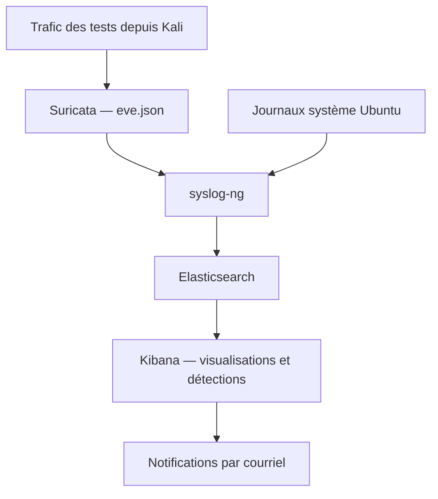

# Laboratoire de détection d’intrusions

## Présentation

Ce projet consiste à déployer un laboratoire permettant de collecter, centraliser et analyser des journaux de sécurité afin de détecter des tentatives d’intrusion.

Suricata analyse le trafic réseau et produit des événements de sécurité. syslog-ng collecte les journaux système et les événements Suricata, puis les transmet à Elasticsearch. Kibana permet de consulter les données, de configurer les règles de détection et de visualiser les résultats.

Des notifications par courriel complètent le dispositif pour signaler les détections.

## Objectifs

- Centraliser les journaux système et les événements du capteur réseau.
- Implémenter des règles de détection pour différents scénarios d’intrusion.
- Tester les détections dans un environnement contrôlé.
- Présenter les résultats dans un tableau de bord Kibana.
- Envoyer des notifications lors du déclenchement des règles.
- Documenter l’installation et la configuration pour rendre le déploiement reproductible.

## Environnement

Le laboratoire utilise deux machines virtuelles sous VirtualBox, hébergées sur un ordinateur Windows 11.

| Machine | Système | Adresse du réseau de laboratoire | Fonction |
|---|---|---|---|
| Serveur | Ubuntu Server 24.04.4 LTS | 192.168.56.10/24 | Collecte, détection, stockage et visualisation |
| Machine de test | Kali Linux 2025.4 | 192.168.56.101/24 | Exécution des scénarios d’intrusion |

Les machines communiquent sur le réseau Host-Only `192.168.56.0/24`. Le serveur Ubuntu dispose également d’une interface NAT pour accéder à Internet.

## Outils utilisés

| Outil | Version | Fonction |
|---|---|---|
| Suricata | 7.0.3 | Analyse du trafic réseau et génération d’alertes IDS |
| syslog-ng | 4.3 | Collecte et transmission des journaux |
| Elasticsearch | 9.5.4 | Indexation et stockage des événements |
| Kibana | 9.5.4 | Consultation, détection et visualisation |

Dans ce déploiement, Suricata fonctionne en mode IDS avec AF_PACKET.

## Chaîne de traitement

Les journaux système sont stockés dans l’index `lab-syslog-system` et les événements Suricata dans `lab-syslog-ids`.

## Scénarios testés

| Scénario | Objectif du test |
|---|---|
| Brute force SSH | Détecter des échecs d’authentification répétés |
| Reconnaissance Nmap | Détecter une activité de scan réseau |
| Tentative JNDI de type Log4Shell | Détecter un motif JNDI dans une requête HTTP |
| Injection SQL | Détecter des charges SQL dans les requêtes envoyées à l’application de test |
| Traversée de répertoires | Détecter une tentative d’accès utilisant le motif `../` |

Le test JNDI vérifie la détection de la requête ; il ne démontre pas l’exploitation d’un service Log4j vulnérable.

## Documentation

| Partie | Contenu |
|---|---|
| [Environnement](docs/01-environnement.md) | Configuration des VM, interfaces et connectivité |
| [Elasticsearch et Kibana](docs/02-installation-elasticsearch-kibana.md) | Installation, configuration et vérification |
| [syslog-ng](docs/03-installation-syslog-ng.md) | Installation et configuration de la collecte |
| [Suricata](docs/04-installation-suricata.md) | Installation, capture réseau et chargement des règles |
| [Application web](docs/05-application-web.md) | Installation Apache/PHP/SQLite, code, base, sessions et vulnérabilités de test |
| [Configuration des détections](docs/06-configuration-detection.md) | Règles Elastic Security et notifications par courriel |
| [Guide d’utilisation](docs/07-guide-utilisation.md) | Démarrage, reproduction des scénarios et vérification des alertes |
| [Visualisations Kibana](docs/08-visualisations-kibana.md) | Captures et explication de leur lecture |
| [Analyse et conclusion](docs/09-analyse-conclusion.md) | Résultats, limites et améliorations possibles |

## Organisation du dépôt

- `docs/` : procédures d’installation, de configuration et d’utilisation.
- `config/` : fichiers de configuration et règles utilisés.
- `scripts/` : relais Python de notification par courriel.
- `application-test/` : code de l’application PHP utilisée pour les tests web.
- `exports-kibana/` : exports des objets Kibana.
- `captures/` : preuves de l’installation, des configurations et des résultats.

Les mots de passe, clés API et identifiants SMTP sont remplacés par des valeurs à renseigner dans les configurations publiées.
