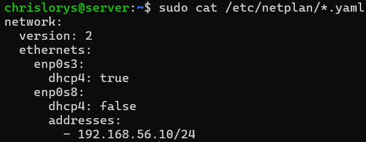
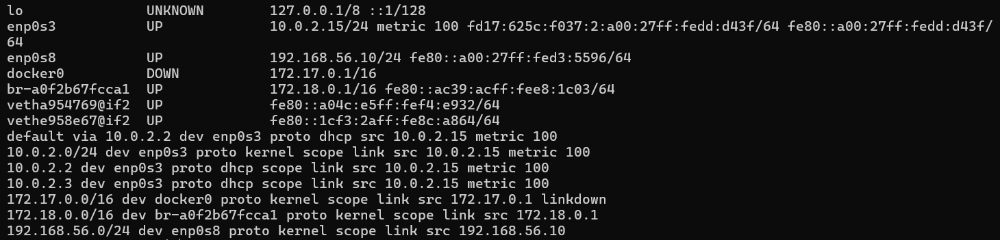
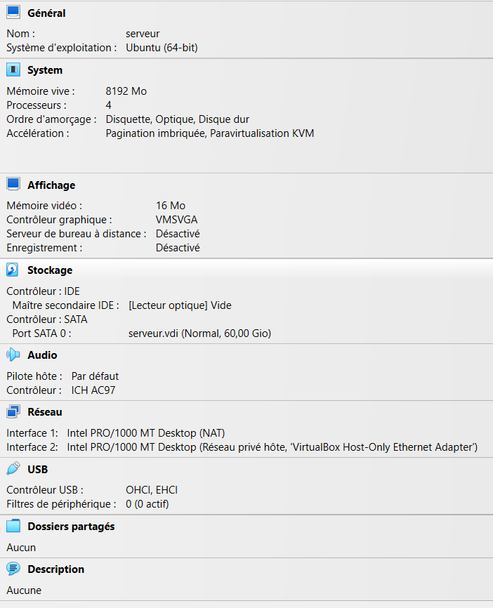
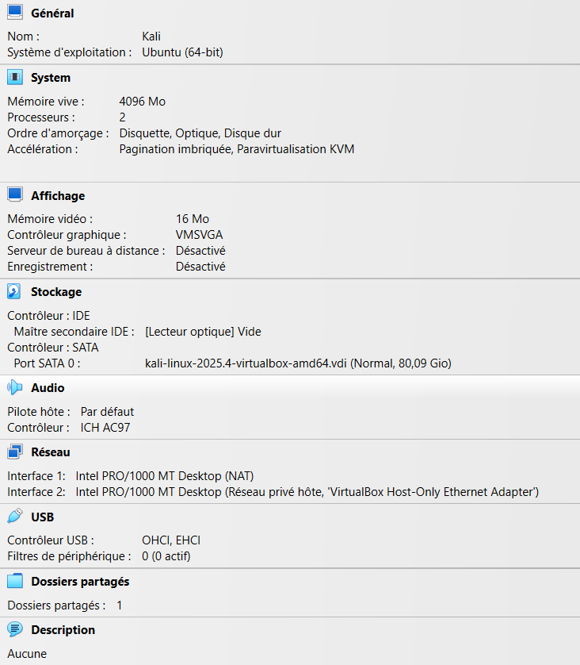
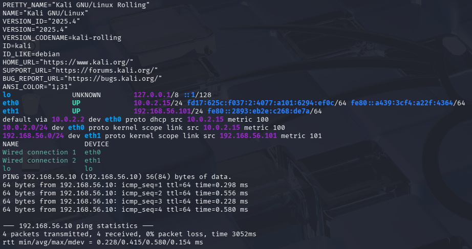
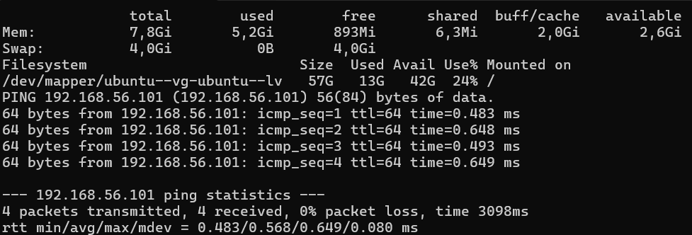

# Configuration de l’environnement

## Objectif

Deux machines virtuelles VirtualBox constituent le laboratoire : Ubuntu héberge la collecte, la détection et la visualisation ; Kali génère le trafic des scénarios. L’ordinateur hôte utilise Windows 11 et dispose de 16 Go de RAM.

## Machines et adresses

| Machine / interface | Système ou réseau | Adresse | Fonction |
|---|---|---|---|
| Ubuntu — enp0s8 | Ubuntu Server 24.04.4 LTS, Host-Only | 192.168.56.10/24 | Services du laboratoire et trafic surveillé |
| Ubuntu — enp0s3 | NAT | 10.0.2.15/24 | Téléchargement des paquets et des règles |
| Kali — eth1 | Kali Linux 2025.4, Host-Only | 192.168.56.101/24 | Exécution des tests |
| Hôte Windows | Host-Only | 192.168.56.1/24 | Accès au réseau des VM |

Le serveur Ubuntu dispose d’environ 7,8 Gio de mémoire utilisable et d’un système de fichiers principal affiché à 57G dans le relevé du 30 septembre 2026.

## Paramétrage VirtualBox

1. Ouvrir les paramètres réseau du serveur Ubuntu.
2. Configurer l’adaptateur 1 en NAT et l’adaptateur 2 en réseau privé hôte (Host-Only).
3. Sélectionner le réseau Host-Only correspondant au sous-réseau `192.168.56.0/24` et activer le câble virtuel.
4. Connecter Kali au même réseau Host-Only.
5. Vérifier les adresses dans les systèmes invités avant de lancer les tests.

Le réseau Host-Only permet les échanges entre les VM et l’hôte. L’interface NAT d’Ubuntu permet l’accès à Internet.

## Configuration persistante avec Netplan

La capture du serveur montre la configuration suivante, obtenue avec `sudo cat /etc/netplan/*.yaml` :

```yaml
network:
  version: 2
  ethernets:
    enp0s3:
      dhcp4: true
    enp0s8:
      dhcp4: false
      addresses:
        - 192.168.56.10/24
```

| Paramètre | Explication |
|---|---|
| `version: 2` | Version du format de configuration Netplan |
| `enp0s3: dhcp4: true` | L’interface NAT reçoit automatiquement sa configuration IPv4 par DHCP |
| `enp0s8: dhcp4: false` | Désactive l’attribution IPv4 par DHCP sur l’interface Host-Only |
| `192.168.56.10/24` | Fixe l’adresse du serveur sur le réseau du laboratoire, avec le masque `255.255.255.0` |

L’adresse fixe permet à Kali et aux services du laboratoire de retrouver le serveur à la même adresse. Aucune passerelle par défaut n’est définie sur l’interface Host-Only ; l’accès à Internet utilise l’interface NAT.




*Figure 1 — enp0s3 utilise DHCP ; enp0s8 conserve l’adresse 192.168.56.10/24.*

### Reproduire cette configuration

Lister les fichiers existants pour identifier celui à modifier :

```bash
ls -l /etc/netplan/
```

Modifier le fichier YAML qui définit ces interfaces avec `sudo nano /etc/netplan/NOM_DU_FICHIER.yaml`, en remplaçant `NOM_DU_FICHIER.yaml` par son nom réel. La capture ne montre pas ce nom. Reporter la configuration ci-dessus en respectant l’indentation et éviter de définir les mêmes interfaces dans plusieurs fichiers.

Depuis la console VirtualBox du serveur, valider puis appliquer la configuration :

```bash
sudo netplan generate
sudo netplan try
```

`generate` vérifie et génère la configuration réseau. `try` l’applique temporairement et demande une confirmation ; sans confirmation, les modifications sont annulées. Vérifier la connectivité avant de confirmer.

Les commandes de cette section servent à reproduire le paramétrage ; le serveur déjà configuré n’a pas besoin d’être modifié.

## Contrôle des interfaces

Sur chacune des VM :

```bash
ip -br addr
```

La sortie présente l’état et les adresses de chaque interface. Sur Ubuntu, vérifier `192.168.56.10/24` sur `enp0s8` ; sur Kali, vérifier `192.168.56.101/24` sur l’interface Host-Only.

Sur Ubuntu :

```bash
ip route
```

La route vers `192.168.56.0/24` doit utiliser `enp0s8`. La route par défaut doit utiliser l’interface NAT.




*Figure 2 — Les interfaces enp0s3 et enp0s8 sont UP. La route par défaut passe par 10.0.2.2 sur enp0s3 ; le réseau 192.168.56.0/24 passe par enp0s8. Les autres interfaces affichées ne sont pas utilisées dans la topologie décrite.*

## Test de connectivité

Depuis Kali :

```bash
ping -c 4 192.168.56.10
```

Depuis Ubuntu :

```bash
ping -c 4 192.168.56.101
```

Chaque commande envoie quatre requêtes ICMP. Les réponses permettent de vérifier la connectivité dans les deux sens. Les captures ci-dessous confirment quatre paquets transmis et reçus, avec 0 % de perte dans les deux sens. Les temps moyens sont de 0,415 ms depuis Kali et 0,568 ms depuis Ubuntu.

## Contrôle des ressources

Sur Ubuntu :

```bash
free -h
df -h /
```

`free -h` affiche la mémoire totale, utilisée et disponible. `df -h /` affiche l’espace du système de fichiers principal. Ces informations permettent de vérifier les ressources avant le démarrage des services.

## Éléments à compléter pour la reproductibilité

- Préciser la méthode d’attribution de l’adresse Kali.


La commande suivante permet de consulter la configuration Netplan existante sur Ubuntu :

```bash
sudo cat /etc/netplan/*.yaml
```

## Paramètres VirtualBox et preuves complémentaires

| VM | RAM attribuée | Processeurs virtuels | Disque virtuel | Réseau |
|---|---|---|---|---|
| Serveur Ubuntu | 8192 Mo | 4 | serveur.vdi, 60 Gio | Adaptateur 1 NAT ; adaptateur 2 Host-Only |
| Kali | 4096 Mo | 2 | kali-linux-2025.4-virtualbox-amd64.vdi, 80,09 Gio | Adaptateur 1 NAT ; adaptateur 2 Host-Only |

Les deux VM utilisent « VirtualBox Host-Only Ethernet Adapter » et des cartes Intel PRO/1000 MT Desktop. Pour reproduire ces paramètres, les reporter dans Système, Stockage et Réseau de chaque VM. La capacité du disque virtuel et la taille du système de fichiers invité sont deux mesures différentes.



*Figure 3 — Configuration du serveur : 8 Go de RAM, 4 processeurs virtuels, disque de 60 Gio et deux adaptateurs réseau.*



*Figure 4 — Configuration Kali : 4 Go de RAM, 2 processeurs virtuels et deux adaptateurs réseau. Le profil VirtualBox « Ubuntu (64-bit) » ne désigne pas le système installé, confirmé comme Kali par /etc/os-release.*

Pour obtenir ces captures, sélectionner la VM et afficher son résumé dans le gestionnaire VirtualBox.



*Figure 5 — Kali 2025.4 : eth0 porte 10.0.2.15/24 (NAT), eth1 porte 192.168.56.101/24 (Host-Only). La route par défaut passe par 10.0.2.2 sur eth0 ; le réseau de laboratoire passe par eth1. Le ping vers Ubuntu reçoit quatre réponses.*

Commandes pour reproduire le relevé :

```bash
cat /etc/os-release
ip -br address
ip route
nmcli -f NAME,DEVICE connection show --active
ping -c 4 192.168.56.10
```

« Wired connection 1 » est actif sur eth0 et « Wired connection 2 » sur eth1. Pour consulter la méthode d'attribution de l'adresse Kali :

```bash
nmcli -f connection.id,connection.interface-name,ipv4.method,ipv4.addresses connection show "Wired connection 2"
```

Ce contrôle ne modifie pas la configuration. Son résultat permettra de préciser la reproduction de l'adressage. Les deux VM peuvent afficher la même adresse NAT 10.0.2.15 dans leurs réseaux NAT individuels ; les échanges du laboratoire utilisent les adresses Host-Only.



*Figure 6 — Ubuntu affiche 7,8 Gio de mémoire totale et 4 Gio de swap (0 utilisé). Le système de fichiers principal affiche 57G, dont 13G utilisés et 42G disponibles (24 % utilisé). Le ping vers Kali reçoit quatre réponses sans perte.*

Commandes pour reproduire le relevé :

```bash
free -h
df -h /
ping -c 4 192.168.56.101
```

La mémoire utilisable est légèrement inférieure à la mémoire attribuée dans VirtualBox. Les valeurs de mémoire et de stockage disponibles varient pendant l'utilisation du laboratoire.

[Référence NetworkManager : nmcli](https://networkmanager.dev/docs/api/latest/nmcli.html).

## Navigation

[Retour au README](../README.md) · [Installation d’Elasticsearch et de Kibana](02-installation-elasticsearch-kibana.md)
