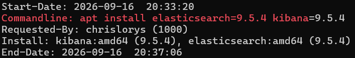
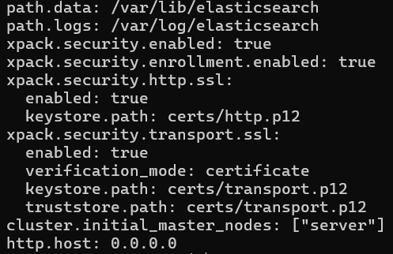
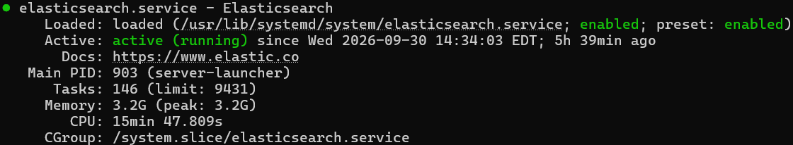
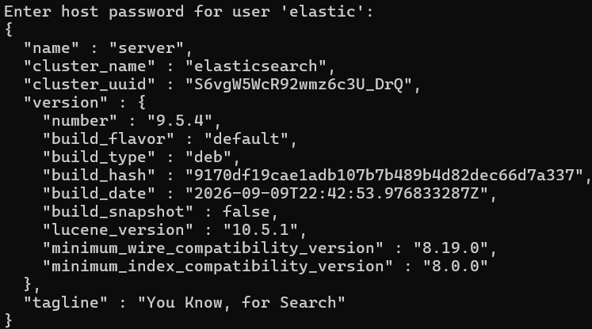
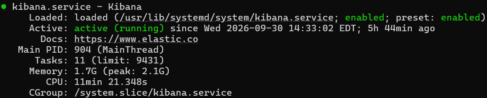
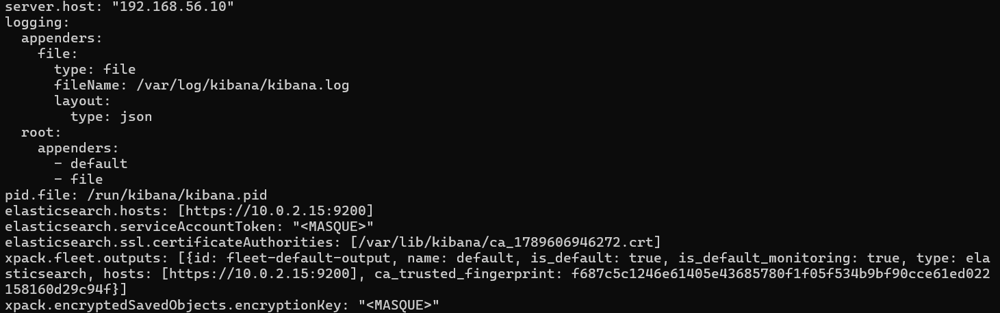

# Installation et configuration d’Elasticsearch et Kibana

## Rôle dans le projet

Elasticsearch stocke les journaux système et les événements Suricata transmis par syslog-ng. Kibana fournit les recherches, les visualisations, les règles de détection et les actions de notification. Le laboratoire utilise Elasticsearch et Kibana **9.5.4** sur Ubuntu Server.

La commande d’installation ci-dessous provient de l’historique APT communiqué pour le projet. Les configurations sont celles relevées sur le serveur, avec les secrets retirés. Les captures ci-dessous documentent l’installation enregistrée et l’état observé du serveur. Les commandes de préparation constituent la procédure de reproduction.

## 1. Préparer le dépôt APT Elastic

Sur Ubuntu :

```bash
sudo apt update
sudo apt install ca-certificates curl gnupg apt-transport-https
curl -fsSL https://artifacts.elastic.co/GPG-KEY-elasticsearch | sudo gpg --dearmor -o /usr/share/keyrings/elasticsearch-keyring.gpg
echo "deb [signed-by=/usr/share/keyrings/elasticsearch-keyring.gpg] https://artifacts.elastic.co/packages/9.x/apt stable main" | sudo tee /etc/apt/sources.list.d/elastic-9.x.list
sudo apt update
```

La clé permet à APT de vérifier la signature des paquets. Le fichier de dépôt indique où récupérer les versions 9.x. Sur un serveur déjà installé, consulter les sources existantes avant d’ajouter une entrée identique.

## 2. Installer les versions du laboratoire

```bash
sudo apt install elasticsearch=9.5.4 kibana=9.5.4
dpkg-query -W elasticsearch kibana
```

La première commande fixe explicitement les deux versions. La seconde affiche les versions installées ; conserver cette sortie comme preuve. Si APT ne trouve pas la version, consulter `apt-cache policy elasticsearch kibana` avant de poursuivre.




*Figure 1 — L’historique APT enregistre l’installation des deux paquets 9.5.4 le 16 septembre 2026, de 20:33:20 à 20:37:06 selon l’horloge du journal.*


*Figure 2 — Les deux paquets installés portent la version 9.5.4.*

## 3. Configurer et démarrer Elasticsearch

Fichier : `/etc/elasticsearch/elasticsearch.yml`.

[Consulter la configuration relevée](../config/elasticsearch/elasticsearch.yml.example).




*Figure 3 — La configuration active la sécurité et TLS et définit les chemins de données et de journaux.*

| Paramètre | Rôle |
|---|---|
| `path.data` | Répertoire des données indexées : `/var/lib/elasticsearch` |
| `path.logs` | Répertoire des journaux du service : `/var/log/elasticsearch` |
| `xpack.security.enabled` | Active l’authentification et les contrôles d’accès |
| `xpack.security.enrollment.enabled` | Permet l’enrôlement de Kibana et de nouveaux nœuds |
| `xpack.security.http.ssl` | Active HTTPS pour l’API et utilise `certs/http.p12` |
| `xpack.security.transport.ssl` | Configure TLS pour les communications entre nœuds |
| `verification_mode: certificate` | Vérifie le certificat de transport sans contrôler le nom d’hôte |
| `cluster.initial_master_nodes` | Paramètre d’amorçage initial ; la valeur relevée est `server` |
| `http.host: 0.0.0.0` | Écoute HTTP sur toutes les interfaces IPv4 |

Les fichiers PKCS#12 et leurs mots de passe sont propres à l’installation. Les laisser générer par l’auto-configuration de sécurité ; le fichier d’exemple ne suffit pas à recréer ces certificats.

Le nom `server` doit correspondre au nom du nœud lors de l’amorçage. Après formation du cluster, retirer `cluster.initial_master_nodes` de la configuration ; ce paramètre ne doit pas servir lors des redémarrages d’un cluster existant.

```bash
sudo systemctl daemon-reload
sudo systemctl enable --now elasticsearch
sudo systemctl status elasticsearch --no-pager
```




*Figure 4 — active (running) confirme le fonctionnement du service ; enabled indique son activation au démarrage.*

Le résultat attendu est `active (running)`. Pour une nouvelle installation, définir le mot de passe du compte administrateur :

```bash
sudo /usr/share/elasticsearch/bin/elasticsearch-reset-password -u elastic -i
```

Cette commande change le mot de passe : elle n’est pas nécessaire pour contrôler le serveur existant.

Tester l’API depuis Ubuntu, avec saisie interactive du mot de passe :

```bash
sudo curl --cacert /etc/elasticsearch/certs/http_ca.crt -u elastic https://10.0.2.15:9200
```

La réponse attendue est un objet JSON décrivant le nœud et sa version. Le certificat CA permet de valider la connexion TLS.




*Figure 5 — L’API retourne le nœud server, le cluster elasticsearch et la version 9.5.4 après authentification.*

## 4. Associer Kibana à Elasticsearch

Sur une nouvelle installation, générer un jeton d’enrôlement :

```bash
sudo /usr/share/elasticsearch/bin/elasticsearch-create-enrollment-token -s kibana
```

Dans `/etc/kibana/kibana.yml`, définir l’adresse d’écoute :

```yaml
server.host: "192.168.56.10"
```

Démarrer Kibana :

```bash
sudo systemctl enable --now kibana
sudo systemctl status kibana --no-pager
```

Ouvrir `http://192.168.56.10:5601` depuis l’hôte et suivre l’assistant avec le jeton d’enrôlement. Si un code de vérification est demandé :

```bash
sudo /usr/share/kibana/bin/kibana-verification-code
```

Terminer l’association puis se connecter avec `elastic` et son mot de passe. L’enrôlement configure la connexion de service et l’autorité de certification. Il ne faut pas recopier le jeton de service d’un autre déploiement.




*Figure 6 — Kibana est active (running) et enabled.*


*Figure 7 — Le navigateur atteint la page de connexion sur 192.168.56.10:5601. Cette capture confirme l’accès à la page, pas une authentification réussie. La mention Non sécurisé correspond à l’accès HTTP du navigateur.*

## 5. Comprendre la configuration Kibana du laboratoire

[Consulter la configuration sans secrets](../config/kibana/kibana.yml.example).




*Figure 8 — Kibana écoute sur 192.168.56.10 et joint Elasticsearch en HTTPS sur 10.0.2.15:9200. Le jeton de service et la clé de chiffrement sont masqués.*

| Paramètre | Valeur ou rôle |
|---|---|
| `server.host` | Écoute sur l’adresse Host-Only `192.168.56.10` |
| `logging.appenders.file` | Écrit les logs au format JSON dans `/var/log/kibana/kibana.log` |
| `logging.root.appenders` | Active les sorties par défaut et fichier |
| `pid.file` | Stocke l’identifiant du processus dans `/run/kibana/kibana.pid` |
| `elasticsearch.hosts` | Joint Elasticsearch en HTTPS sur `10.0.2.15:9200` |
| `elasticsearch.serviceAccountToken` | Authentifie le service Kibana auprès d’Elasticsearch |
| `elasticsearch.ssl.certificateAuthorities` | Désigne le certificat CA utilisé pour vérifier Elasticsearch |
| `xpack.fleet.outputs` | Définit une sortie Fleet ; sa présence ne démontre pas l’utilisation de Fleet dans la collecte du projet |
| `xpack.encryptedSavedObjects.encryptionKey` | Chiffre les attributs sensibles des objets enregistrés, notamment ceux des connecteurs |

Le nom du certificat `ca_1789606946272.crt` est propre au serveur observé et doit être adapté lors d’un autre déploiement. L’empreinte CA n’est pas un mot de passe, mais doit correspondre au certificat de la nouvelle installation.

Sur une nouvelle installation, générer les clés nécessaires avec :

```bash
sudo /usr/share/kibana/bin/kibana-encryption-keys generate
```

Reporter la valeur générée pour `xpack.encryptedSavedObjects.encryptionKey` dans la configuration, puis redémarrer Kibana. Conserver cette clé de manière durable. Sur l’installation existante, son remplacement exige une rotation planifiée pour préserver l’accès aux objets déjà chiffrés.

```bash
sudo systemctl restart kibana
sudo systemctl status kibana --no-pager
```

Le navigateur accède à Kibana en HTTP dans la configuration fournie ; la connexion Kibana–Elasticsearch utilise HTTPS. L’adresse NAT `10.0.2.15` étant attribuée par DHCP, vérifier qu’elle reste celle du serveur après un changement de réseau.


*Figure 9 — La page `/app/home#/` présente l’accueil Kibana après connexion, avec les espaces Elasticsearch, Observabilité, Security et Analyse. Elle confirme l’accès à l’interface authentifiée sur `192.168.56.10:5601` ; les données ingérées et les détections sont vérifiées dans les guides suivants.*

## 5.1. Appliquer les fichiers de configuration lors de la reproduction

Les fichiers `.example` du dépôt servent de référence. Après installation des paquets, modifier les fichiers système existants plutôt que de les remplacer intégralement : ils contiennent les réglages et certificats générés pour le déploiement.

```bash
sudo cp -a /etc/elasticsearch/elasticsearch.yml /etc/elasticsearch/elasticsearch.yml.bak
sudo cp -a /etc/kibana/kibana.yml /etc/kibana/kibana.yml.bak
sudo nano /etc/elasticsearch/elasticsearch.yml
sudo nano /etc/kibana/kibana.yml
```

Dans Elasticsearch, conserver les paramètres TLS et les fichiers PKCS#12 créés par l'auto-configuration. Reporter les chemins de données/journaux et l'adresse d'écoute documentés. Le nom du nœud et les paramètres d'amorçage doivent correspondre au nouveau déploiement.

Dans Kibana, définir `server.host` avant l'enrôlement. Après association, conserver le jeton de service et le chemin CA générés localement. Reporter le bloc de journalisation, `pid.file` et la clé de chiffrement générée pour cette installation. Les valeurs entre chevrons dans le fichier d'exemple ne sont pas des valeurs utilisables.

### Répertoires et accès du service

Le paquet Debian utilise les comptes de service `elasticsearch` et `kibana`. Les données Elasticsearch résident dans `/var/lib/elasticsearch`, ses journaux dans `/var/log/elasticsearch`. Kibana utilise `/var/lib/kibana` pour ses données et le chemin de journalisation configuré `/var/log/kibana/kibana.log`.

Pour reproduire la sortie fichier, si le répertoire des journaux Kibana n'a pas été créé par le paquet :

```bash
sudo install -d -o kibana -g kibana -m 0750 /var/log/kibana
```

Le compte Kibana doit pouvoir écrire dans ce répertoire et lire le certificat CA indiqué. Le répertoire PID `/run/kibana` est lié au démarrage du service ; il doit être recréé par la configuration du paquet à chaque démarrage. Ne pas appliquer de permissions globales aux répertoires de données ou aux certificats privés.

Après modification sur le déploiement reproduit :

```bash
sudo systemctl restart elasticsearch
sudo systemctl status elasticsearch --no-pager
sudo systemctl restart kibana
sudo systemctl status kibana --no-pager
```

Vérifier ensuite l'API HTTPS et l'accès authentifié à Kibana avec les contrôles et captures des sections précédentes. Les sauvegardes conservent les permissions originales et permettent de revenir aux configurations précédentes.

## 6. Bilan de validation

| Capture | Lecture attendue |
|---|---|
| Historique APT ou commande d’installation et versions | Versions Elasticsearch et Kibana cohérentes |
| Configuration Elasticsearch | Authentification et TLS activés, chemins de stockage identifiés |
| Configuration Kibana expurgée | Adresse d’écoute et destination Elasticsearch ; secrets masqués |
| État des deux services | Présence de `active (running)` |
| Réponse de l’API Elasticsearch | Nœud joignable et version retournée |
| Connexion et accueil Kibana | Interface joignable depuis l’hôte et accès après authentification confirmé |

En cas d’échec de démarrage :

```bash
sudo journalctl -u elasticsearch -n 50 --no-pager
sudo journalctl -u kibana -n 50 --no-pager
sudo tail -n 50 /var/log/kibana/kibana.log
```

Lire les messages pour distinguer une erreur de configuration, de certificat ou d’authentification. Les captures attestent l’état observé au moment de leur réalisation.

## Références

- [Installation Debian d’Elasticsearch](https://www.elastic.co/docs/deploy-manage/deploy/self-managed/install-elasticsearch-with-debian-package)
- [Installation Debian de Kibana](https://www.elastic.co/docs/deploy-manage/deploy/self-managed/install-kibana-with-debian-package)
- [Paramètres Kibana](https://www.elastic.co/docs/reference/kibana/configuration-reference)
- [Objets enregistrés chiffrés](https://www.elastic.co/docs/deploy-manage/security/secure-saved-objects)

[Retour au README](../README.md)
