# Installation et configuration de syslog-ng

## Objectif

syslog-ng collecte les événements locaux du serveur Ubuntu et les événements réseau produits par Suricata. Il sélectionne les messages utiles, les encode en JSON et les transmet à Elasticsearch en HTTPS.

| Source | Événements sélectionnés | Index | Pipeline |
|---|---|---|---|
| s_src : system() et internal() | Facilities auth/authpriv ou programme projet-securite | lab-syslog-system | system-logs |
| Fichier /var/log/suricata/eve.json | event_type alert ou flow | lab-syslog-ids | suricata-json |

Les destinations locales du fichier principal sont conservées. La configuration fournie n’active pas de source réseau distante.

## 1. Installer les paquets

Sur Ubuntu :

```bash
sudo apt update
sudo apt install syslog-ng-core syslog-ng-mod-http
```

Le paquet core fournit le service ; mod-http fournit la destination HTTP utilisée pour envoyer les documents à Elasticsearch. La capture de l’historique APT confirme cette installation le 16 septembre 2026 à 21:18:43, selon l’horloge du journal. Elle indique également le retrait de rsyslog lors de cette installation.

Vérifier les versions :

```bash
dpkg-query -W -f='${Package}\t${Version}\n' syslog-ng-core syslog-ng-mod-http
```

Les captures confirment la version de paquet **4.3.1-2build5** pour les deux composants. La directive `@version: 4.3` désigne la syntaxe de configuration.


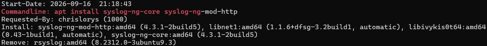

*Figure 1 — Historique APT : installation des deux paquets et retrait de rsyslog.*


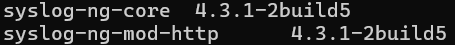

*Figure 2 — Les paquets core et mod-http sont installés en version 4.3.1-2build5.*

## 2. Comprendre le fichier principal

Le fichier `/etc/syslog-ng/syslog-ng.conf` contient notamment :

```conf
@version: 4.3
@include "scl.conf"

source s_src {
    system();
    internal();
};

@include "/etc/syslog-ng/conf.d/*.conf"
```

Cet extrait présente les points de raccordement ; il ne remplace pas le fichier principal complet.

- system() collecte les messages locaux.
- internal() collecte les messages internes de syslog-ng.
- use_dns(no) évite la résolution DNS des sources.
- owner("root"), group("adm") et perm(0640) définissent les propriétés par défaut des fichiers créés.
- Les chemins log relient une source, un filtre et une destination.
- L’inclusion conf.d charge les configurations complémentaires.

Les chemins locaux continuent notamment à écrire les événements d’authentification dans /var/log/auth.log.


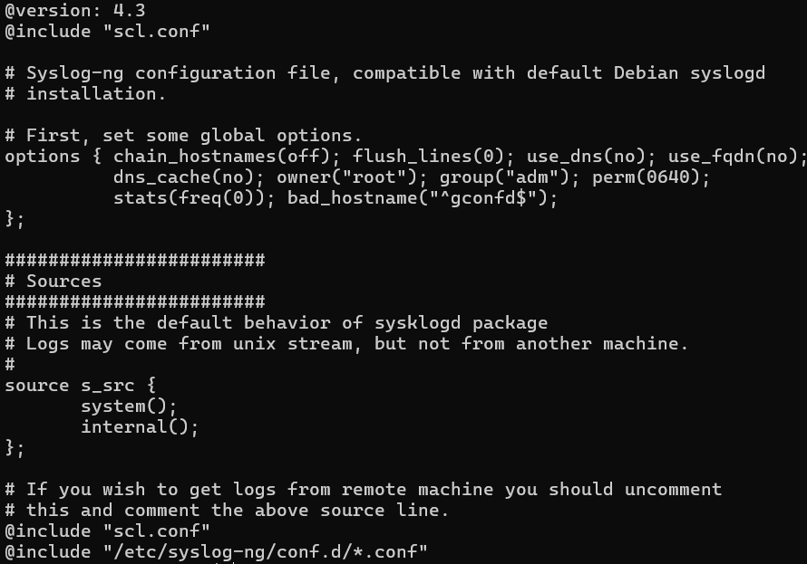

*Figure 3 — Source locale s_src et chargement des fichiers complémentaires. La répétition de scl.conf dans cette sortie provient de l’affichage de deux commandes, pas d’une preuve de doublon dans le fichier.*

## 3. Configurer les deux circuits

Les blocs exacts fournis par le laboratoire sont conservés dans les exemples suivants, avec le mot de passe retiré :

- [Circuit système](../config/syslog-ng/10-elasticsearch-system.conf.example)
- [Circuit Suricata](../config/syslog-ng/20-elasticsearch-suricata.conf.example)

Les noms des fichiers sont proposés pour l’organisation du dépôt ; les noms d’origine n’apparaissent pas dans la sortie concaténée fournie.

Pour reproduire le déploiement, placer les blocs dans des fichiers .conf sous /etc/syslog-ng/conf.d/, remplacer le mot de passe localement et conserver la source s_src du fichier principal. Éviter de définir deux fois les mêmes objets. Le laboratoire existant n’a pas besoin d’être reconfiguré.

## 4. Préparer la connexion sécurisée

Le compte syslog_ingest doit être autorisé à indexer dans les deux index. Les pipelines system-logs, ssh-auth et suricata-json doivent exister.

Sur un déploiement reproduit, installer le certificat public CA au chemin demandé :

```bash
sudo install -d -m 0755 /etc/syslog-ng/certs
sudo install -m 0644 /etc/elasticsearch/certs/http_ca.crt /etc/syslog-ng/certs/elasticsearch-ca.crt
```

La destination utilise peer-verify(yes) pour vérifier TLS. Le certificat du serveur doit être valide pour localhost, nom utilisé dans les URL. Le certificat CA ne contient pas la clé privée du serveur.

Le compte syslog_ingest utilise le rôle syslog_writer, dont la définition et la création sont documentées ci-dessous.

## 5. Circuit des journaux système

Le filtre conserve les facilities auth et authpriv ainsi que le programme exactement nommé projet-securite. Il n’expédie donc pas tous les journaux système.

La destination effectue un POST vers :

```text
https://localhost:9200/lab-syslog-system/_doc?pipeline=system-logs
```

format-json encode les valeurs et construit les champs explicites :

| Champ | Macro source |
|---|---|
| @timestamp | ISODATE |
| host.name | HOST |
| process.name | PROGRAM |
| message | MESSAGE |

Le paramètre --scope none limite le document aux champs indiqués. Le compte syslog_ingest s’authentifie avec user() et password(). L’en-tête Content-Type vaut application/json.

Le pipeline system-logs ajoute event.ingested avec l’horodatage d’ingestion Elasticsearch. Si process.name vaut sshd, il appelle **ssh-auth**, avec un tiret.

ssh-auth traite les messages qui commencent par Failed password for. Son grok extrait user.name, source.ip et source.port, y compris lorsqu’il s’agit d’un utilisateur invalide. Il renseigne ensuite event.outcome à failure, event.category à authentication et event.action à ssh_login_failed. Les autres messages SSH ne sont pas classés comme échecs par cette condition.


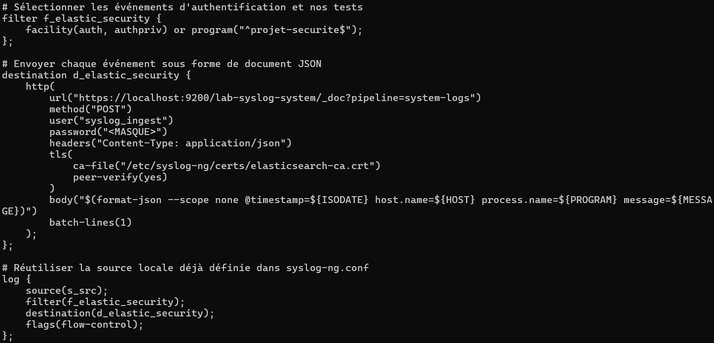

*Figure 4 — Sélection des événements système, envoi JSON vers system-logs et vérification TLS. Le mot de passe est masqué.*


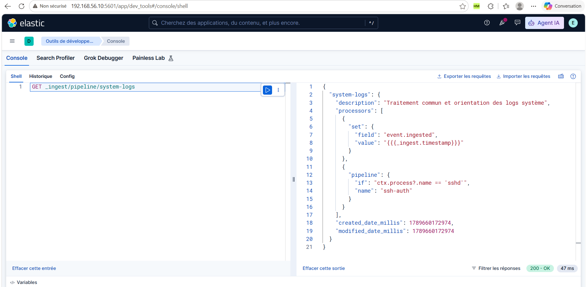

*Figure 5 — system-logs ajoute event.ingested et appelle ssh-auth pour les messages du programme sshd ; la réponse est 200 OK.*

## 6. Circuit Suricata

La source suit /var/log/suricata/eve.json. follow-freq(1) fixe un intervalle de suivi d’une seconde. flags(no-parse) conserve la ligne complète dans MESSAGE sans l’interpréter comme un en-tête syslog.

Le filtre recherche les types alert et flow dans le JSON compact. Son nom f_suricata_alert ne signifie pas qu’il sélectionne uniquement les alertes. Le motif dépend de l’espacement du JSON.

La destination effectue un POST vers :

```text
https://localhost:9200/lab-syslog-ids/_doc?pipeline=suricata-json
```

Le document contient la ligne EVE dans message et process.name fixé à suricata.

Le pipeline suricata-json :

1. Renomme l’horodatage fourni par syslog-ng en event.ingested.
2. Décode message dans l’objet suricata.
3. Convertit suricata.timestamp, au format ISO8601, en @timestamp.
4. Copie suricata.src_ip vers source.ip et suricata.dest_ip vers destination.ip.

Dans ce pipeline, event.ingested conserve donc l’heure fournie par syslog-ng, et non directement l’heure d’arrivée dans Elasticsearch. Si la conversion de date échoue, ignore_failure permet de continuer, potentiellement sans @timestamp.


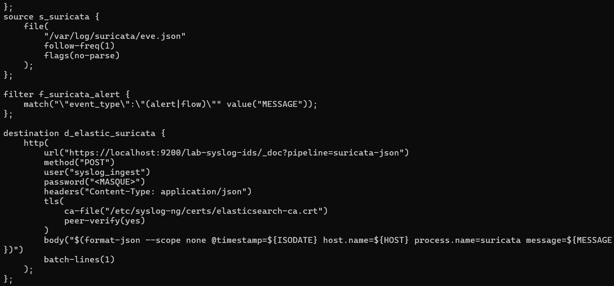

*Figure 6 — Lecture de eve.json et sélection des types alert et flow, puis envoi vers suricata-json.*


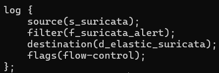

*Figure 7 — Le chemin relie la source, le filtre et la destination Suricata avec flow-control.*


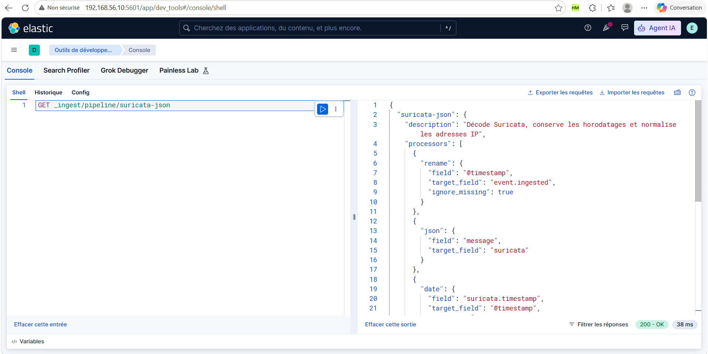

*Figure 8 — suricata-json conserve l’horodatage syslog-ng et décode le message EVE.*


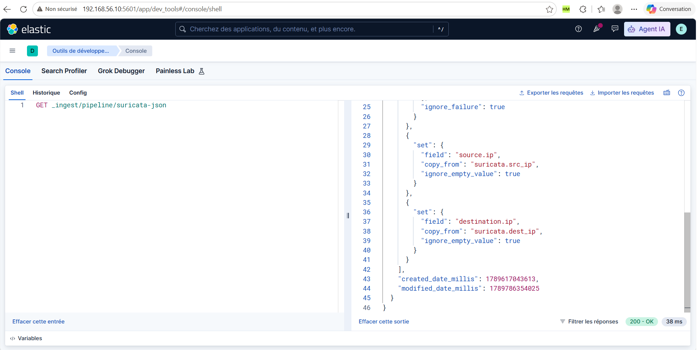

*Figure 9 — Les adresses Suricata sont copiées dans source.ip et destination.ip.*

## 7. Envoi et régulation

batch-lines(1) limite le lot à un message, correspondant à l’envoi d’un document par requête _doc. flags(flow-control) régule la collecte lorsque la destination ralentit. Aucun tampon disque explicite n’est configuré dans les blocs transmis ; le contrôle de flux ne garantit pas à lui seul la conservation lors d’un arrêt brutal.

## 8. Valider et lancer le service

Avant d’appliquer une modification :

```bash
sudo syslog-ng -s && printf 'Configuration syslog-ng valide\n'
```


Après installation ou modification validée :

```bash
sudo systemctl enable syslog-ng
sudo systemctl restart syslog-ng
sudo systemctl status syslog-ng --no-pager -l
```

La capture confirme active (running) et enabled.


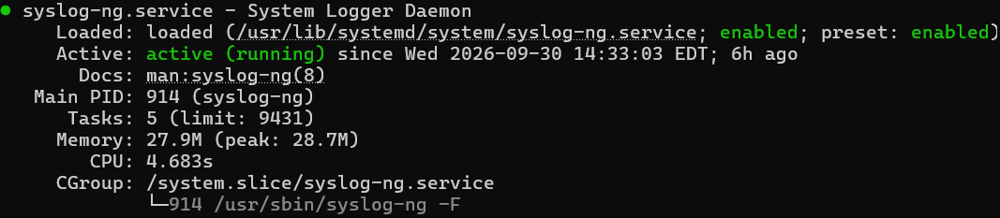

*Figure 11 — Le service syslog-ng est active (running) et enabled.*

Pour diagnostiquer un échec :

```bash
sudo journalctl -u syslog-ng -n 50 --no-pager
```

La validation syntaxique ne vérifie pas les identifiants Elasticsearch, les certificats ni le contenu des pipelines.

## 9. Tester la collecte de bout en bout

```bash
logger -t projet-securite "TEST-COLLECTE-SYSLOG-GITHUB"
```

Dans Discover, sélectionner « Logs sécurité laboratoire » et une période récente. Rechercher :

```text
message : "TEST-COLLECTE-SYSLOG-GITHUB"
```

La capture transmise montre ce message dans lab-syslog-system, avec host.name = server et process.name = projet-securite. Elle valide le trajet du message local jusqu’à Elasticsearch.


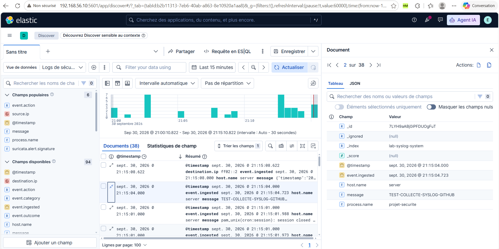

*Figure 12 — Le document TEST-COLLECTE-SYSLOG-GITHUB est reçu dans lab-syslog-system avec process.name = projet-securite. Le nombre global de documents affiché ne représente pas uniquement le test.*

## Reproduire les pipelines

Les fichiers JSON et les instructions de création sont disponibles dans [config/elasticsearch/pipelines](../config/elasticsearch/pipelines/README.md). Créer ssh-auth avant system-logs, qui l’appelle. Les corps correspondent aux configurations confirmées ; les dates de métadonnées ont été retirées.

## Compte et rôle Elasticsearch du collecteur

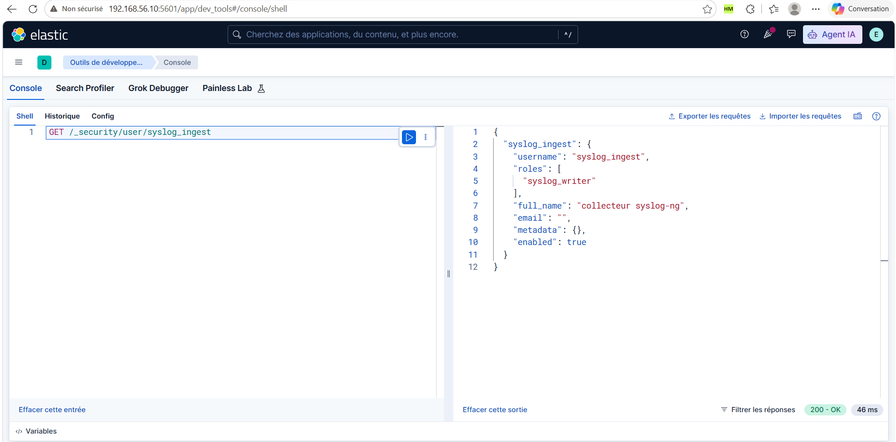

*Compte collecteur actif, associé au rôle syslog_writer ; réponse 200 OK.*

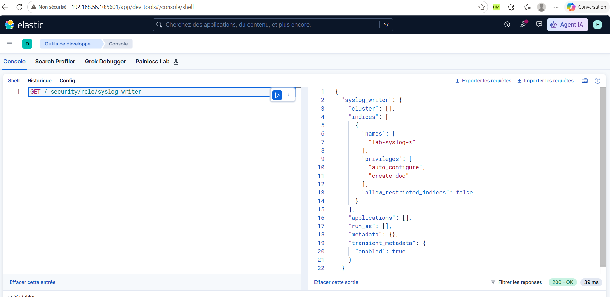

*Le rôle autorise auto_configure et create_doc sur `lab-syslog-*`, sans privilège de cluster. La réponse 200 OK confirme la lecture de sa définition.*

Le contrôle GET /_security/user/syslog_ingest retourne 200 OK. Le compte est actif, porte le libellé « collecteur syslog-ng » et possède le rôle syslog_writer. Cette API ne retourne pas son mot de passe.

*Le contrôle GET /_security/role/syslog_writer retourne 200 OK et montre les droits du rôle utilisé.

| Paramètre | Valeur | Explication |
|---|---|---|
| cluster | [] | Aucun privilège de cluster |
| indices.names | lab-syslog-* | Inclut lab-syslog-system et lab-syslog-ids |
| auto_configure | accordé | Autorise l'auto-création et les mises à jour automatiques de mappings couvertes par ce privilège |
| create_doc | accordé | Autorise la création de documents, sans écraser les documents existants |
| allow_restricted_indices | false | Ne donne pas accès aux index restreints |
| applications / run_as | [] / [] | Aucun droit applicatif ni usurpation d'un autre utilisateur |

La destination syslog-ng effectue un POST sur `_doc` sans identifiant de document explicite, ce qui correspond à la création de documents avec identifiant généré. Le compte collecteur ne reçoit pas de droit de lecture par ce rôle. Les pipelines sont créés au préalable avec un compte administrateur ; le rôle collecteur n'accorde pas leur gestion.

### Reproduire le rôle puis le compte

Sur le déploiement à reproduire, ouvrir Kibana → Dev Tools avec un compte autorisé à gérer la sécurité. Créer d'abord le rôle avec le corps disponible dans [syslog_writer.json](../config/elasticsearch/security/syslog_writer.json) :

```http
PUT /_security/role/syslog_writer
{
  "cluster": [],
  "indices": [
    {
      "names": [
        "lab-syslog-*"
      ],
      "privileges": [
        "auto_configure",
        "create_doc"
      ],
      "allow_restricted_indices": false
    }
  ],
  "applications": [],
  "run_as": [],
  "metadata": {}
}
```

Créer ensuite le compte, en remplaçant le mot de passe documentaire par un mot de passe choisi localement :

```http
PUT /_security/user/syslog_ingest
{
  "password": "<MOT_DE_PASSE_A_RENSEIGNER_LOCALEMENT>",
  "roles": ["syslog_writer"],
  "full_name": "collecteur syslog-ng",
  "email": "",
  "metadata": {},
  "enabled": true
}
```

Ces PUT sont les instructions de reproduction ; ils ne sont pas nécessaires pour relire les comptes existants. Reporter le même mot de passe dans les deux destinations HTTP syslog-ng, sans le publier dans GitHub. Créer les pipelines avec les instructions du dossier pipelines, installer le certificat CA, puis valider et démarrer syslog-ng comme indiqué plus haut.

Vérifier les objets créés :

```http
GET /_security/role/syslog_writer
GET /_security/user/syslog_ingest
```

Les preuves de collecte du message système et de l'alerte Suricata dans le [guide Suricata](04-installation-suricata.md#72-preuve-de-collecte-dans-kibana) complètent cette configuration.

## Référence

[Documentation syslog-ng : destination HTTP](https://syslog-ng.github.io/admin-guide/070_Destinations/081_http/000_http_options.html)

[Retour au README](../README.md)
