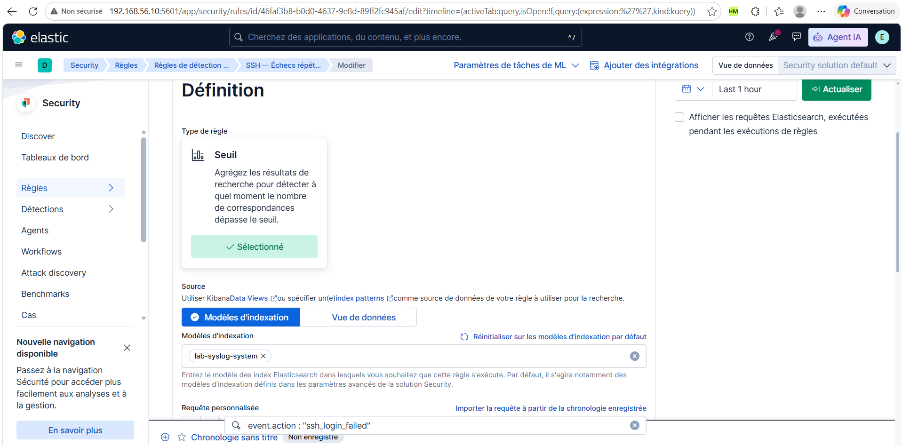
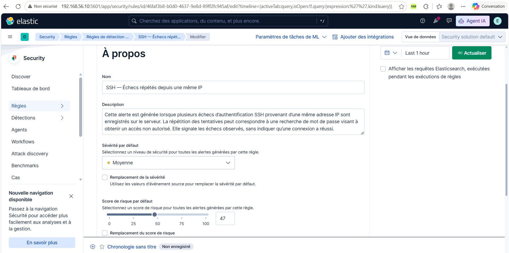
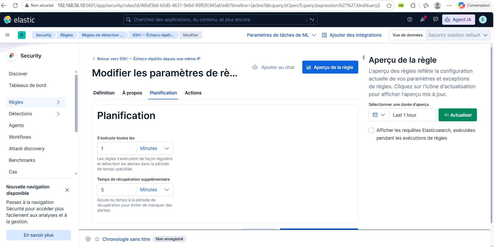

# Configuration des détections

## 1. Du journal à l'alerte Elastic Security

Les événements collectés et les alertes de détection sont deux résultats distincts. Les journaux SSH sont indexés dans `lab-syslog-system` ; les événements Suricata sont indexés dans `lab-syslog-ids`. Les règles Elastic Security recherchent ensuite les événements correspondant à leurs critères et génèrent des alertes.

La collecte, les pipelines `system-logs`, `ssh-auth` et `suricata-json` sont décrits dans le [guide syslog-ng](03-installation-syslog-ng.md). Les signatures réseau et leurs SID sont décrits dans le [guide Suricata](04-installation-suricata.md).

## 2. SSH — Échecs répétés depuis une même IP

### Objectif et événements utilisés

Cette règle recherche des échecs d'authentification SSH répétés provenant d'une même adresse IP. Ces répétitions peuvent signaler une recherche de mot de passe. Elles ne démontrent pas qu'une connexion a réussi.

Le pipeline `ssh-auth` extrait les champs des messages `Failed password for ...` émis par `sshd`, notamment `user.name`, `source.ip` et `source.port`. Il ajoute `event.outcome: failure`, `event.category: authentication` et `event.action: ssh_login_failed`. Ces champs permettent de sélectionner les échecs et de regrouper les événements pour une détection par seuil.

### 2.1. Définition

Dans Kibana, ouvrir **Security → Règles → Règles de détection**, sélectionner la règle SSH puis **Modifier → Définition**. Pour la recréer, ouvrir la création d'une règle et choisir le type **Seuil**.

**Lecture :** le type **Seuil** est sélectionné et le modèle d'indexation est `lab-syslog-system`. La règle travaille donc sur les journaux système collectés, plutôt que sur les événements du capteur Suricata.

La barre inférieure affiche `event.action : "ssh_login_failed"` dans une **Chronologie sans titre**. Ce panneau ne constitue pas une preuve de la requête enregistrée dans la règle. La capture ne montre pas intégralement les champs de requête, de regroupement et de seuil ; leur valeur reste à confirmer avant de pouvoir reproduire exactement la définition.

### 2.2. Nom, description et priorité

Ouvrir l'onglet **À propos**.

| Paramètre | Valeur observée |
| --- | --- |
| Nom | SSH — Échecs répétés depuis une même IP |
| Sévérité par défaut | Moyenne |
| Score de risque par défaut | 47 |
| Remplacement de la sévérité | Case non cochée |
| Remplacement du score de risque | Case non cochée |

Description affichée, à reprendre pour recréer la règle :

> Cette alerte est générée lorsque plusieurs échecs d’authentification SSH provenant d’une même adresse IP sont enregistrés sur le serveur. La répétition des tentatives peut correspondre à une recherche de mot de passe visant à obtenir un accès non autorisé. Elle signale les échecs observés, sans indiquer qu’une connexion a réussi.

**Lecture :** la sévérité et le score définissent la priorité attribuée à l'alerte. Le score 47 n'est ni le nombre d'échecs, ni le seuil de déclenchement, ni une probabilité de compromission.

### 2.3. Planification

Ouvrir l'onglet **Planification**.

| Paramètre | Valeur observée | Fonction |
| --- | --- | --- |
| S'exécute toutes les | 1 minute | Fréquence planifiée de la recherche |
| Temps de récupération supplémentaire | 5 minutes | Étend la période de recherche vers le passé |

**Lecture :** la règle est planifiée chaque minute. Les cinq minutes supplémentaires servent à rechercher des événements sur une période plus large ; elles ne signifient pas que la règle s'exécute toutes les cinq minutes. Le sélecteur **Last 1 hour** du panneau de droite concerne l'aperçu, pas la fréquence d'exécution.

Une fréquence d'une minute ne garantit pas une notification en moins d'une minute : l'événement doit être collecté, indexé, recherché et satisfaire les conditions de la règle avant l'envoi éventuel d'une notification.

### 2.4. Vérification à terminer avant le scénario suivant

Les trois captures attestent le type, l'index, la description, la priorité et la planification visibles dans l'éditeur. Pour terminer la reproduction de cette règle, compléter la preuve de définition avec :

- la requête réellement configurée et son langage ;
- le champ de regroupement et la valeur numérique du seuil ;
- un éventuel critère de cardinalité ou remplacement du champ temporel.

Une preuve d'activation et une alerte produite par un test permettront ensuite de vérifier l'exécution. La configuration de l'action courriel sera documentée avec ses paramètres et sa preuve de réception.
