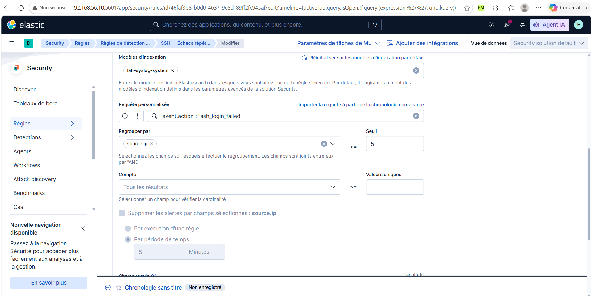
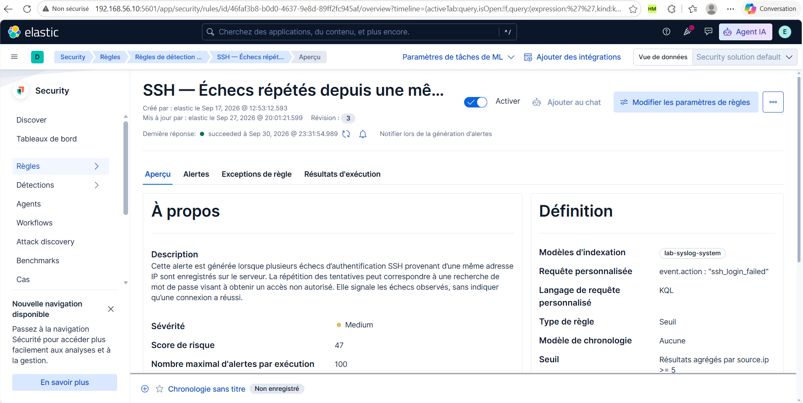

# Configuration des détections

## 1. Du journal à l'alerte Elastic Security

Les événements collectés et les alertes de détection sont deux résultats distincts. Les journaux SSH sont indexés dans `lab-syslog-system` ; les événements Suricata sont indexés dans `lab-syslog-ids`. Les règles Elastic Security recherchent ensuite les événements correspondant à leurs critères et génèrent des alertes.

La collecte, les pipelines `system-logs`, `ssh-auth` et `suricata-json` sont décrits dans le [guide syslog-ng](03-installation-syslog-ng.md). Les signatures réseau et leurs SID sont décrits dans le [guide Suricata](04-installation-suricata.md).

## 2. SSH — Échecs répétés depuis une même IP

### Objectif et événements utilisés

Cette règle recherche des échecs d'authentification SSH répétés provenant d'une même adresse IP. Ces répétitions peuvent signaler une recherche de mot de passe. Elles ne démontrent pas qu'une connexion a réussi.

Le pipeline `ssh-auth` extrait les champs des messages `Failed password for ...` émis par `sshd`, notamment `user.name`, `source.ip` et `source.port`. Il ajoute `event.outcome: failure`, `event.category: authentication` et `event.action: ssh_login_failed`. Ces champs permettent de sélectionner les échecs et de regrouper les événements pour une détection par seuil.

### 2.1. Définition

Dans Kibana, ouvrir **Security → Règles → Règles de détection**, sélectionner la règle SSH puis **Modifier → Définition**. Pour la recréer, ouvrir la création d'une règle et choisir le type **Seuil**.

**Lecture :** le type **Seuil** est sélectionné et le modèle d'indexation est `lab-syslog-system`. La règle travaille donc sur les journaux système collectés, plutôt que sur les événements du capteur Suricata.

| Paramètre | Valeur observée | Fonction |
| --- | --- | --- |
| Requête personnalisée | `event.action : "ssh_login_failed"` | Sélectionne les échecs SSH normalisés par le pipeline |
| Regrouper par | `source.ip` | Compte séparément les événements de chaque adresse source |
| Seuil | ≥ 5 | Déclenche lorsque le groupe contient au moins cinq événements correspondants dans la période recherchée |
| Compte | Tous les résultats | Aucun champ de cardinalité sélectionné |
| Valeurs uniques | Non renseigné | Aucun minimum de valeurs distinctes ajouté |
| Supprimer les alertes par champs sélectionnés | Case non cochée | Suppression des alertes non activée |

**Lecture :** cinq échecs depuis la même IP peuvent satisfaire le seuil ; cinq échecs répartis entre cinq IP différentes ne le satisfont pas si chaque groupe ne contient qu'un événement. La règle n'exige pas cinq utilisateurs distincts. Les contrôles grisés de suppression, dont la durée affichée de cinq minutes, ne sont pas actifs et ne définissent pas la période de recherche.

La requête est ici visible dans le champ **Requête personnalisée** de la règle. Elle correspond au filtre montré auparavant dans la Chronologie. La page récapitulative présentée en section 2.4 confirme que le langage de cette requête est **KQL**.

Pour recréer la définition :

1. Dans **Security → Règles → Règles de détection**, créer une règle de type **Seuil**.
2. Choisir **Modèles d'indexation** et renseigner uniquement `lab-syslog-system`.
3. Sélectionner **KQL** et saisir `event.action : "ssh_login_failed"` dans **Requête personnalisée**.
4. Dans **Regrouper par**, sélectionner `source.ip`, puis renseigner le seuil **5**.
5. Laisser **Compte** sur **Tous les résultats** et **Valeurs uniques** vide.
6. Conserver la suppression des alertes désactivée.
7. Renseigner **À propos** et **Planification** avec les valeurs des sections suivantes, puis enregistrer et activer la règle.

### 2.2. Nom, description et priorité

Ouvrir l'onglet **À propos**.

| Paramètre | Valeur observée |
| --- | --- |
| Nom | SSH — Échecs répétés depuis une même IP |
| Sévérité par défaut | Moyenne |
| Score de risque par défaut | 47 |
| Remplacement de la sévérité | Case non cochée |
| Remplacement du score de risque | Case non cochée |

Description affichée, à reprendre pour recréer la règle :

> Cette alerte est générée lorsque plusieurs échecs d’authentification SSH provenant d’une même adresse IP sont enregistrés sur le serveur. La répétition des tentatives peut correspondre à une recherche de mot de passe visant à obtenir un accès non autorisé. Elle signale les échecs observés, sans indiquer qu’une connexion a réussi.

**Lecture :** la sévérité et le score définissent la priorité attribuée à l'alerte. Le score 47 n'est ni le nombre d'échecs, ni le seuil de déclenchement, ni une probabilité de compromission.

### 2.3. Planification

Ouvrir l'onglet **Planification**.

| Paramètre | Valeur observée | Fonction |
| --- | --- | --- |
| S'exécute toutes les | 1 minute | Fréquence planifiée de la recherche |
| Temps de récupération supplémentaire | 5 minutes | Étend la période de recherche vers le passé |

**Lecture :** la règle est planifiée chaque minute. Les cinq minutes supplémentaires servent à rechercher des événements sur une période plus large ; elles ne signifient pas que la règle s'exécute toutes les cinq minutes. Le sélecteur **Last 1 hour** du panneau de droite concerne l'aperçu, pas la fréquence d'exécution.

Une fréquence d'une minute ne garantit pas une notification en moins d'une minute : l'événement doit être collecté, indexé, recherché et satisfaire les conditions de la règle avant l'envoi éventuel d'une notification.

### 2.4. Activation et exécution de la règle

Après enregistrement, revenir à la page de la règle et vérifier son activation.

| Élément visible | Valeur observée | Lecture |
| --- | --- | --- |
| Interrupteur Activer | Bleu, coché | La règle est activée |
| Dernière réponse | succeeded, 30 septembre 2026 à 23:31:54.989 | La dernière exécution affichée a réussi |
| Langage de requête personnalisé | KQL | Langage utilisé pour la sélection des événements |
| Seuil | Résultats agrégés par source.ip ≥ 5 | Confirme le regroupement et le seuil enregistrés |
| Nombre maximal d'alertes par exécution | 100 | Limite de production d'alertes lors d'une exécution |
| Modèle de chronologie | Aucune | Aucun modèle associé |

**Lecture :** le statut `succeeded` atteste une exécution réussie, mais ne signifie pas qu'une alerte a été produite à cette exécution. La limite de 100 concerne les alertes générées ; elle ne remplace pas le seuil de cinq événements SSH.

Pour reproduire cette capture, ouvrir la règle **SSH — Échecs répétés depuis une même IP**, sélectionner **Aperçu** et afficher ensemble l'interrupteur, la dernière réponse et la définition. Lors d'un test, rechercher dans Discover les événements `event.action : "ssh_login_failed"` de `lab-syslog-system` et contrôler leur `source.ip` ainsi que leur heure.

Vérifier ensuite dans les alertes Elastic Security qu'une alerte porte le nom **SSH — Échecs répétés depuis une même IP**, puis ouvrir ses détails pour contrôler le groupe source et le nombre d'événements ayant satisfait le seuil. Une capture de l'éditeur décrit la configuration ; la preuve d'exécution doit montrer l'activation et une alerte effectivement produite.

La définition enregistrée, le langage KQL, l'activation et une exécution réussie sont attestés. Le [guide d'utilisation](06-guide-utilisation.md#25-vérifier-lalerte-elastic-security) présente le test et sa preuve : cinq échecs depuis Kali, cinq événements indexés et une alerte SSH à 23:47:56.613 mentionnant 192.168.56.101. Le compteur interne du seuil reste à confirmer dans le panneau de détails. L'action courriel sera documentée avec ses paramètres et sa preuve de réception.
