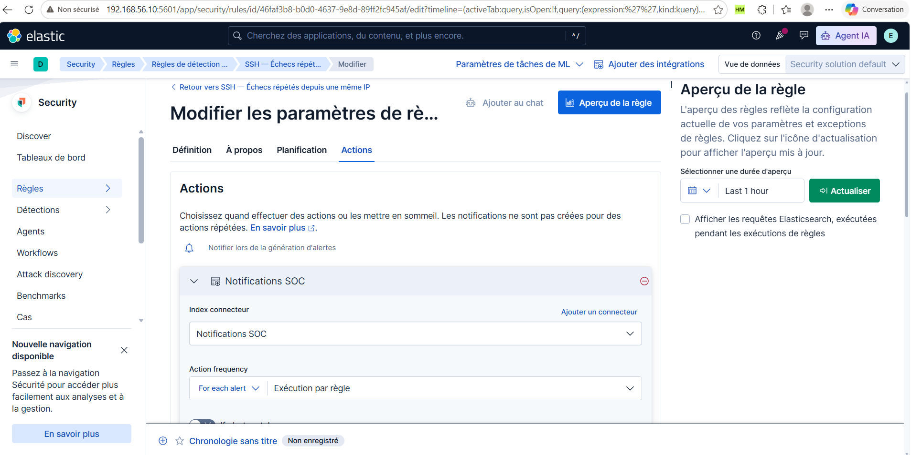
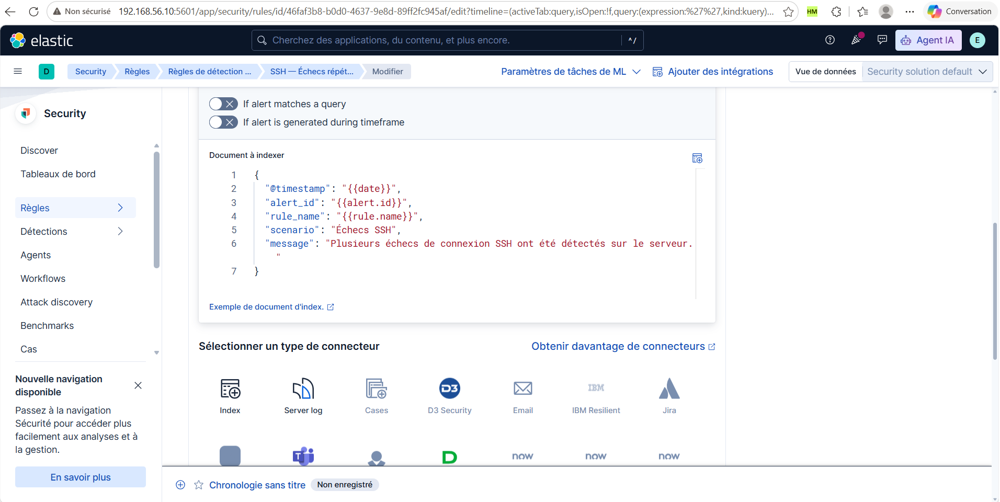

# Configuration des détections

## 1. Du journal à l'alerte Elastic Security

Les événements collectés et les alertes de détection sont deux résultats distincts. Les journaux SSH sont indexés dans `lab-syslog-system` ; les événements Suricata sont indexés dans `lab-syslog-ids`. Les règles Elastic Security recherchent ensuite les événements correspondant à leurs critères et génèrent des alertes.

La collecte, les pipelines `system-logs`, `ssh-auth` et `suricata-json` sont décrits dans le [guide syslog-ng](03-installation-syslog-ng.md). Les signatures réseau et leurs SID sont décrits dans le [guide Suricata](04-installation-suricata.md).

## 2. SSH — Échecs répétés depuis une même IP

### Objectif et événements utilisés

Cette règle recherche des échecs d'authentification SSH répétés provenant d'une même adresse IP. Ces répétitions peuvent signaler une recherche de mot de passe. Elles ne démontrent pas qu'une connexion a réussi.

Le pipeline `ssh-auth` extrait les champs des messages `Failed password for ...` émis par `sshd`, notamment `user.name`, `source.ip` et `source.port`. Il ajoute `event.outcome: failure`, `event.category: authentication` et `event.action: ssh_login_failed`. Ces champs permettent de sélectionner les échecs et de regrouper les événements pour une détection par seuil.

### 2.1. Définition

Dans Kibana, ouvrir **Security → Règles → Règles de détection**, sélectionner la règle SSH puis **Modifier → Définition**. Pour la recréer, ouvrir la création d'une règle et choisir le type **Seuil**.


**Lecture :** le type **Seuil** est sélectionné et le modèle d'indexation est `lab-syslog-system`. La règle travaille donc sur les journaux système collectés, plutôt que sur les événements du capteur Suricata.


| Paramètre | Valeur observée | Fonction |
| --- | --- | --- |
| Requête personnalisée | `event.action : "ssh_login_failed"` | Sélectionne les échecs SSH normalisés par le pipeline |
| Regrouper par | `source.ip` | Compte séparément les événements de chaque adresse source |
| Seuil | ≥ 5 | Déclenche lorsque le groupe contient au moins cinq événements correspondants dans la période recherchée |
| Compte | Tous les résultats | Aucun champ de cardinalité sélectionné |
| Valeurs uniques | Non renseigné | Aucun minimum de valeurs distinctes ajouté |
| Supprimer les alertes par champs sélectionnés | Case non cochée | Suppression des alertes non activée |

**Lecture :** cinq échecs depuis la même IP peuvent satisfaire le seuil ; cinq échecs répartis entre cinq IP différentes ne le satisfont pas si chaque groupe ne contient qu'un événement. La règle n'exige pas cinq utilisateurs distincts. Les contrôles grisés de suppression, dont la durée affichée de cinq minutes, ne sont pas actifs et ne définissent pas la période de recherche.

La requête est ici visible dans le champ **Requête personnalisée** de la règle. Elle correspond au filtre montré auparavant dans la Chronologie. La page récapitulative présentée en section 2.4 confirme que le langage de cette requête est **KQL**.

Pour recréer la définition :

1. Dans **Security → Règles → Règles de détection**, créer une règle de type **Seuil**.
2. Choisir **Modèles d'indexation** et renseigner uniquement `lab-syslog-system`.
3. Sélectionner **KQL** et saisir `event.action : "ssh_login_failed"` dans **Requête personnalisée**.
4. Dans **Regrouper par**, sélectionner `source.ip`, puis renseigner le seuil **5**.
5. Laisser **Compte** sur **Tous les résultats** et **Valeurs uniques** vide.
6. Conserver la suppression des alertes désactivée.
7. Renseigner **À propos** et **Planification** avec les valeurs des sections suivantes, puis enregistrer et activer la règle.

### 2.2. Nom, description et priorité

Ouvrir l'onglet **À propos**.


| Paramètre | Valeur observée |
| --- | --- |
| Nom | SSH — Échecs répétés depuis une même IP |
| Sévérité par défaut | Moyenne |
| Score de risque par défaut | 47 |
| Remplacement de la sévérité | Case non cochée |
| Remplacement du score de risque | Case non cochée |

Description affichée, à reprendre pour recréer la règle :

> Cette alerte est générée lorsque plusieurs échecs d’authentification SSH provenant d’une même adresse IP sont enregistrés sur le serveur. La répétition des tentatives peut correspondre à une recherche de mot de passe visant à obtenir un accès non autorisé. Elle signale les échecs observés, sans indiquer qu’une connexion a réussi.

**Lecture :** la sévérité et le score définissent la priorité attribuée à l'alerte. Le score 47 n'est ni le nombre d'échecs, ni le seuil de déclenchement, ni une probabilité de compromission.

### 2.3. Planification

Ouvrir l'onglet **Planification**.


| Paramètre | Valeur observée | Fonction |
| --- | --- | --- |
| S'exécute toutes les | 1 minute | Fréquence planifiée de la recherche |
| Temps de récupération supplémentaire | 5 minutes | Étend la période de recherche vers le passé |

**Lecture :** la règle est planifiée chaque minute. Les cinq minutes supplémentaires servent à rechercher des événements sur une période plus large ; elles ne signifient pas que la règle s'exécute toutes les cinq minutes. Le sélecteur **Last 1 hour** du panneau de droite concerne l'aperçu, pas la fréquence d'exécution.

Une fréquence d'une minute ne garantit pas une notification en moins d'une minute : l'événement doit être collecté, indexé, recherché et satisfaire les conditions de la règle avant l'envoi éventuel d'une notification.

### 2.4. Activation et exécution de la règle

Après enregistrement, revenir à la page de la règle et vérifier son activation.


| Élément visible | Valeur observée | Lecture |
| --- | --- | --- |
| Interrupteur Activer | Bleu, coché | La règle est activée |
| Dernière réponse | succeeded, 30 septembre 2026 à 23:31:54.989 | La dernière exécution affichée a réussi |
| Langage de requête personnalisé | KQL | Langage utilisé pour la sélection des événements |
| Seuil | Résultats agrégés par source.ip ≥ 5 | Confirme le regroupement et le seuil enregistrés |
| Nombre maximal d'alertes par exécution | 100 | Limite de production d'alertes lors d'une exécution |
| Modèle de chronologie | Aucune | Aucun modèle associé |

**Lecture :** le statut `succeeded` atteste une exécution réussie, mais ne signifie pas qu'une alerte a été produite à cette exécution. La limite de 100 concerne les alertes générées ; elle ne remplace pas le seuil de cinq événements SSH.

Pour reproduire cette capture, ouvrir la règle **SSH — Échecs répétés depuis une même IP**, sélectionner **Aperçu** et afficher ensemble l'interrupteur, la dernière réponse et la définition. Lors d'un test, rechercher dans Discover les événements `event.action : "ssh_login_failed"` de `lab-syslog-system` et contrôler leur `source.ip` ainsi que leur heure.

Vérifier ensuite dans les alertes Elastic Security qu'une alerte porte le nom **SSH — Échecs répétés depuis une même IP**, puis ouvrir ses détails pour contrôler le groupe source et le nombre d'événements ayant satisfait le seuil. Une capture de l'éditeur décrit la configuration ; la preuve d'exécution doit montrer l'activation et une alerte effectivement produite.

La définition enregistrée, le langage KQL, l'activation et une exécution réussie sont attestés. Le [guide d'utilisation](06-guide-utilisation.md#25-vérifier-lalerte-elastic-security) présente le test et sa preuve : cinq échecs depuis Kali, cinq événements indexés et une alerte SSH à 23:47:56.613 mentionnant 192.168.56.101. Les détails confirment le groupe `source.ip`, l'adresse `192.168.56.101` et le seuil configuré 5. Le compteur interne des événements agrégés n'est pas affiché ; le guide distingue ce compteur du paramètre de seuil. L'action Index visible est documentée ci-dessous. Le mécanisme de courriel et sa preuve de réception restent à préciser.

### 2.5. Action « Notifications SOC »

Dans **Modifier → Actions**, l'action visible utilise un connecteur de type **Index**, nommé **Notifications SOC**.





| Paramètre visible | Valeur |
| --- | --- |
| Type de connecteur | Index |
| Nom | Notifications SOC |
| Mode de fréquence | For each alert |
| Fréquence | Exécution par règle |
| Condition « If alert matches a query » | Désactivée |
| Condition « If alert is generated during timeframe » | Désactivée |

**Lecture :** l'action est configurée par alerte et exécutée avec la règle, sans les deux conditions supplémentaires visibles. Elle demande l'indexation du document suivant ; les variables sont remplacées lors de l'exécution :

```json
{
  "@timestamp": "{{date}}",
  "alert_id": "{{alert.id}}",
  "rule_name": "{{rule.name}}",
  "scenario": "Échecs SSH",
  "message": "Plusieurs échecs de connexion SSH ont été détectés sur le serveur."
}
```

| Champ | Fonction |
| --- | --- |
| @timestamp | Date fournie au modèle d'action |
| alert_id | Identifiant de l'alerte |
| rule_name | Nom de la règle |
| scenario | Étiquette fixe du scénario SSH |
| message | Explication destinée à l'administrateur |

Pour reproduire l'action, sélectionner le connecteur **Index** existant **Notifications SOC**, reprendre la fréquence affichée et renseigner le document JSON. L'index cible retrouvé dans les éléments précédents du projet est `lab-notifications` ; le connecteur est identifié par `soc-notifications-index`. Les captures ci-dessus n'affichent pas les paramètres de cet index cible.

Ces images attestent la configuration dans l'éditeur, pas l'exécution de l'action ni la présence du document dans l'index cible. Le connecteur **Index** écrit dans Elasticsearch ; il n'envoie pas lui-même un courriel. L'icône **Email** au bas de l'écran appartient à la liste des types de connecteurs disponibles et ne prouve pas une action Email configurée.

### 2.6. Relais d'envoi de courriel

Le mécanisme mis en place dans le projet relie l'action Index à un script :

1. Le connecteur **Notifications SOC** écrit le document dans `lab-notifications`.
2. `/usr/local/sbin/soc_notifications.py` lit les notifications.
3. Un état SQLite local conserve les notifications traitées pour éviter leur renvoi.
4. Le script utilise SMTP SSL vers `smtp.gmail.com:465`.
5. Le service `soc-notifications.service` est lancé périodiquement par un timer systemd, réglé à 10 secondes lors des essais.

Ces paramètres ont été retrouvés dans les éléments précédents du projet. Les fichiers du service et du timer sont fournis ci-dessous. Le script et sa configuration sans secrets restent à intégrer pour rendre l'installation du relais entièrement reproductible. Le nom d'expéditeur retenu est **Ne pas répondre - Alertes SOC**.

#### Vérification du fonctionnement périodique

Sur Ubuntu :

```bash
systemctl list-timers --all | grep soc-notifications
sudo journalctl -u soc-notifications.service -n 30 --no-pager
```

L'extrait fourni le **1er octobre 2026** montre des démarrages à **09:49:45, 09:49:56, 09:50:07, 09:50:18, 09:50:29, 09:50:40 et 09:50:51**. Chaque passage affiche `Aucune nouvelle notification.` et le service termine avec `Deactivated successfully` et `Finished ... Envoi des alertes SOC par courriel`.

**Lecture :** les démarrages sont espacés de 11 secondes dans cet échantillon. Ils attestent une exécution périodique et une fin sans erreur signalée, sans établir à eux seuls le réglage exact du timer. La désactivation après chaque passage est compatible avec un service qui termine son traitement ; elle ne signifie pas ici une panne.

`Aucune nouvelle notification` indique qu'aucune notification nouvelle n'est à traiter à ces passages. Cela ne prouve ni un nouvel envoi ni la réception du courriel SSH de la veille. Le [guide d'utilisation](06-guide-utilisation.md) présente désormais la preuve complète du test SSH : notification dans `lab-notifications`, envoi journalisé à 23:48:07 le 30 septembre et courriel reçu avec le même `alert_id`.

### 2.7. Installer le service et le timer de notifications

Les unités fournies correspondent aux fichiers réellement utilisés :

- [soc-notifications.service](../config/notifications/soc-notifications.service), installé dans `/etc/systemd/system/soc-notifications.service`.
- [soc-notifications.timer](../config/notifications/soc-notifications.timer), installé dans `/etc/systemd/system/soc-notifications.timer`.

#### Service

```ini
[Unit]
Description=Envoi des alertes SOC par courriel
Wants=network-online.target
After=network-online.target elasticsearch.service

[Service]
Type=oneshot
User=root
UMask=0077
ExecStart=/usr/bin/python3 /usr/local/sbin/soc_notifications.py
```

| Directive | Fonction |
| --- | --- |
| Wants=network-online.target | Demande l'activation de la cible réseau |
| After=network-online.target elasticsearch.service | Ordonne le démarrage après ces unités lorsqu'elles sont démarrées ; ne garantit pas que l'API Elasticsearch est déjà prête |
| Type=oneshot | Exécute le script jusqu'à sa fin ; le processus ne reste pas actif en permanence |
| User=root | Exécute le script avec le compte root, comme dans le laboratoire |
| UMask=0077 | Retire les permissions du groupe et des autres lors de la création de fichiers par le service |
| ExecStart | Lance le script avec le Python système |

`After=elasticsearch.service` définit un ordre ; cette directive ne démarre pas à elle seule Elasticsearch. Le démarrage des services du laboratoire doit précéder l'utilisation du relais.

#### Timer

```ini
[Unit]
Description=Vérification périodique des nouvelles alertes SOC

[Timer]
OnBootSec=10s
OnUnitActiveSec=10s
AccuracySec=1s
Unit=soc-notifications.service

[Install]
WantedBy=timers.target
```

| Directive | Fonction |
| --- | --- |
| OnBootSec=10s | Programme un premier déclenchement dix secondes après le démarrage |
| OnUnitActiveSec=10s | Programme les déclenchements suivants à partir de la dernière activation du service |
| AccuracySec=1s | Définit une précision de planification d'une seconde ; ce n'est pas une garantie de délai d'envoi |
| Unit=soc-notifications.service | Désigne le service lancé |
| WantedBy=timers.target | Permet l'activation automatique du timer au démarrage |

La configuration confirme le réglage de dix secondes. Les intervalles de onze secondes observés dans les journaux ne changent pas cette valeur configurée. La durée du traitement et la planification peuvent influer sur les heures effectives. Le timer ne lance pas une seconde instance du même service s'il est déjà actif.

#### Déploiement et contrôles

**Prérequis :** le script existant `/usr/local/sbin/soc_notifications.py`, ses paramètres Elasticsearch/SMTP, son état SQLite et ses éventuelles dépendances doivent être installés avant l'activation. Les deux unités ne suffisent pas à recréer le relais sans ces éléments.

Depuis la racine du dépôt :

```bash
sudo install -m 0644 config/notifications/soc-notifications.service /etc/systemd/system/soc-notifications.service
sudo install -m 0644 config/notifications/soc-notifications.timer /etc/systemd/system/soc-notifications.timer
sudo systemd-analyze verify /etc/systemd/system/soc-notifications.service /etc/systemd/system/soc-notifications.timer
sudo systemctl daemon-reload
sudo systemctl enable --now soc-notifications.timer
```

`daemon-reload` recharge les définitions ; `enable --now` active immédiatement le timer et son démarrage automatique. C'est le timer qui est activé : le service oneshot fourni n'a pas de section Install.

Vérifier :

```bash
sudo systemctl cat soc-notifications.service soc-notifications.timer
systemctl is-enabled soc-notifications.timer
systemctl status soc-notifications.timer --no-pager -l
systemctl list-timers --all | grep soc-notifications
sudo journalctl -u soc-notifications.service -n 30 --no-pager
```

**Résultat attendu :** timer activé, prochaines et dernières exécutions visibles ; le service peut être inactif entre deux passages puisqu'il est de type oneshot. Lorsqu'une nouvelle notification est traitée, le journal doit être rapproché du document Elasticsearch et du courriel reçu, comme dans le test SSH documenté.

Pour produire la capture des fichiers de configuration, utiliser `sudo systemctl cat soc-notifications.service soc-notifications.timer`.
