# Configuration des détections

## 1. Du journal à l'alerte Elastic Security

Les événements collectés et les alertes de détection sont deux résultats distincts. Les journaux SSH sont indexés dans `lab-syslog-system` ; les événements Suricata sont indexés dans `lab-syslog-ids`. Les règles Elastic Security recherchent ensuite les événements correspondant à leurs critères et génèrent des alertes.

La collecte et les pipelines sont décrits dans le [guide syslog-ng](03-installation-syslog-ng.md), les signatures dans le [guide Suricata](04-installation-suricata.md). Pour créer une règle, ouvrir **Security → Règles → Règles de détection**. Après avoir renseigné sa définition, sa priorité, sa planification et son action, l’enregistrer et l’activer.

Les cinq règles utilisent une sévérité **moyenne**, un score de risque **47**, une exécution toutes les **minutes** et **cinq minutes de recherche supplémentaire** pour couvrir les arrivées tardives. Le score sert à prioriser le traitement. Le statut `succeeded` indique que la recherche s’est exécutée correctement ; les résultats des tests figurent dans le [guide d’utilisation](07-guide-utilisation.md).

## 2. SSH — Échecs répétés depuis une même IP

### Objectif et événements utilisés

Cette règle recherche des échecs d'authentification SSH répétés provenant d'une même adresse IP. Ces répétitions peuvent signaler une recherche de mot de passe. Elles ne démontrent pas qu'une connexion a réussi.

Le pipeline `ssh-auth` extrait les champs des messages `Failed password for ...` émis par `sshd`, notamment `user.name`, `source.ip` et `source.port`. Il ajoute `event.outcome: failure`, `event.category: authentication` et `event.action: ssh_login_failed`. Ces champs permettent de sélectionner les échecs et de regrouper les événements pour une détection par seuil.

### 2.1. Définition

Dans Kibana, ouvrir **Security → Règles → Règles de détection**, sélectionner la règle SSH puis **Modifier → Définition**. Pour la recréer, ouvrir la création d'une règle et choisir le type **Seuil**.


La règle utilise les journaux de `lab-syslog-system`.


| Paramètre | Valeur observée | Fonction |
| --- | --- | --- |
| Requête personnalisée | `event.action : "ssh_login_failed"` | Sélectionne les échecs SSH normalisés par le pipeline |
| Regrouper par | `source.ip` | Compte séparément les événements de chaque adresse source |
| Seuil | ≥ 5 | Déclenche lorsque le groupe contient au moins cinq événements correspondants dans la période recherchée |
| Compte | Tous les résultats | Aucun champ de cardinalité sélectionné |
| Valeurs uniques | Non renseigné | Aucun minimum de valeurs distinctes ajouté |
| Supprimer les alertes par champs sélectionnés | Case non cochée | Suppression des alertes non activée |

Le seuil s’applique séparément à chaque IP : cinq échecs provenant de cinq sources différentes ne déclenchent pas cette règle.

Pour recréer la définition :

1. Dans **Security → Règles → Règles de détection**, créer une règle de type **Seuil**.
2. Choisir **Modèles d'indexation** et renseigner uniquement `lab-syslog-system`.
3. Sélectionner **KQL** et saisir `event.action : "ssh_login_failed"` dans **Requête personnalisée**.
4. Dans **Regrouper par**, sélectionner `source.ip`, puis renseigner le seuil **5**.
5. Laisser **Compte** sur **Tous les résultats** et **Valeurs uniques** vide.
6. Conserver la suppression des alertes désactivée.
7. Renseigner **À propos** et **Planification** avec les valeurs des sections suivantes, puis enregistrer et activer la règle.

### 2.2. Nom, description et priorité

Ouvrir l'onglet **À propos**.


| Paramètre | Valeur observée |
| --- | --- |
| Nom | SSH — Échecs répétés depuis une même IP |
| Sévérité par défaut | Moyenne |
| Score de risque par défaut | 47 |
| Remplacement du score de risque | Case non cochée |

Description affichée, à reprendre pour recréer la règle :

> Cette alerte est générée lorsque plusieurs échecs d’authentification SSH provenant d’une même adresse IP sont enregistrés sur le serveur. La répétition des tentatives peut correspondre à une recherche de mot de passe visant à obtenir un accès non autorisé. Elle signale les échecs observés, sans indiquer qu’une connexion a réussi.

### 2.3. Planification

Ouvrir l'onglet **Planification**.


| Paramètre | Valeur observée | Fonction |
| --- | --- | --- |
| S'exécute toutes les | 1 minute | Fréquence planifiée de la recherche |
| Temps de récupération supplémentaire | 5 minutes | Étend la période de recherche vers le passé |

Les cinq minutes supplémentaires étendent la période recherchée vers le passé.

### 2.4. Activation et exécution de la règle

Après enregistrement, revenir à la page de la règle et vérifier son activation.


| Élément visible | Valeur observée | Lecture |
| --- | --- | --- |
| Interrupteur Activer | Bleu, coché | La règle est activée |
| Dernière réponse | succeeded, 30 septembre 2026 à 23:31:54.989 | La dernière exécution affichée a réussi |
| Langage de requête personnalisé | KQL | Langage utilisé pour la sélection des événements |
| Seuil | Résultats agrégés par source.ip ≥ 5 | Confirme le regroupement et le seuil enregistrés |

Le [test SSH](07-guide-utilisation.md#2-reproduire-le-scénario-ssh) relie les cinq échecs, les journaux collectés et l’alerte produite.

### 2.5. Action « Notifications SOC »

Dans **Modifier → Actions**, l'action visible utilise un connecteur de type **Index**, nommé **Notifications SOC**.


| Paramètre visible | Valeur |
| --- | --- |
| Type de connecteur | Index |
| Nom | Notifications SOC |
| Mode de fréquence | For each alert |
| Fréquence | Exécution par règle |
| Condition « If alert matches a query » | Désactivée |
| Condition « If alert is generated during timeframe » | Désactivée |

Le connecteur indexe un document par alerte. Les variables sont remplacées lors de l’exécution :

```json
{
  "@timestamp": "{{date}}",
  "alert_id": "{{alert.id}}",
  "rule_name": "{{rule.name}}",
  "scenario": "Échecs SSH",
  "message": "Plusieurs échecs de connexion SSH ont été détectés sur le serveur."
}
```

| Champ | Fonction |
| --- | --- |
| @timestamp | Date fournie au modèle d'action |
| alert_id | Identifiant de l'alerte |
| rule_name | Nom de la règle |
| scenario | Étiquette fixe du scénario SSH |
| message | Explication destinée à l'administrateur |

Utiliser le connecteur **Index** nommé **Notifications SOC**, identifié par `soc-notifications-index`, avec `lab-notifications` comme index cible.

L’action Index enregistre la notification. Le relais Python décrit ci-dessous assure l’envoi du courriel.

### 2.6. Relais d'envoi de courriel

Le mécanisme mis en place dans le projet relie l'action Index à un script :

1. Le connecteur **Notifications SOC** écrit le document dans `lab-notifications`.
2. `/usr/local/sbin/soc_notifications.py` lit les notifications.
3. Un état SQLite local conserve les notifications traitées pour éviter leur renvoi.
4. Le script utilise SMTP SSL vers `smtp.gmail.com:465`.
5. Le service `soc-notifications.service` est lancé périodiquement par un timer systemd, réglé à 10 secondes lors des essais.

Les fichiers du relais sont fournis dans le dépôt. Le nom d’expéditeur est **Ne pas répondre - Alertes SOC**.

#### Vérification du fonctionnement périodique

Sur Ubuntu :

```bash
systemctl list-timers --all | grep soc-notifications
sudo journalctl -u soc-notifications.service -n 30 --no-pager
```

Le journal du 1er octobre montre une exécution environ toutes les onze secondes. Le service termine chaque passage avec succès.

Le service est de type `oneshot` : il s’arrête après chaque traitement et reste inactif jusqu’au déclenchement suivant.

`Aucune nouvelle notification` signifie qu’aucun document nouveau n’est à traiter. Les exemples d’envoi et de réception figurent dans le [guide d’utilisation](07-guide-utilisation.md).

### 2.7. Installer le service et le timer de notifications

Installer les deux unités suivantes :

- [soc-notifications.service](../config/notifications/soc-notifications.service), installé dans `/etc/systemd/system/soc-notifications.service`.
- [soc-notifications.timer](../config/notifications/soc-notifications.timer), installé dans `/etc/systemd/system/soc-notifications.timer`.

#### Service

```ini
[Unit]
Description=Envoi des alertes SOC par courriel
Wants=network-online.target
After=network-online.target elasticsearch.service

[Service]
Type=oneshot
User=root
UMask=0077
ExecStart=/usr/bin/python3 /usr/local/sbin/soc_notifications.py
```

| Directive | Fonction |
| --- | --- |
| Wants=network-online.target | Demande l'activation de la cible réseau |
| After=network-online.target elasticsearch.service | Ordonne le démarrage après ces unités lorsqu'elles sont démarrées ; ne garantit pas que l'API Elasticsearch est déjà prête |
| Type=oneshot | Exécute le script jusqu'à sa fin ; le processus ne reste pas actif en permanence |
| User=root | Exécute le script avec le compte root, comme dans le laboratoire |
| UMask=0077 | Retire les permissions du groupe et des autres lors de la création de fichiers par le service |
| ExecStart | Lance le script avec le Python système |

`After=elasticsearch.service` définit un ordre ; cette directive ne démarre pas à elle seule Elasticsearch. Le démarrage des services du laboratoire doit précéder l'utilisation du relais.

#### Timer

```ini
[Unit]
Description=Vérification périodique des nouvelles alertes SOC

[Timer]
OnBootSec=10s
OnUnitActiveSec=10s
AccuracySec=1s
Unit=soc-notifications.service

[Install]
WantedBy=timers.target
```

| Directive | Fonction |
| --- | --- |
| OnBootSec=10s | Programme un premier déclenchement dix secondes après le démarrage |
| OnUnitActiveSec=10s | Programme les déclenchements suivants à partir de la dernière activation du service |
| AccuracySec=1s | Définit une précision de planification d'une seconde ; ce n'est pas une garantie de délai d'envoi |
| Unit=soc-notifications.service | Désigne le service lancé |
| WantedBy=timers.target | Permet l'activation automatique du timer au démarrage |

Le timer est réglé à dix secondes. L’intervalle effectif dépend de la durée du traitement ; une instance déjà active n’est pas relancée.

#### Déploiement et contrôles

Installer d’abord le script et sa configuration selon la section 2.8, puis activer les unités ci-dessous.

Depuis la racine du dépôt :

```bash
sudo install -m 0644 config/notifications/soc-notifications.service /etc/systemd/system/soc-notifications.service
sudo install -m 0644 config/notifications/soc-notifications.timer /etc/systemd/system/soc-notifications.timer
sudo systemd-analyze verify /etc/systemd/system/soc-notifications.service /etc/systemd/system/soc-notifications.timer
sudo systemctl daemon-reload
sudo systemctl enable --now soc-notifications.timer
```

`daemon-reload` recharge les définitions ; `enable --now` active immédiatement le timer et son démarrage automatique. C'est le timer qui est activé : le service oneshot fourni n'a pas de section Install.

Vérifier :

```bash
sudo systemctl cat soc-notifications.service soc-notifications.timer
systemctl is-enabled soc-notifications.timer
systemctl status soc-notifications.timer --no-pager -l
systemctl list-timers --all | grep soc-notifications
sudo journalctl -u soc-notifications.service -n 30 --no-pager
```

Le timer doit être actif et afficher ses dernières et prochaines exécutions. Le service peut être inactif entre deux passages.

### 2.8. Installer le script et sa configuration

Le script [soc_notifications.py](../scripts/soc_notifications.py) utilise la bibliothèque standard Python.

| Ressource | Chemin utilisé |
| --- | --- |
| Script | /usr/local/sbin/soc_notifications.py |
| Configuration JSON | /etc/soc-notifications.json |
| Autorité de certification Elasticsearch | /etc/elasticsearch/certs/http_ca.crt |
| État SQLite | /var/lib/soc-notifications/etat.db |
| Source des notifications | https://localhost:9200/lab-notifications/_search |
| Serveur SMTP SSL | smtp.gmail.com:465 |

Depuis la racine du dépôt, installer Python si nécessaire puis le script :

```bash
sudo apt install -y python3
sudo install -o root -g root -m 0750 scripts/soc_notifications.py /usr/local/sbin/soc_notifications.py
sudo install -d -o root -g root -m 0700 /var/lib/soc-notifications
sudo test -r /etc/elasticsearch/certs/http_ca.crt && echo "Certificat CA accessible"
```

Le script vérifie HTTPS avec le certificat CA généré par Elasticsearch.

Sur une première installation, installer le [modèle JSON](../config/notifications/soc-notifications.json.example), puis remplacer localement les valeurs :

```bash
sudo install -o root -g root -m 0600 config/notifications/soc-notifications.json.example /etc/soc-notifications.json
sudo nano /etc/soc-notifications.json
```

Ne pas écraser une configuration existante avec le modèle. Le fichier doit contenir les quatre clés suivantes :

```json
{
  "cle_elastic": "<CLE_API_ELASTIC_ENCODEE>",
  "expediteur": "<ADRESSE_GMAIL_DU_LABORATOIRE>",
  "mot_de_passe_gmail": "<MOT_DE_PASSE_APPLICATION_GMAIL>",
  "destinataire": "<ADRESSE_DESTINATAIRE>"
}
```

| Clé | Valeur à renseigner |
| --- | --- |
| cle_elastic | Clé API Elasticsearch encodée utilisée après le préfixe ApiKey |
| expediteur | Compte Gmail utilisé pour l'authentification SMTP et l'expéditeur |
| mot_de_passe_gmail | Secret SMTP du compte du laboratoire |
| destinataire | Adresse de réception des alertes |

La clé API doit autoriser la lecture de `lab-notifications`. Pour créer une clé dédiée à cette lecture dans Dev Tools, avec un compte autorisé :

```http
POST /_security/api_key
{
  "name": "soc-notifications-reader",
  "role_descriptors": {
    "notifications_reader": {
      "cluster": [],
      "indices": [
        {
          "names": ["lab-notifications"],
          "privileges": ["read"]
        }
      ]
    }
  }
}
```

Copier la valeur **encoded** de la réponse dans `cle_elastic`, sur le serveur. Cette clé autorise la lecture des notifications ; le connecteur Kibana assure leur écriture.

Contrôler les fichiers sans afficher les secrets :

```bash
sudo python3 -c 'import ast; from pathlib import Path; ast.parse(Path("/usr/local/sbin/soc_notifications.py").read_text()); print("Syntaxe Python valide")'
sudo python3 -c 'import json; p="/etc/soc-notifications.json"; c=json.load(open(p)); k={"cle_elastic","expediteur","mot_de_passe_gmail","destinataire"}; assert k.issubset(c) and all(isinstance(c[x],str) and c[x] and not c[x].startswith("<") for x in k); print("Clés de configuration renseignées")'
sudo stat -c '%a %U:%G %n' /etc/soc-notifications.json /usr/local/sbin/soc_notifications.py /var/lib/soc-notifications
```

Les modes attendus sont **600**, **750** et **700**, avec le propriétaire `root`.

Installer ensuite les unités et activer le timer suivant la section 2.7. Sur une installation existante, une modification du script ou du JSON sera lue lors du passage suivant ; `daemon-reload` concerne les modifications des unités systemd.

#### Traitement et déduplication

À chaque passage, le script :

1. Lit jusqu'à **1 000 documents**, triés par date décroissante.
2. Inverse cette liste pour traiter les documents retournés du plus ancien au plus récent.
3. Compare chaque `_id` Elasticsearch à la table SQLite `envoyees`.
4. Ouvre une session SMTP SSL si de nouvelles notifications existent.
5. Envoie un message par document, puis enregistre son `_id` dans SQLite après l'envoi.

Le champ `alert_id` est inclus dans le courriel pour relier la notification à l'alerte. La déduplication est fondée sur le **_id du document de notification**, et non sur `alert_id`. Deux documents distincts associés à la même alerte peuvent donc entraîner deux courriels.

Le script génère une explication adaptée aux cinq scénarios à partir de leur nom. Il conserve la distinction entre une tentative détectée et une exploitation réussie. Les délais configurés sont de **10 secondes** pour la requête HTTPS et de **15 secondes** pour les opérations SMTP.

Conserver la base d'état entre les passages. La supprimer peut provoquer le renvoi des notifications présentes dans les 1 000 derniers documents. Au premier démarrage avec une base vide, le script peut traiter des notifications historiques déjà présentes.

La lecture est limitée aux 1 000 dernières notifications. Une interruption entre l’envoi SMTP et l’enregistrement SQLite peut provoquer un renvoi au passage suivant.

## 3. Scan de ports potentiel — nombreux ports contactés

### Objectif et événements utilisés

Cette règle détecte une source contactant de nombreux ports d’un serveur, comportement caractéristique d’une reconnaissance réseau. Elle utilise les événements **flow** de Suricata dans `lab-syslog-ids`.

### 3.1. Définition et conditions de déclenchement

Dans **Security → Règles → Règles de détection**, sélectionner **Scan de ports potentiel — nombreux ports contactés**, puis **Modifier → Définition**. Pour la recréer, choisir le type **Seuil** et le modèle d'indexation `lab-syslog-ids`.

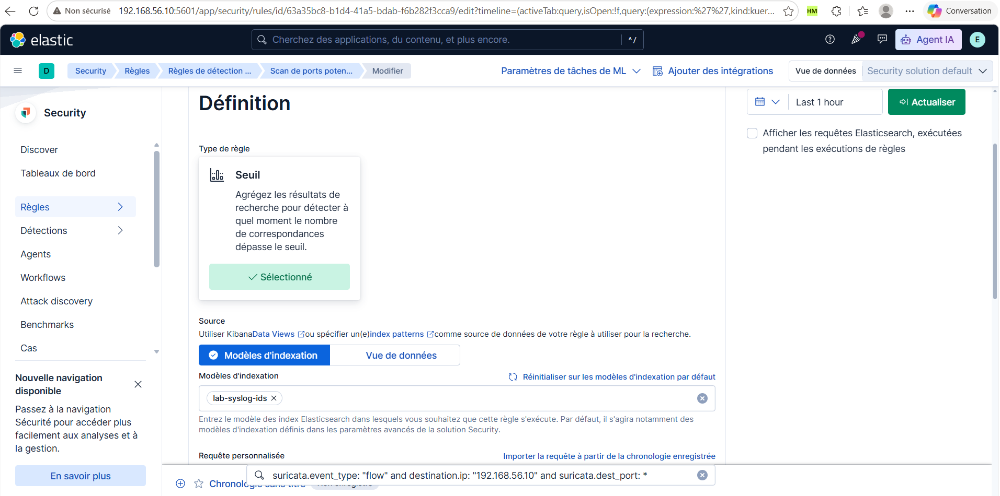

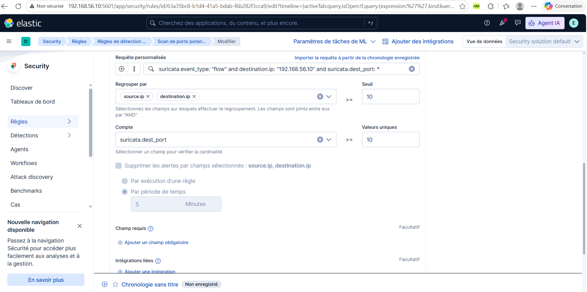

Requête à reprendre dans le champ **Requête personnalisée**, en KQL :

```text
suricata.event_type: "flow" and destination.ip: "192.168.56.10" and suricata.dest_port: *
```

| Paramètre | Valeur observée | Fonction |
| --- | --- | --- |
| Regrouper par | source.ip et destination.ip | Constitue un groupe par couple source–destination |
| Seuil | ≥ 10 | Exige au moins dix événements correspondants par groupe |
| Compte | suricata.dest_port | Champ utilisé pour mesurer la cardinalité |
| Valeurs uniques | ≥ 10 | Exige au moins dix ports de destination distincts |
| Suppression des alertes | Case non cochée | Suppression désactivée |

Les deux seuils doivent être atteints dans le même groupe : dix événements concernant un seul port ne suffisent pas. Le filtre `suricata.dest_port: *` exige la présence du champ.

Saisir la requête, sélectionner les deux champs de regroupement, puis renseigner **10** pour le seuil et **10** valeurs uniques de **suricata.dest_port**. Laisser la suppression désactivée.

### 3.2. Nom, description et priorité

Ouvrir **À propos**.

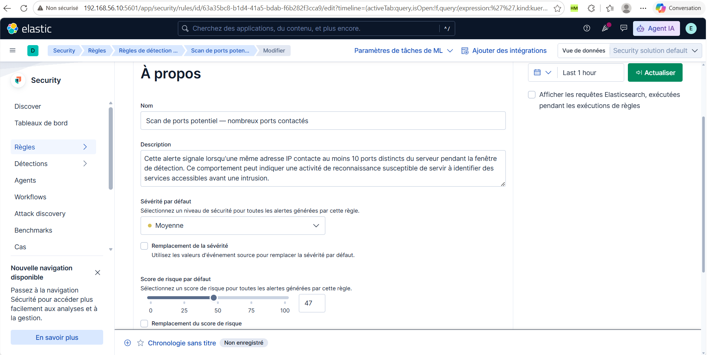

| Paramètre | Valeur observée |
| --- | --- |
| Nom | Scan de ports potentiel — nombreux ports contactés |
| Sévérité par défaut | Moyenne |
| Score de risque par défaut | 47 |
| Remplacement du score de risque | Désactivé |

Description à reprendre :

> Cette alerte signale lorsqu'une même adresse IP contacte au moins 10 ports distincts du serveur pendant la fenêtre de détection. Ce comportement peut indiquer une activité de reconnaissance susceptible de servir à identifier des services accessibles avant une intrusion.

### 3.3. Planification

Ouvrir **Planification**, reprendre les valeurs suivantes puis enregistrer les modifications.

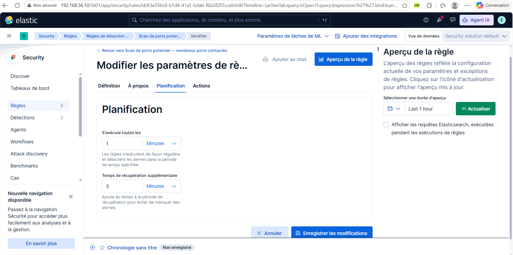

| Paramètre | Valeur observée |
| --- | --- |
| S'exécute toutes les | 1 minute |
| Temps de récupération supplémentaire | 5 minutes |

Les flux doivent être produits, collectés et indexés avant l’exécution de la règle. Leur écriture par Suricata peut suivre la fin du scan.

### 3.4. Activation et dernière exécution

Revenir à la page de la règle, dans l'onglet **Aperçu**.

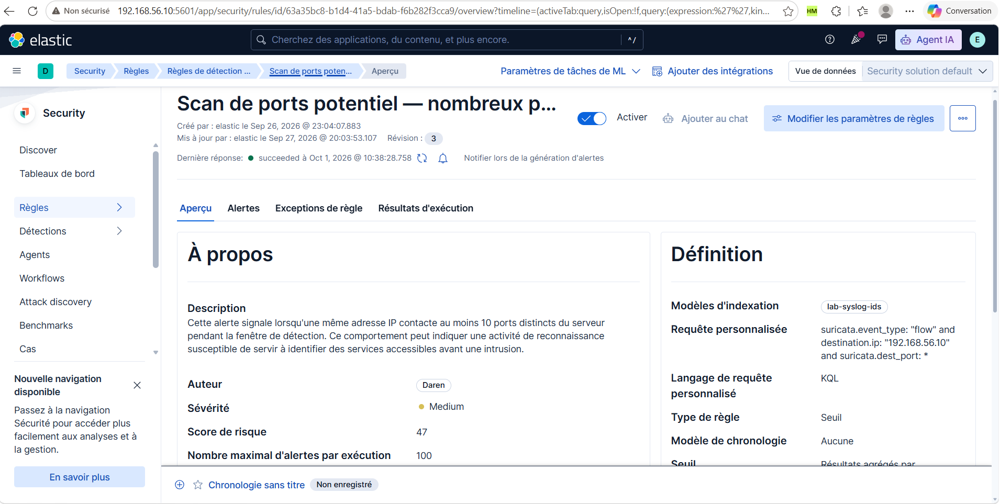

| Élément | Valeur observée | Lecture |
| --- | --- | --- |
| Activer | Interrupteur bleu, coché | Règle activée |
| Dernière réponse | succeeded, 1er octobre 2026 à 10:38:28.758 | Dernière exécution affichée réussie |
| Modèle d'indexation | lab-syslog-ids | Source des événements réseau |
| Langage | KQL | Confirme le langage de la requête enregistrée |
| Type | Seuil | Détection par agrégation |
| Auteur | Daren | Auteur renseigné |
| Sévérité / risque | Medium / 47 | Priorité de l'alerte |

### 3.5. Action « Notifications SOC »

Ouvrir **Modifier → Actions**, puis développer **Notifications SOC**.

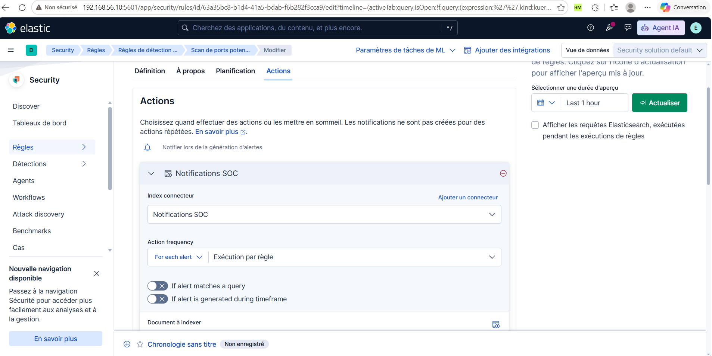

| Paramètre | Valeur observée |
| --- | --- |
| Type de connecteur | Index |
| Connecteur | Notifications SOC |
| Mode | For each alert |
| Fréquence | Exécution par règle |
| Condition par requête | Désactivée |
| Condition par plage horaire | Désactivée |

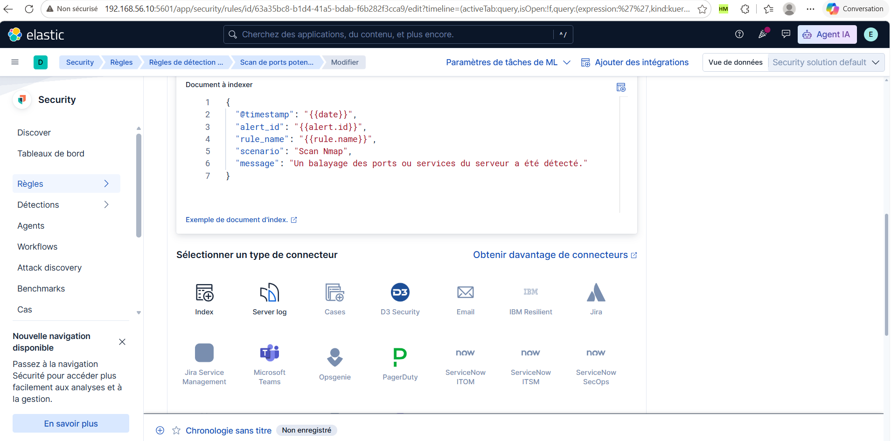

Document à reprendre :

```json
{
  "@timestamp": "{{date}}",
  "alert_id": "{{alert.id}}",
  "rule_name": "{{rule.name}}",
  "scenario": "Scan Nmap",
  "message": "Un balayage des ports ou services du serveur a été détecté."
}
```

Le libellé **Scan Nmap** désigne le scénario du laboratoire. La détection repose sur les ports contactés, sans identifier l’outil utilisé.

Pour reproduire l'action, choisir le connecteur Index existant **Notifications SOC**, sélectionner **For each alert → Exécution par règle**, laisser les deux conditions supplémentaires désactivées, saisir ce document et enregistrer.

Le relais décrit en sections 2.6 à 2.8 lit `lab-notifications` et transmet le courriel.

Les résultats sont présentés dans le [test Nmap](07-guide-utilisation.md#4-reproduire-le-scénario-de-scan-nmap).

## 4. Tentative d’exploitation de Log4Shell - JNDI

### 4.1. Objectif et définition

Cette règle Elastic Security recherche les alertes produites par la signature locale Suricata **1000002**, décrite dans le [guide Suricata](04-installation-suricata.md). Cette signature inspecte le User-Agent des requêtes HTTP vers le port 80 et recherche le motif littéral `${jndi:`, sans distinction de casse.

La détection indique la présence de ce motif dans le trafic inspecté. Elle ne prouve pas qu'une application vulnérable l'a interprété, qu'une résolution JNDI a eu lieu ou que du code a été exécuté.

Dans **Security → Règles → Règles de détection**, ouvrir la règle puis **Modifier → Définition**. Pour la recréer, choisir **Requête personnalisée** et le modèle d'indexation `lab-syslog-ids`.

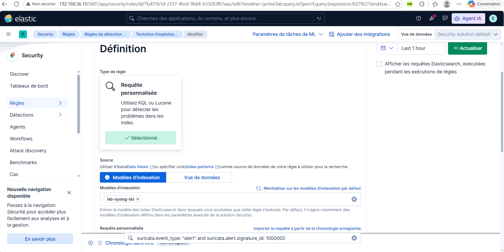

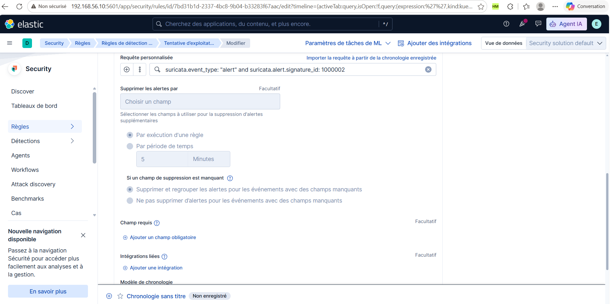

Saisir la requête suivante dans le champ **Requête personnalisée**, en KQL :

```text
suricata.event_type: "alert" and suricata.alert.signature_id: 1000002
```

| Paramètre | Valeur observée | Fonction |
| --- | --- | --- |
| Type | Requête personnalisée | Recherche les documents correspondant au filtre |
| Index | lab-syslog-ids | Événements Suricata collectés |
| suricata.event_type | alert | Sélectionne les alertes IDS |
| suricata.alert.signature_id | 1000002 | Sélectionne la signature locale JNDI |
| Supprimer les alertes par | Aucun champ sélectionné | Aucun regroupement de suppression configuré |

La règle sélectionne les événements de la signature **1000002**, sans seuil de répétition.

### 4.2. Nom, description et priorité

Ouvrir **À propos** et reprendre :

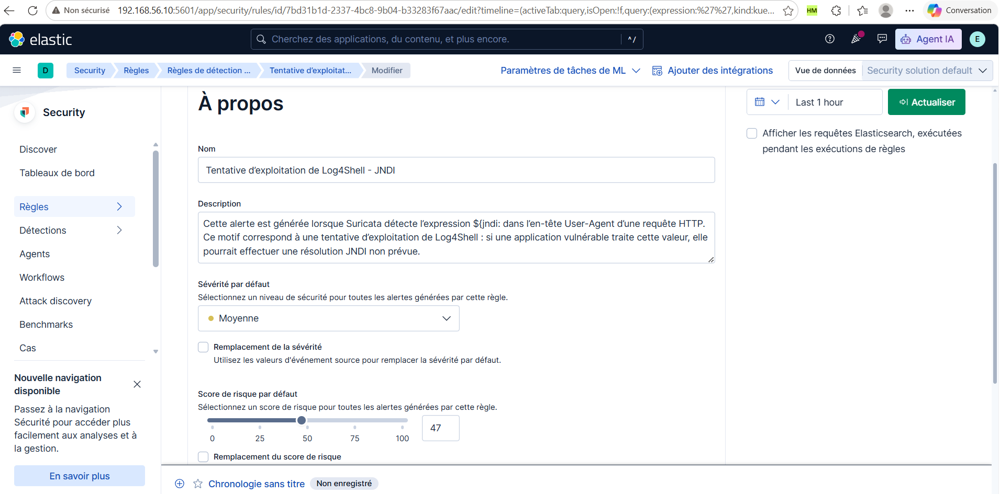

| Paramètre | Valeur observée |
| --- | --- |
| Nom | Tentative d’exploitation de Log4Shell - JNDI |
| Sévérité par défaut | Moyenne |
| Score de risque par défaut | 47 |
| Remplacement du score de risque | Désactivé |

Description affichée :

> Cette alerte est générée lorsque Suricata détecte l’expression `${jndi:` dans l’en-tête User-Agent d’une requête HTTP. Ce motif correspond à une tentative d’exploitation de Log4Shell : si une application vulnérable traite cette valeur, elle pourrait effectuer une résolution JNDI non prévue.

### 4.3. Planification

Ouvrir **Planification**.

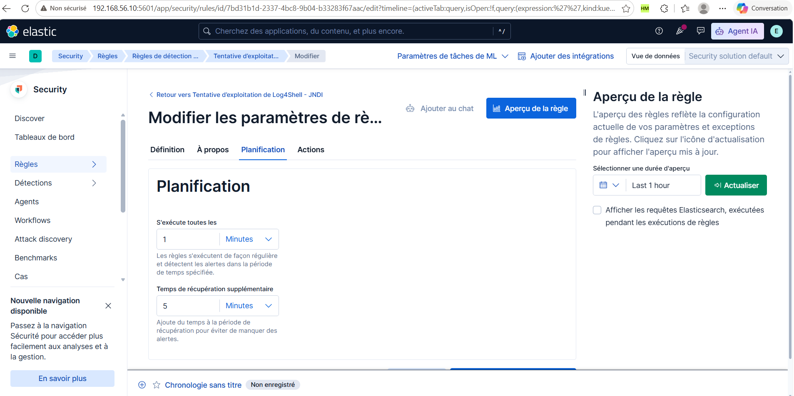

| Paramètre | Valeur observée |
| --- | --- |
| S'exécute toutes les | 1 minute |
| Temps de récupération supplémentaire | 5 minutes |

### 4.4. Action « Notifications SOC »

Ouvrir **Actions**, développer **Notifications SOC**, puis choisir le connecteur Index existant.

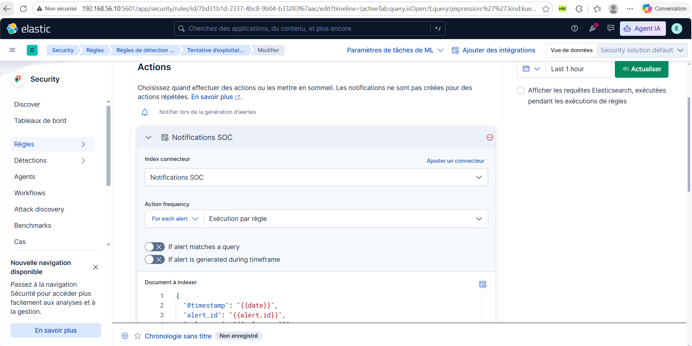

| Paramètre | Valeur observée |
| --- | --- |
| Connecteur | Notifications SOC |
| Type | Index |
| Mode | For each alert |
| Fréquence | Exécution par règle |
| Condition par requête | Désactivée |
| Condition par plage horaire | Désactivée |

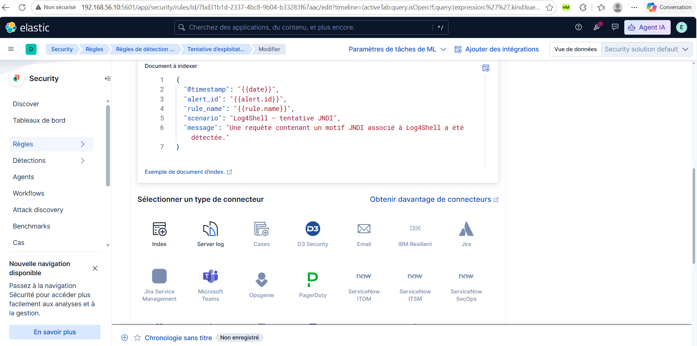

Document à reprendre :

```json
{
  "@timestamp": "{{date}}",
  "alert_id": "{{alert.id}}",
  "rule_name": "{{rule.name}}",
  "scenario": "Log4Shell — tentative JNDI",
  "message": "Une requête contenant un motif JNDI associé à Log4Shell a été détectée."
}
```

L’action écrit dans `lab-notifications`. Le relais décrit en sections 2.6 à 2.8 transmet le courriel.

Enregistrer la configuration, puis revenir à **Aperçu** pour contrôler l’activation.

### 4.5. Activation et exécution

Après enregistrement, revenir à l'onglet **Aperçu** de la règle.

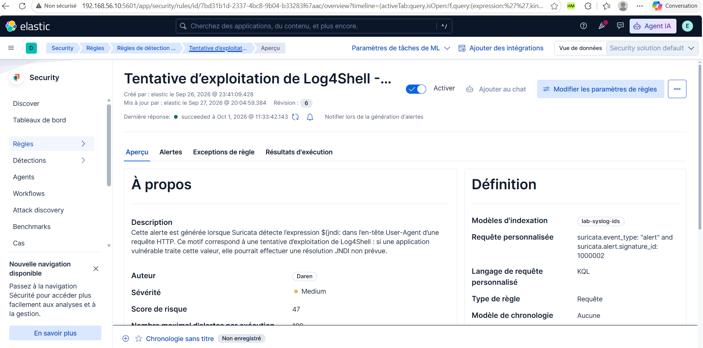

| Élément visible | Valeur observée |
| --- | --- |
| Activer | Interrupteur bleu, coché |
| Dernière réponse | succeeded, 1er octobre 2026 à 11:33:42.143 |
| Auteur | Daren |
| Index | lab-syslog-ids |
| Requête | suricata.event_type: "alert" and suricata.alert.signature_id: 1000002 |
| Langage | KQL |
| Type de règle | Requête |
| Sévérité / score de risque | Medium / 47 |

La règle est activée et sa dernière exécution affiche `succeeded`.

Le [test JNDI](07-guide-utilisation.md#5-reproduire-le-scénario-log4shell--tentative-jndi) présente la requête HTTP, les alertes et le courriel.

## 5. Tentative d'injection SQL

### 5.1. Objectif et définition

La règle Elastic Security sélectionne les documents associés à la signature locale Suricata **1000004**, décrite dans le [guide Suricata](04-installation-suricata.md). Cette signature inspecte les données envoyées au formulaire `/apptest/login.php` et détecte des motifs SQL. L'alerte indique une tentative ; la réussite du contournement d'authentification doit être vérifiée dans le résultat du test applicatif.

Ouvrir **Security → Règles → Règles de détection → Tentative d'injection SQL → Modifier → Définition**. Pour recréer la règle, choisir **Requête personnalisée**, l'index `lab-syslog-ids` et le langage KQL.

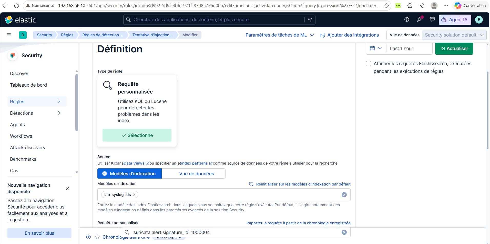

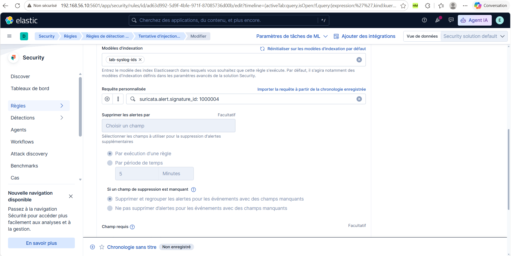

Requête enregistrée :

```text
suricata.alert.signature_id: 1000004
```

| Paramètre | Valeur observée | Fonction |
| --- | --- | --- |
| Type | Requête personnalisée | Sélection des documents correspondant au filtre |
| Index | lab-syslog-ids | Source des événements Suricata |
| Langage | KQL | Langage confirmé dans Aperçu |
| Signature | 1000004 | SID de la signature locale SQLi |
| Supprimer les alertes par | Aucun champ choisi | Aucun regroupement de suppression configuré |

La requête filtre sur le SID **1000004**, sans condition supplémentaire sur `suricata.event_type` ni seuil de répétition.

### 5.2. Nom, description et priorité

Ouvrir **À propos**.

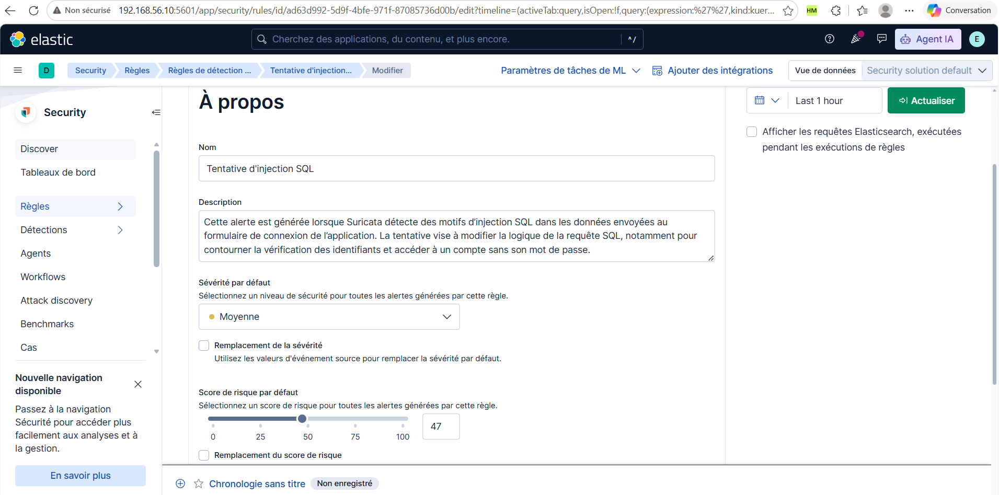

| Paramètre | Valeur observée |
| --- | --- |
| Nom | Tentative d'injection SQL |
| Sévérité par défaut | Moyenne |
| Score de risque par défaut | 47 |
| Remplacement du score de risque | Désactivé |

Description à reprendre :

> Cette alerte est générée lorsque Suricata détecte des motifs d’injection SQL dans les données envoyées au formulaire de connexion de l’application. La tentative vise à modifier la logique de la requête SQL, notamment pour contourner la vérification des identifiants et accéder à un compte sans son mot de passe.

### 5.3. Planification

Ouvrir **Planification**.

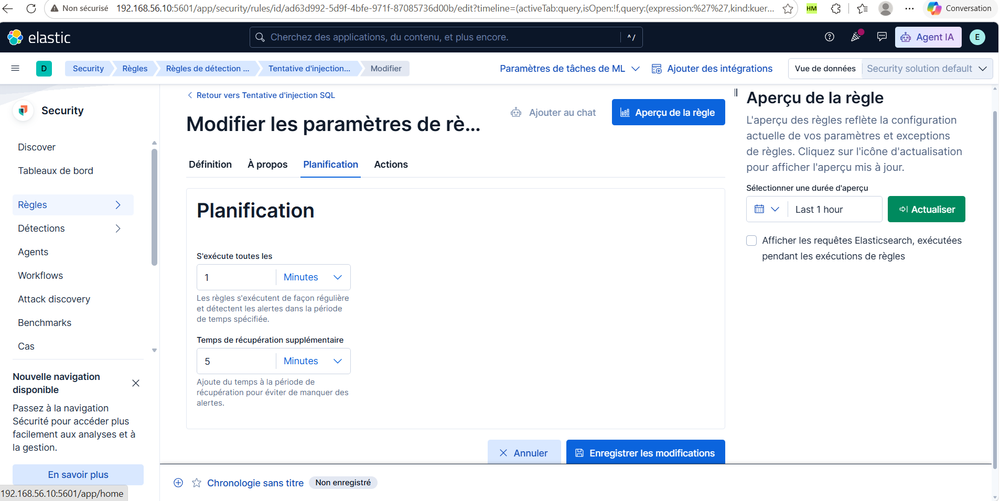

| Paramètre | Valeur observée |
| --- | --- |
| S'exécute toutes les | 1 minute |
| Temps de récupération supplémentaire | 5 minutes |

### 5.4. Action « Notifications SOC »

Dans **Actions**, développer le connecteur Index existant **Notifications SOC**.

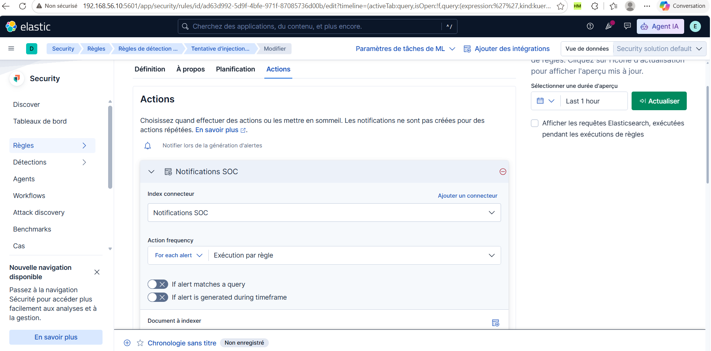

| Paramètre | Valeur observée |
| --- | --- |
| Type de connecteur | Index |
| Connecteur | Notifications SOC |
| Mode | For each alert |
| Fréquence | Exécution par règle |
| Condition par requête | Désactivée |
| Condition par plage horaire | Désactivée |

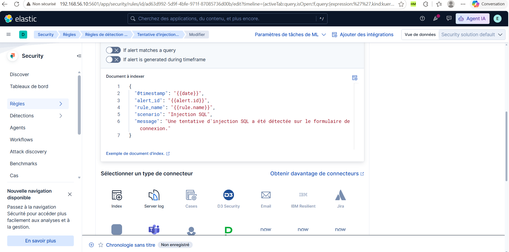

Document à reprendre :

```json
{
  "@timestamp": "{{date}}",
  "alert_id": "{{alert.id}}",
  "rule_name": "{{rule.name}}",
  "scenario": "Injection SQL",
  "message": "Une tentative d'injection SQL a été détectée sur le formulaire de connexion."
}
```

Les variables fournissent la date, l'identifiant de l'alerte et le nom de règle. Le scénario et le message sont fixes. Choisir **For each alert → Exécution par règle**, laisser les conditions supplémentaires désactivées, puis saisir ce JSON et enregistrer.

Le relais décrit en sections 2.6 à 2.8 transmet les documents de `lab-notifications` par courriel.

### 5.5. Activation et dernière exécution

Après enregistrement, revenir à **Aperçu**.

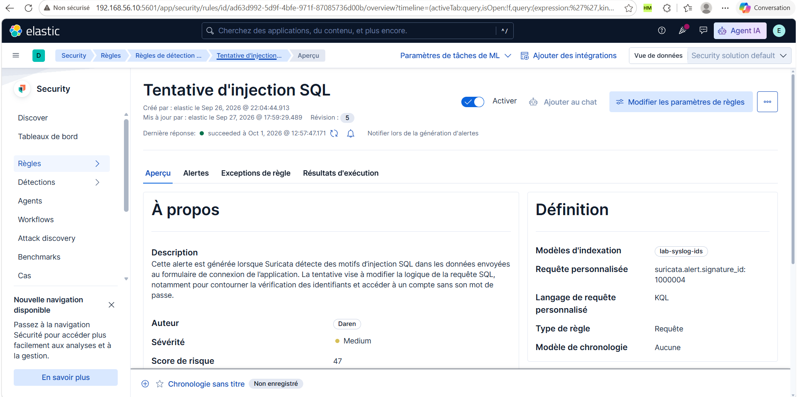

| Élément | Valeur observée |
| --- | --- |
| Activer | Interrupteur bleu, coché |
| Dernière réponse | succeeded, 1er octobre 2026 à 12:57:47.171 |
| Auteur | Daren |
| Index | lab-syslog-ids |
| Requête | suricata.alert.signature_id: 1000004 |
| Langage / type | KQL / Requête |
| Sévérité / score | Medium / 47 |

La règle est activée et sa dernière exécution affiche **succeeded**. Le [test SQLi](07-guide-utilisation.md#6-reproduire-le-scénario-dinjection-sql) présente les résultats applicatifs et les alertes.

## 6. Règle Elastic Security — traversée de répertoires

Cette règle transforme en alerte SIEM les événements Suricata correspondant au motif de traversée `../`. L’application cible et le fonctionnement de `download.php` sont décrits dans [Application web du laboratoire](05-application-web.md). La détection du motif ne prouve pas, à elle seule, la lecture du fichier demandé.

### 6.1. Source et requête

Dans **Security → Règles**, ouvrir **Tentative de traversée de répertoires**, puis **Modifier les paramètres de règles → Définition**.

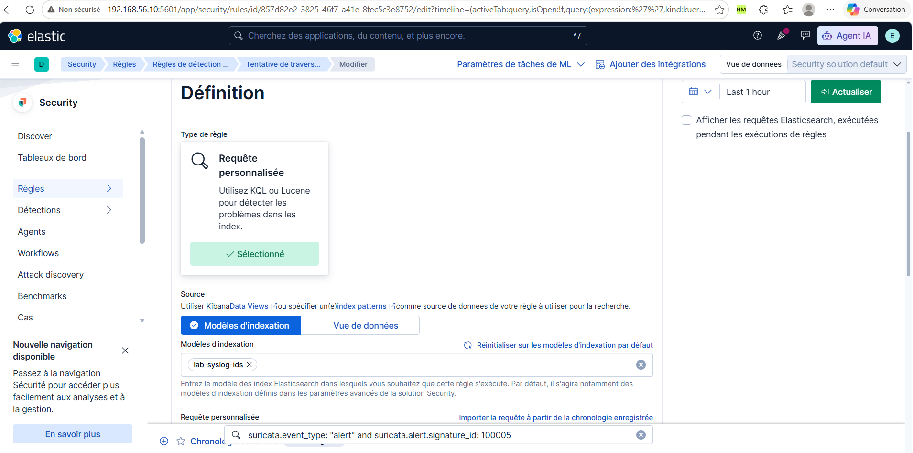

| Paramètre | Valeur observée |
| --- | --- |
| Type | Requête personnalisée |
| Source | Modèles d’indexation |
| Index | `lab-syslog-ids` |
| Langage | KQL |

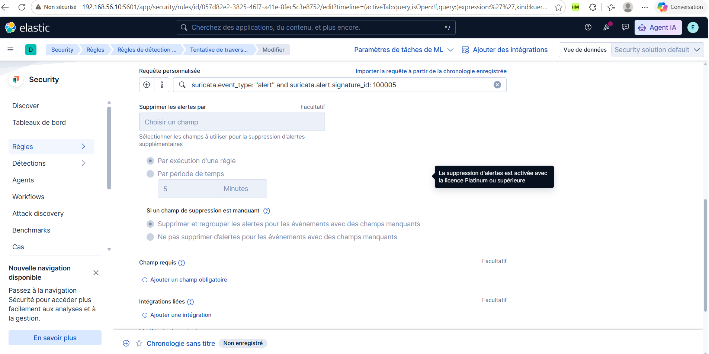

Requête à reprendre :

```kql
suricata.event_type: "alert" and suricata.alert.signature_id: 100005
```

Le premier filtre sélectionne les événements IDS de type `alert`, plutôt que les événements de flux réseau. Le second sélectionne la signature de traversée. Le SID **100005** correspond à la règle publiée dans [local.rules](../config/suricata/local.rules) :

```suricata
alert http any any -> 192.168.56.10 80 (msg:"Tentative de traversee de repertoires"; flow:established,to_server; http.uri.raw; content:"../"; sid:100005; rev:1;)
```

La signature inspecte l’URI HTTP brute d’un flux établi vers le serveur Ubuntu sur le port 80. Elle recherche la séquence littérale `../` ; elle ne vérifie pas le contenu de la réponse HTTP ni le succès de la lecture. Elle n’est pas limitée au chemin `download.php`.

La règle est de type Requête personnalisée, sans seuil de répétition ni suppression d’alertes.

### 6.2. Nom, description et priorité

Dans **À propos** :

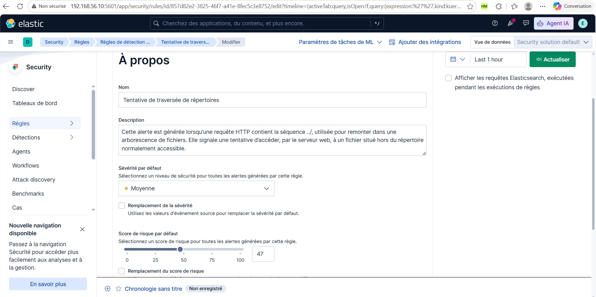

| Paramètre | Valeur observée |
| --- | --- |
| Nom | Tentative de traversée de répertoires |
| Sévérité par défaut | Moyenne |
| Score de risque | 47 |
| Remplacement du score de risque | Décoché |

La description explique que `../` permet de remonter dans l’arborescence et peut signaler une tentative d’accès hors du répertoire autorisé.

### 6.3. Planification

Dans **Planification** :


| Paramètre | Valeur observée |
| --- | --- |
| S’exécute toutes les | 1 minute |
| Temps de récupération supplémentaire | 5 minutes |

### 6.4. Action de notification

Dans **Actions**, utiliser le connecteur Index existant **Notifications SOC**.

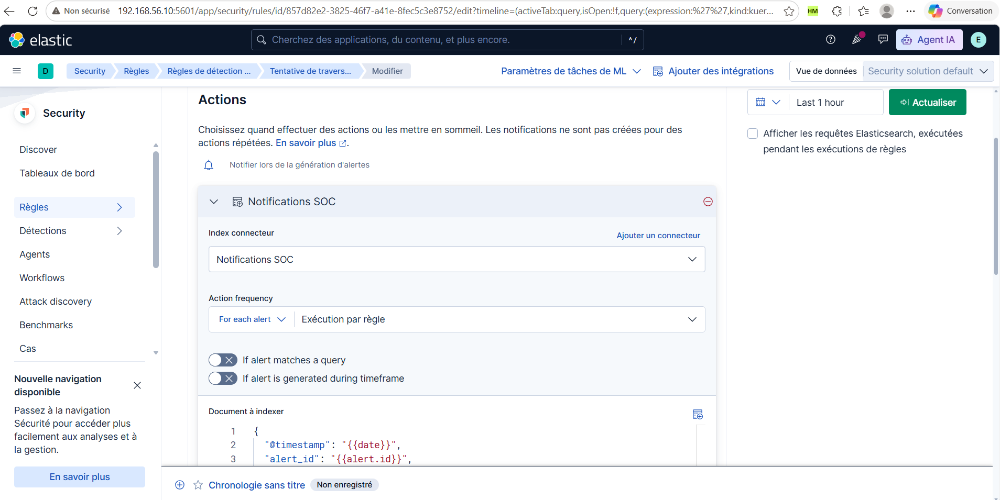

| Paramètre | Valeur observée |
| --- | --- |
| Type de connecteur | Index |
| Connecteur | Notifications SOC |
| Mode | For each alert |
| Fréquence | Exécution par règle |
| Condition par requête | Désactivée |
| Condition par plage horaire | Désactivée |

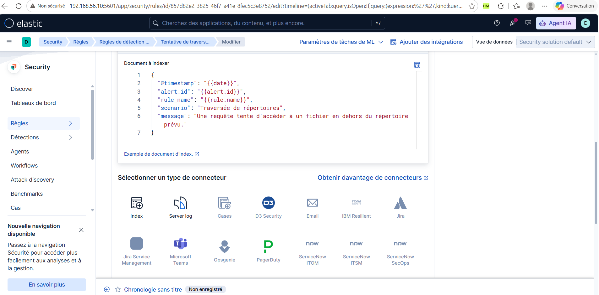

Document à reprendre :

```json
{
  "@timestamp": "{{date}}",
  "alert_id": "{{alert.id}}",
  "rule_name": "{{rule.name}}",
  "scenario": "Traversée de répertoires",
  "message": "Une requête tente d'accéder à un fichier en dehors du répertoire prévu."
}
```

Les variables fournissent la date de l’action, l’identifiant de l’alerte et le nom de la règle. Le scénario et le message sont fixes. L’identifiant permet de rapprocher la notification de l’alerte SIEM.

Le relais décrit en sections 2.6 à 2.8 transmet les documents de `lab-notifications` par courriel. Enregistrer l’action après avoir renseigné le JSON.

### 6.5. Activation et exécution

Revenir à **Aperçu** :

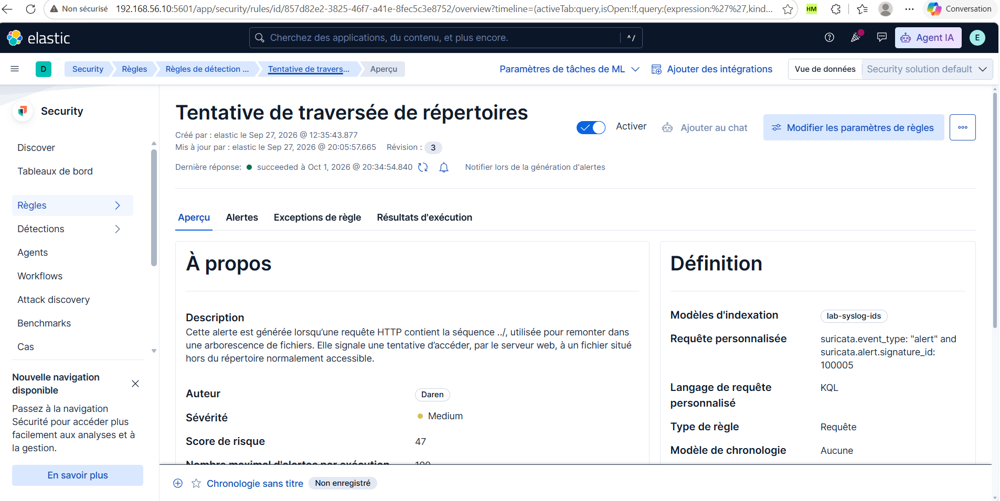

| Élément | Valeur observée |
| --- | --- |
| Activer | Interrupteur bleu, coché |
| Dernière réponse | succeeded, 1er octobre 2026 à 20:34:54.840 |
| Auteur | Daren |
| Index | `lab-syslog-ids` |
| Requête | `suricata.event_type: "alert" and suricata.alert.signature_id: 100005` |
| Langage / type | KQL / Requête |
| Sévérité / score | Medium / 47 |

La règle est activée et sa dernière exécution affiche **succeeded**. Le [test de traversée](07-guide-utilisation.md#7-reproduire-le-scénario-de-traversée-de-répertoires) présente les événements et le courriel associés.
