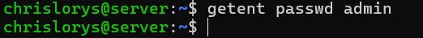
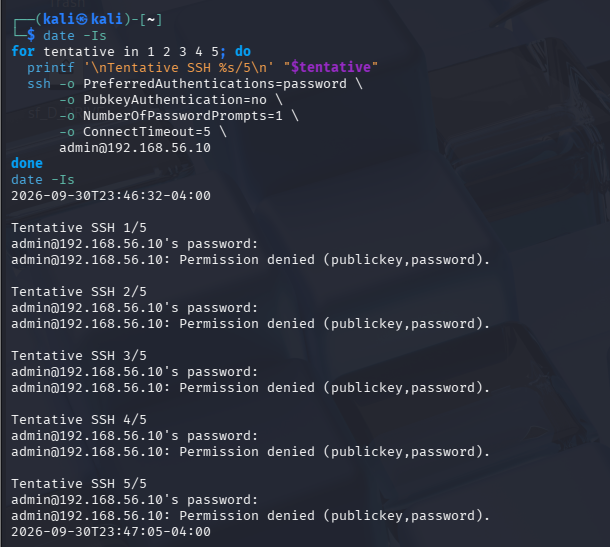
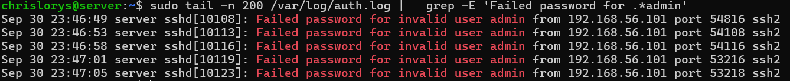
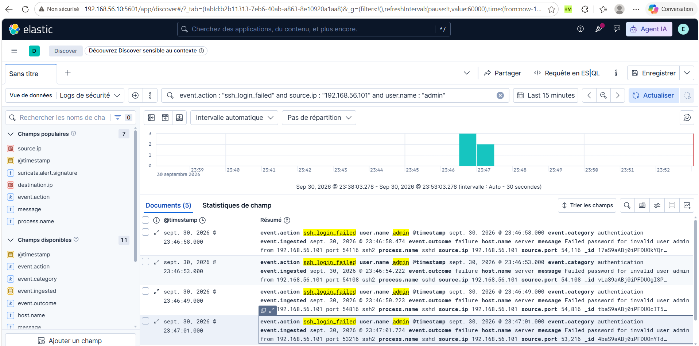

# Guide d'utilisation du laboratoire

Ce guide décrit le démarrage du laboratoire et la reproduction des tests. Les paramètres des règles Elastic Security sont décrits dans le [guide de configuration des détections](05-configuration-detection.md). Les commandes ci-dessous s'appliquent aux VM du projet : Kali `192.168.56.101` et Ubuntu `192.168.56.10`.

## 1. Démarrer et vérifier le laboratoire

Démarrer les deux VM dans VirtualBox. Sur Ubuntu :

```bash
ip -br address
sudo systemctl start elasticsearch kibana syslog-ng suricata
systemctl is-active elasticsearch kibana syslog-ng suricata
```

**Résultat attendu :** l'adresse `192.168.56.10/24` apparaît sur `enp0s8` et chaque service affiche `active`. L'activation d'un service ne prouve pas à elle seule la collecte des événements.

Pour le scénario SSH, contrôler aussi le service et l'écoute :

```bash
sudo systemctl start ssh
sudo systemctl status ssh --no-pager -l
sudo ss -lntp 'sport = :22'
```

**Résultat attendu :** le service SSH est actif et écoute sur le port TCP 22 accessible depuis Kali. Si l'authentification par mot de passe est désactivée, ce test ne produira pas les messages attendus ; vérifier la configuration SSH déjà utilisée pour le scénario avant de continuer.

Depuis Kali :

```bash
ip -br address
ping -c 4 192.168.56.10
```

**Résultat attendu :** l'interface du réseau de laboratoire possède l'adresse `192.168.56.101` et le serveur répond.

Ouvrir `http://192.168.56.10:5601`, se connecter à Kibana et vérifier que la règle **SSH — Échecs répétés depuis une même IP** est activée. Elle recherche dans `lab-syslog-system` les événements `event.action : "ssh_login_failed"`, regroupés par `source.ip`, avec un seuil de **5**. Elle est planifiée chaque minute avec cinq minutes de recherche supplémentaire.

## 2. Reproduire le scénario SSH

### 2.1. Objectif et conditions

Générer au moins cinq échecs d'authentification SSH depuis la même VM Kali vers Ubuntu, rapprochés dans le temps. Le test utilise des saisies manuelles de mots de passe erronés et ne nécessite pas de nouvel outil.

Les messages `Failed password for ...` sont collectés par syslog-ng, puis normalisés par les pipelines `system-logs` et `ssh-auth`. La règle Elastic Security compte ensuite les événements de chaque IP.

### 2.2. Générer les échecs depuis Kali

Sur Ubuntu, vérifier préalablement que le compte de test choisi n'existe pas :

```bash
getent passwd admin
```

**Résultat attendu :** aucune entrée. Si ce nom existe, choisir un autre nom inexistant et l'utiliser dans la commande suivante.



**Lecture de la capture :** `getent passwd admin` ne renvoie aucune entrée. Le nom `admin` n'est donc pas résolu comme compte utilisateur sur ce serveur lors du contrôle ; il est utilisé comme utilisateur inexistant pour le test.

Sur Kali :

```bash
date -Is
for tentative in 1 2 3 4 5; do
  printf '\nTentative SSH %s/5\n' "$tentative"
  ssh -o PreferredAuthentications=password \
      -o PubkeyAuthentication=no \
      -o NumberOfPasswordPrompts=1 \
      -o ConnectTimeout=5 \
      admin@192.168.56.10
done
date -Is
```

À chaque demande, saisir un mot de passe volontairement erroné. La saisie ne s'affiche pas dans le terminal. Lors de la première connexion, vérifier l'identité du serveur avant d'accepter sa clé ; les connexions suivantes réutilisent cette confiance.

**Résultat attendu :** cinq refus d'authentification, typiquement `Permission denied`. Un refus de connexion ou un délai d'attente ne constitue pas un échec d'authentification et ne valide pas ce scénario. Réaliser les cinq tentatives en quelques minutes et conserver les heures de début et de fin.



**Résultat observé :** les cinq tentatives vers `admin@192.168.56.10` affichent `Permission denied (publickey,password)`. Le test débute le **30 septembre 2026 à 23:46:32−04:00** et se termine à **23:47:05−04:00**. Les options SSH demandent l'authentification par mot de passe, désactivent l'authentification par clé et limitent chaque connexion à une demande de mot de passe. Ces refus sont rapprochés dans le temps et visent le même serveur.

### 2.3. Vérifier les journaux sur Ubuntu

Juste après le test :

```bash
sudo journalctl -u ssh --since "10 minutes ago" --no-pager |
  rg 'Failed password for .*admin'
```

Si `rg` n'est pas installé dans la VM, utiliser :

```bash
sudo journalctl -u ssh --since "10 minutes ago" --no-pager |
  grep -E 'Failed password for .*admin'
```

Le fichier d'authentification écrit par la configuration syslog-ng du laboratoire permet également de contrôler les événements :

```bash
sudo tail -n 200 /var/log/auth.log |
  grep -E 'Failed password for .*admin'
```

**Résultat attendu :** au moins cinq messages du type `Failed password for invalid user admin from 192.168.56.101 port ... ssh2`, correspondant aux heures du test. Le port source peut changer entre les connexions.



**Résultat observé :** cinq messages `Failed password for invalid user admin` proviennent de `192.168.56.101`, aux heures **23:46:49, 23:46:53, 23:46:58, 23:47:01 et 23:47:05**, le 30 septembre. Ils correspondent à la période du test Kali. Les ports sources changent entre les connexions, tandis que l'adresse source reste identique : le regroupement de la règle repose sur cette IP.

Cette preuve confirme les échecs enregistrés localement sur Ubuntu. La collecte dans Elasticsearch et la génération de l'alerte sont vérifiées dans les étapes suivantes.

### 2.4. Vérifier la collecte dans Discover

Dans Kibana :

1. Ouvrir **Discover** et sélectionner la vue de données couvrant `lab-syslog-system`.
2. Choisir une plage absolue couvrant le test. Pour la preuve fournie : **30 septembre 2026, 23:45 à 23:50 en UTC−4**, soit **1er octobre 2026, 03:45 à 03:50 en UTC**. Adapter les heures au fuseau d'affichage Kibana.
3. Appliquer le filtre KQL :

```text
event.action : "ssh_login_failed" and source.ip : "192.168.56.101" and user.name : "admin"
```

4. Ajouter les colonnes `@timestamp`, `source.ip`, `user.name`, `event.action`, `event.outcome` et `message`.
5. Actualiser et vérifier les documents du test.

**Résultat attendu :** au moins cinq événements avec `event.outcome: failure` et `event.action: ssh_login_failed`, depuis la même IP. Les heures doivent correspondre aux messages Ubuntu, en tenant compte du fuseau d'affichage Kibana.



**Résultat observé :** la vue affichée **Logs de sécurité**, avec le filtre ci-dessus et la période **Last 15 minutes**, renvoie **Documents (5)**. La plage visible est le **30 septembre 2026 de 23:38:03.278 à 23:53:03.278**. Elle inclut le test Kali de 23:46:32 à 23:47:05.

| Élément visible | Lecture |
| --- | --- |
| Documents (5) | Cinq événements correspondent au filtre et à la période |
| source.ip : 192.168.56.101 | Adresse de Kali |
| user.name : admin | Utilisateur inexistant testé |
| process.name : sshd | Processus ayant émis les messages |
| event.action : ssh_login_failed | Action ajoutée par le pipeline SSH |
| event.outcome : failure | Échec d'authentification |
| event.category : authentication | Catégorie normalisée |
| host.name : server | Hôte ayant journalisé les échecs |
| message : Failed password for invalid user admin ... | Message d'origine conservé |

Les heures des documents visibles, notamment **23:46:49, 23:46:53, 23:46:58 et 23:47:01**, correspondent aux journaux Ubuntu. Le compteur indique cinq documents, même si toutes les lignes ne sont pas entièrement visibles dans la capture.

**Lecture de l'histogramme :** les deux barres représentent trois documents puis deux documents dans des compartiments de **30 secondes**. Cette largeur est l'intervalle de représentation automatique ; elle ne correspond ni à la fréquence d'exécution de la règle ni à un délai d'ingestion.

La capture confirme la chaîne **sshd → syslog-ng → Elasticsearch et ses pipelines → Discover** pour les événements de ce test. Les documents Discover sont les journaux indexés ; leur compteur n'est pas un nombre d'alertes Elastic Security.

Pour reproduire cette capture plus tard, utiliser la plage absolue indiquée dans les instructions, plutôt que **Last 15 minutes**, qui se déplace avec l'heure de consultation.

### 2.5. Vérifier l'alerte Elastic Security

Ouvrir la règle **SSH — Échecs répétés depuis une même IP**, puis son onglet **Alertes**. Choisir une période incluant le test et la période suivant son exécution. Actualiser après les exécutions planifiées.

Ouvrir l'alerte correspondant au test et vérifier :

- le nom de la règle ;
- le regroupement sur `source.ip` et la valeur `192.168.56.101` ;
- la date de l'alerte et la période du test ;
- le compteur du résultat de seuil, lorsqu'il est affiché ;
- la sévérité moyenne et le score de risque 47.

**Résultat attendu :** une alerte de cette règle pour le groupe ayant atteint au moins cinq échecs. Une alerte par seuil est un résultat agrégé ; elle ne reprend pas nécessairement tous les champs de chaque journal source. Consulter Discover pour les messages individuels.

Le délai réel dépend de la collecte, de l'indexation et de l'exécution de la règle. Une dernière exécution `succeeded` ne prouve pas à elle seule une détection.

**Capture à produire :** détails de l'alerte permettant de relier la règle, l'IP et le test.

### 2.6. Vérifier le courriel

Si une action courriel est configurée sur cette règle, vérifier sa configuration dans **Modifier → Actions**, puis contrôler le message reçu après le test. Le nom de la règle et l'heure doivent permettre de le relier à l'alerte.

La présence d'une alerte ne prouve pas la réception du courriel. Les paramètres de l'action et la preuve de réception seront intégrés à partir des captures du laboratoire ; aucun envoi SSH n'est présenté comme confirmé à ce stade.

## 3. Critères de validation du scénario SSH

| Étape | Preuve attendue |
| --- | --- |
| Génération | Confirmée : cinq refus d'authentification sur Kali |
| Journalisation | Confirmée : cinq messages Failed password pour admin, depuis 192.168.56.101 |
| Collecte et normalisation | Confirmées : cinq documents Discover contenant les champs SSH attendus |
| Détection | Alerte de la règle SSH liée au test |
| Notification | Courriel reçu, si l'action SSH est configurée |

Les captures confirment le contrôle du compte, la génération des cinq échecs, leur journalisation sur Ubuntu et la collecte des cinq documents normalisés dans Discover. Les preuves d'alerte Elastic Security et de notification restent à intégrer pour ce test.
