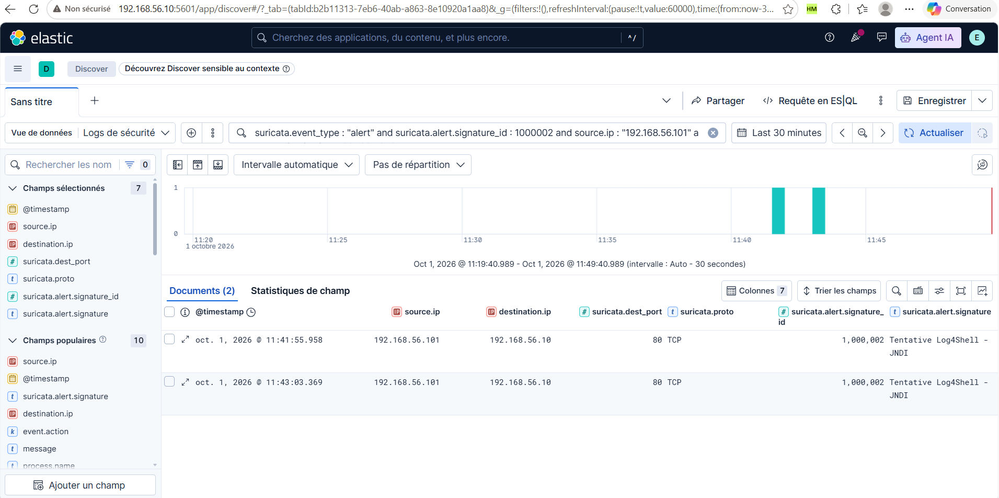

# Preuve de collecte — tentative JNDI

Complément au [guide d'utilisation](06-guide-utilisation.md#53-vérifier-lalerte-suricata-collectée-dans-discover).

La capture affiche **Documents (2)** sur **Last 30 minutes**, du 1er octobre 2026 à **11:19:40.989 jusqu’à 11:49:40.989**, en UTC−4. Les deux événements portent la signature **1000002**, **Tentative Log4Shell - JNDI**, depuis Kali `192.168.56.101` vers Ubuntu `192.168.56.10`, sur **80/TCP**.

| Heure en UTC−4 | Lecture |
| --- | --- |
| 11:41:55.958 | Événement antérieur au test curl débutant à 11:42:59 ; il ne lui est pas attribué |
| 11:43:03.369 | Événement concordant avec la réponse HTTP du test à 11:43:03 |

La capture confirme la collecte de l'alerte IDS correspondant au test. Le User-Agent n'est pas affiché dans les colonnes. Le compteur inclut un événement antérieur et ne représente pas deux alertes issues du seul test documenté. Pour isoler celui-ci, utiliser la période absolue **11:42 à 11:47 en UTC−4**.

La génération de l'alerte Elastic Security et la réception du courriel restent à vérifier. Ouvrir la règle **Tentative d’exploitation de Log4Shell - JNDI → Alertes**, choisir **11:42 à 11:50**, puis capturer la ligne d'alerte et les détails des IP et du SID lorsqu'ils sont présents.
