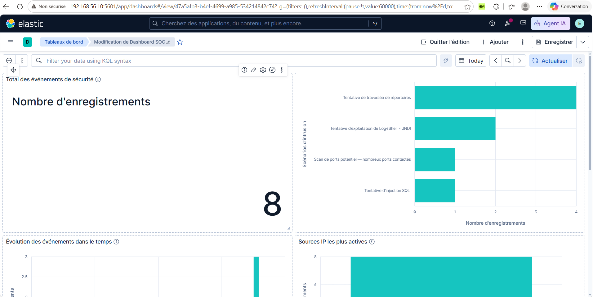
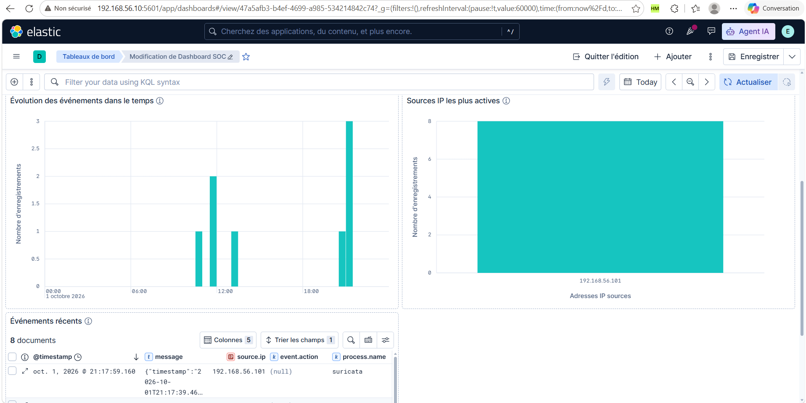
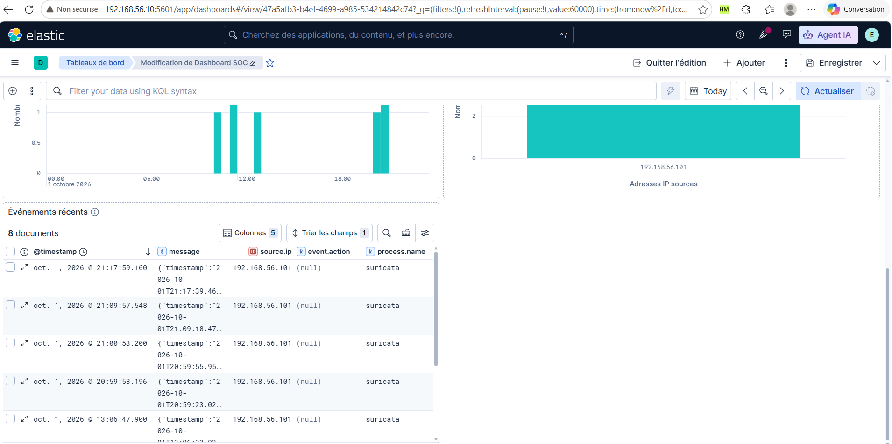

# Visualisations Kibana

## 1. Rôle du Dashboard SOC

Le **Dashboard SOC** donne une vue synthétique des alertes du laboratoire : leur nombre, leur répartition par règle, leur évolution dans le temps et leurs adresses sources. Le tableau de documents permet ensuite d’examiner les alertes récentes.

Les trois captures présentent les **cinq panneaux** du Dashboard SOC pour le **1er octobre 2026**. Ils utilisent la vue **Alertes Elastic**, sans filtre KQL global.

Les preuves détaillées des scénarios et des notifications sont présentées dans le [guide d’utilisation](07-guide-utilisation.md). Le dashboard compte les alertes de la période sélectionnée ; il ne compte pas l’ensemble des journaux système et réseau.

## 2. Total et répartition des alertes

### Carte de synthèse

La carte intitulée **Total des événements de sécurité** affiche **Nombre d’enregistrements : 8**. Avec la vue **Alertes Elastic**, ces huit documents sont des alertes Elastic Security.

### Répartition par scénario

Le graphique horizontal associe les noms de règles sur l’axe **Scénarios d’intrusion** à leur **Nombre d’enregistrements**.

| Règle visible | Nombre d’alertes |
| --- | --- |
| Tentative de traversée de répertoires | 4 |
| Tentative d’exploitation de Log4Shell - JNDI | 2 |
| Scan de ports potentiel — nombreux ports contactés | 1 |
| Tentative d’injection SQL | 1 |
| **Total** | **8** |

La somme concorde avec la carte. Les quatre alertes de traversée concernent plusieurs tentatives dans la journée ; elles ne sont pas attribuées à la seule tentative de 21:17.

Le test SSH a été réalisé le 30 septembre, hors de la journée affichée. Élargir la période pour le retrouver.

## 3. Évolution temporelle et adresses sources

### Évolution des événements dans le temps

L’axe horizontal représente les heures du **1er octobre 2026**. L’axe vertical représente le **Nombre d’enregistrements** par intervalle temporel.

Les cinq barres comptent **1, 2, 1, 1 et 3 alertes**, soit **8** au total. Leur répartition permet de repérer les périodes d’activité ; l’info-bulle fournit les bornes de chaque intervalle.

Ce panneau permet de repérer une période de détection avant d’examiner les alertes correspondantes. L’intervalle d’agrégation du graphique ne définit pas la fréquence d’exécution des règles Elastic Security.

### Sources IP les plus actives

L’axe horizontal **Adresses IP sources** présente une seule catégorie : **192.168.56.101**, l’adresse de Kali. La barre atteint **8** sur l’axe **Nombre d’enregistrements**.

Les huit alertes sont associées à Kali. Ce panneau permet d’identifier les sources les plus actives dans la période sélectionnée.

## 4. Alertes récentes

Le panneau **Événements récents** affiche **8 documents**, avec un tri décroissant sur `@timestamp`.

| Colonne | Utilité |
| --- | --- |
| @timestamp | Situer le document d’alerte |
| message | Lire le message d’origine conservé |
| source.ip | Identifier la source |
| event.action | Consulter l’action normalisée lorsqu’elle est renseignée |
| process.name | Identifier le processus présent dans le document |

La première ligne, à **21:17:59.160**, correspond à l’alerte de traversée décrite dans le guide d’utilisation.

La date contenue dans `message` peut désigner l’événement IDS d’origine, tandis que `@timestamp` affiché situe le document d’alerte. Pour le test de 21:17, l’événement IDS est horodaté **21:17:39.468** et l’alerte Elastic Security **21:17:59.160**.

Une valeur `(null)` signifie que le champ n’est pas renseigné dans le document affiché. Tous les types d’alerte ne possèdent pas les mêmes champs.

## 5. Consultation du dashboard

1. Ouvrir **Kibana → Tableaux de bord → Dashboard SOC**.
2. Choisir une période couvrant les tests à analyser. Pour retrouver les données illustrées, sélectionner une période absolue couvrant le **1er octobre 2026** dans le fuseau d’affichage Kibana.
3. Actualiser les données et comparer le total, la répartition par règle, l’histogramme et les adresses sources.
4. Examiner les documents récents, puis ouvrir les alertes dans **Security → Détections → Alertes** pour lire leur nom de règle et leurs détails.
5. Comparer les alertes aux événements Discover et aux notifications du guide d’utilisation.

Pour consulter les résultats ultérieurement, remplacer **Today** par la date absolue du test. Enregistrer le dashboard après toute modification.

## 6. Configuration des panneaux

Le fichier [dashboard-soc.ndjson](../exports-kibana/dashboard-soc.ndjson) conserve la configuration exportée du dashboard et de ses dépendances.

Tous les panneaux actifs utilisent la vue **Alertes Elastic**, dont le modèle d’index est `.alerts-security.alerts-default` et le champ temporel `@timestamp`. La requête KQL globale est vide. Les visualisations Lens actives et la recherche enregistrée ne comportent pas de filtre supplémentaire.

| Panneau | Configuration exportée |
| --- | --- |
| Total | Métrique Lens ; comptage des enregistrements |
| Répartition par scénario | Barres horizontales ; comptage regroupé sur kibana.alert.rule.name ; neuf valeurs principales, tri décroissant par nombre ; catégorie « autres » activée |
| Évolution temporelle | Barres ; comptage par histogramme sur @timestamp ; intervalle automatique |
| Sources IP | Barres ; comptage regroupé sur source.ip ; neuf valeurs principales, tri décroissant par nombre ; catégorie « autres » activée |
| Alertes récentes | Recherche enregistrée ; colonnes @timestamp, message, source.ip, event.action, process.name ; tri @timestamp décroissant |

La configuration est conservée dans [dashboard-soc.ndjson](../exports-kibana/dashboard-soc.ndjson), avec une [procédure d’import](../exports-kibana/README.md). Les alertes et journaux Elasticsearch ne sont pas inclus dans cet export.
