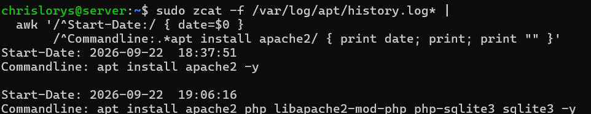
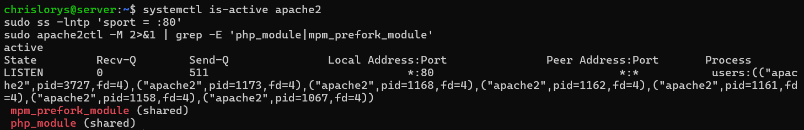
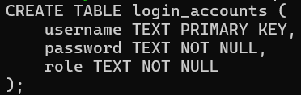
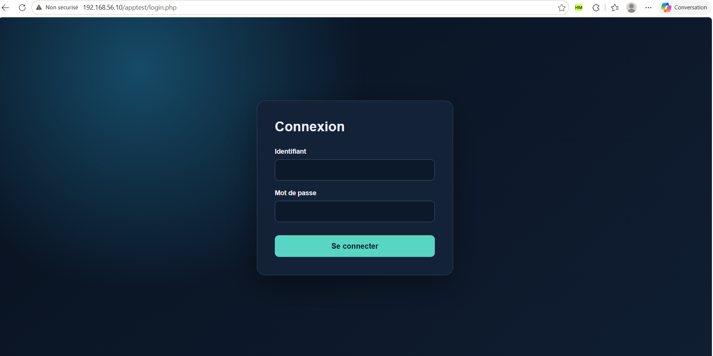
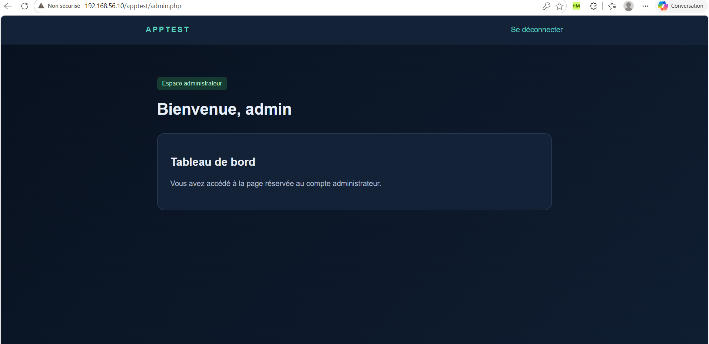
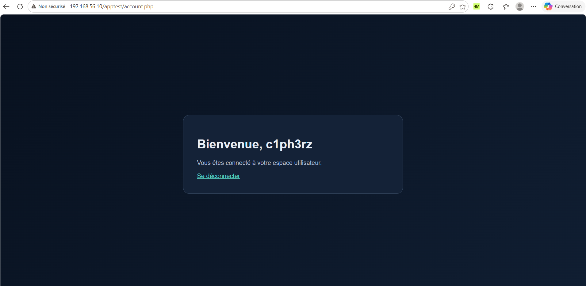
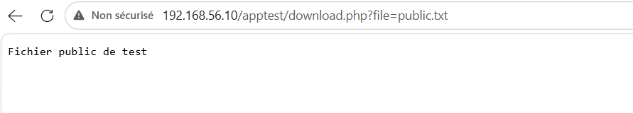

# Installation et fonctionnement de l’application web du laboratoire

L’application `apptest` est hébergée sur Ubuntu `192.168.56.10`, dans `/var/www/html/apptest`, et utilisée depuis Kali `192.168.56.101`. Elle fournit les cibles HTTP des scénarios d’injection SQL et de traversée de répertoires. Les vulnérabilités décrites sont volontaires et servent aux tests du laboratoire.

Le code publié dans [application-test](../application-test/) provient du relevé des fichiers transmis le 1er octobre 2026. Le schéma de la base et les permissions ont également été relevés. L’historique APT transmis établit les commandes d’installation Apache/PHP/SQLite du 22 septembre 2026. Les captures du formulaire, des deux espaces et de la lecture du fichier public illustrent le fonctionnement du site.

## 1. Composants et versions relevées

| Composant | Version du paquet relevée | Fonction |
|---|---|---|
| Apache | `2.4.58-1ubuntu8.15` | Réception des requêtes HTTP |
| PHP 8.3 | `8.3.6-0ubuntu0.24.04.11` | Exécution des pages PHP |
| libapache2-mod-php8.3 | `8.3.6-0ubuntu0.24.04.11` | Intégration de PHP dans Apache |
| php8.3-sqlite3 | `8.3.6-0ubuntu0.24.04.11` | Accès PHP à SQLite |
| sqlite3 | `3.45.1-1ubuntu2.8` | Création et inspection de la base |

`php -m` montre notamment `session`, `sqlite3` et `pdo_sqlite`. Le code utilise la classe `SQLite3`, et non PDO. `apache2ctl -M` montre `php_module` et `mpm_prefork_module`, cohérents avec l’exécution PHP par le module Apache. La sortie CLI ne suffit pas, à elle seule, à prouver l’exécution PHP dans une réponse HTTP.

La longue liste obtenue avec `dpkg-query -W 'php*'` inclut des noms sans version : elle ne constitue pas une liste de tous les modules installés et utilisables. Les versions renseignées et les modules effectivement chargés sont les éléments retenus ici.

## 2. Installation des dépendances

### 2.1. Installation réellement exécutée

L’historique APT montre deux opérations le **22 septembre 2026**, demandées par l’utilisateur `chrislorys` (UID 1000). Les heures sont reproduites telles qu’enregistrées par APT ; le relevé ne précise pas le fuseau horaire.

| Opération | Début | Fin | Commande enregistrée |
|---|---|---|---|
| Installation Apache | 18:37:51 | 18:37:59 | `apt install apache2 -y` |
| Ajout PHP et SQLite | 19:06:16 | 19:06:29 | `apt install apache2 php libapache2-mod-php php-sqlite3 sqlite3 -y` |




La capture montre la commande de consultation des journaux APT et les deux couples `Start-Date` / `Commandline` du 22 septembre 2026. `zcat -f` lit les historiques compressés ou non ; `awk` mémorise la date de début et affiche les lignes de commande contenant `apt install apache2`. Elle corrobore les commandes et heures de début du tableau. Les versions et heures de fin proviennent du relevé textuel détaillé ci-dessous, car elles ne sont pas affichées dans cette capture.

Pour reproduire cette consultation sur Ubuntu :

```bash
sudo zcat -f /var/log/apt/history.log* |
  awk '/^Start-Date:/ { date=$0 }
       /^Commandline:.*apt install apache2/ { print date; print; print "" }'
```

La première opération installe Apache et ses dépendances. La seconde complète le serveur avec PHP, son module Apache, son extension SQLite et l’outil `sqlite3`. Apache figure à nouveau dans la commande, mais il ne figure pas dans la liste des nouveaux paquets de cette seconde opération.

- `php` sélectionne la version PHP par défaut d’Ubuntu, ici PHP 8.3.
- `libapache2-mod-php` installe le module permettant à Apache d’exécuter les pages PHP ; l’historique indique `libapache2-mod-php8.3` comme dépendance automatique.
- `php-sqlite3` apporte l’accès à SQLite depuis PHP, nécessaire à `new SQLite3(...)` dans `login.php`.
- `sqlite3` permet de créer et consulter `lab.db` depuis le terminal.
- `-y` accepte automatiquement les confirmations APT.

Extrait des transactions transmis :

```text
Start-Date: 2026-09-22  18:37:51
Commandline: apt install apache2 -y
Requested-By: chrislorys (1000)
Install: ssl-cert:amd64 (1.1.2ubuntu1, automatic), libaprutil1t64:amd64 (1.6.3-1.1ubuntu7.1, automatic), libaprutil1-dbd-sqlite3:amd64 (1.6.3-1.1ubuntu7.1, automatic), liblua5.4-0:amd64 (5.4.6-3build2, automatic), apache2-data:amd64 (2.4.58-1ubuntu8.15, automatic), apache2-bin:amd64 (2.4.58-1ubuntu8.15, automatic), apache2-utils:amd64 (2.4.58-1ubuntu8.15, automatic), apache2:amd64 (2.4.58-1ubuntu8.15), libaprutil1-ldap:amd64 (1.6.3-1.1ubuntu7.1, automatic), libapr1t64:amd64 (1.7.2-3.1ubuntu0.1, automatic)
End-Date: 2026-09-22  18:37:59

Start-Date: 2026-09-22  19:06:16
Commandline: apt install apache2 php libapache2-mod-php php-sqlite3 sqlite3 -y
Requested-By: chrislorys (1000)
Install: php:amd64 (2:8.3+93ubuntu2), php8.3-common:amd64 (8.3.6-0ubuntu0.24.04.11, automatic), libapache2-mod-php:amd64 (2:8.3+93ubuntu2), php-common:amd64 (2:93ubuntu2, automatic), php8.3-readline:amd64 (8.3.6-0ubuntu0.24.04.11, automatic), php8.3-opcache:amd64 (8.3.6-0ubuntu0.24.04.11, automatic), libapache2-mod-php8.3:amd64 (8.3.6-0ubuntu0.24.04.11, automatic), php8.3:amd64 (8.3.6-0ubuntu0.24.04.11, automatic), php8.3-sqlite3:amd64 (8.3.6-0ubuntu0.24.04.11, automatic), sqlite3:amd64 (3.45.1-1ubuntu2.8), php8.3-cli:amd64 (8.3.6-0ubuntu0.24.04.11, automatic), php-sqlite3:amd64 (2:8.3+93ubuntu2)
End-Date: 2026-09-22  19:06:29
```

Les versions installées correspondent aux versions relevées dans la section 1. Les lignes marquées `automatic` décrivent des dépendances installées par APT. Ces transactions concernent les paquets : elles ne prouvent pas la création des fichiers PHP ou de la base, traitée dans les sections suivantes.

### 2.2. Reproduction et contrôles

Sur Ubuntu, pour reproduire l’installation si les dépendances sont absentes :

```bash
sudo apt update
sudo apt install apache2 php libapache2-mod-php php-sqlite3 sqlite3 -y
sudo systemctl enable --now apache2
sudo apache2ctl configtest
sudo apache2ctl -M
php -v
php -m
sudo ss -lntp 'sport = :80'
```

Apache doit être actif, écouter sur le port 80 et charger `php_module`. Le contrôle de configuration doit se terminer par `Syntax OK`. L’avertissement `AH00558` présent dans le relevé concerne l’absence de nom global `ServerName` ; il ne démontre pas un échec de chargement des modules.

Les commandes installent les versions disponibles dans les dépôts Ubuntu configurés. Le tableau précédent indique les versions observées sur la VM ; il ne garantit pas leur disponibilité ultérieure.


### 2.3. Vérification du service, de l’écoute HTTP et du module PHP

Sur Ubuntu :

```bash
systemctl is-active apache2
sudo ss -lntp 'sport = :80'
sudo apache2ctl -M 2>&1 | grep -E 'php_module|mpm_prefork_module'
```



| Résultat visible | Interprétation |
|---|---|
| `active` | Le service `apache2` est en cours d’exécution au moment du contrôle |
| `LISTEN` sur `*:80`, processus `apache2` | Apache possède une écoute TCP sur le port HTTP 80 ; aucune adresse locale unique n’est indiquée dans cette sortie |
| `mpm_prefork_module (shared)` | Apache charge le module de traitement des requêtes par processus prefork |
| `php_module (shared)` | Le module d’exécution PHP est chargé dans Apache |

`ss -lntp` affiche les sockets TCP en écoute, les adresses et ports numériques et les processus associés. Le filtre limite le relevé au port 80. `apache2ctl -M` liste les modules chargés ; `2>&1` regroupe les sorties et `grep -E` conserve les deux modules recherchés. Cette sortie filtrée ne constitue pas un contrôle complet des erreurs de configuration.

Ces résultats établissent que le serveur web est actif, écoute sur le port attendu et charge PHP. Les captures du formulaire et des espaces utilisateur et administrateur, en section 7, complètent cette vérification par le rendu des pages dans le navigateur.

## 3. Fichiers et déploiement

| Fichier déployé | Fonction |
|---|---|
| `login.php` | Formulaire, requête d’authentification et création de session |
| `account.php` | Espace réservé au rôle `user` |
| `admin.php` | Espace réservé au rôle `admin` |
| `download.php` | Lecture d’un fichier choisi par le paramètre GET `file` |
| `files/public.txt` | Fichier servi par défaut par `download.php` |
| `lab.db` | Base SQLite contenant les comptes de connexion |

Depuis la racine d’une copie du dépôt sur Ubuntu :

```bash
sudo install -d -o root -g root -m 0755 /var/www/html/apptest/files
sudo install -o root -g root -m 0644 application-test/*.php /var/www/html/apptest/
```

Les quatre fichiers PHP publiés conservent le code et l’interface transmis. La capture du téléchargement montre le texte « Fichier public de test ». Le fichier [public.txt](../application-test/files/public.txt) reproduit ce texte pour le déploiement :

```bash
sudo install -o root -g root -m 0644 application-test/files/public.txt /var/www/html/apptest/files/public.txt
```

Le texte publié correspond au contenu visible dans le navigateur ; la capture ne permet pas de vérifier les octets invisibles ou la présence d’un retour à la ligne final.

## 4. Base de données

Le fichier [schema.sql](../application-test/schema.sql) contient le schéma de la table nécessaire au scénario de connexion :

```sql
CREATE TABLE login_accounts (
    username TEXT PRIMARY KEY,
    password TEXT NOT NULL,
    role TEXT NOT NULL
);
```


Pour consulter le schéma de la table d’authentification sur Ubuntu :

```bash
sudo sqlite3 /var/www/html/apptest/lab.db '.schema login_accounts'
```



La capture présente la définition `CREATE TABLE login_accounts`, avec les trois colonnes utilisées par `login.php` :

| Colonne | Définition visible | Fonction |
|---|---|---|
| `username` | `TEXT PRIMARY KEY` | Identifiant du compte et clé primaire |
| `password` | `TEXT NOT NULL` | Valeur comparée au mot de passe saisi ; la contrainte interdit `NULL` |
| `role` | `TEXT NOT NULL` | Rôle utilisé pour la redirection et le contrôle des espaces ; la contrainte interdit `NULL` |

`NOT NULL` n’interdit pas une chaîne vide. Le schéma ne comporte aucune contrainte limitant `role` à `user` ou `admin` : ces valeurs sont interprétées par les scripts PHP. La capture montre la structure, pas les comptes enregistrés ni leurs mots de passe. Le stockage et la comparaison en clair sont établis par le code d’authentification, pas par le seul type `TEXT`.

`login.php` consulte la table `login_accounts`. La table `users` présente dans la base existante n’a pas été utilisée dans les scénarios retenus et n’est pas nécessaire à leur reproduction. Les mots de passe de `login_accounts` sont comparés directement en texte dans la requête vulnérable.

Pour créer une base absente, depuis la racine du dépôt :

```bash
if sudo test -e /var/www/html/apptest/lab.db; then
    printf 'La base existe déjà : conserver son contenu.\n'
else
    sudo sqlite3 /var/www/html/apptest/lab.db < application-test/schema.sql
fi
```

Les lignes de la base actuelle n’ont pas été transmises. Sur une base de reproduction nouvellement créée, les données fictives suivantes permettent de tester les deux rôles :

```bash
sudo sqlite3 /var/www/html/apptest/lab.db <<'SQL'
INSERT INTO login_accounts (username, password, role) VALUES
('admin_lab', 'AdminLab123!', 'admin'),
('user_lab', 'UserLab123!', 'user');
SQL
```

Ces identifiants sont des exemples fictifs ; ils ne décrivent pas les comptes de la VM actuelle. L’insertion n’est pas à répéter sur une base déjà initialisée.

Permissions observées à reproduire :

```bash
sudo chown www-data:www-data /var/www/html/apptest/lab.db
sudo chmod 0664 /var/www/html/apptest/lab.db
sudo stat -c '%A %U:%G %n' /var/www/html/apptest /var/www/html/apptest/lab.db /var/www/html/apptest/*.php /var/www/html/apptest/files /var/www/html/apptest/files/public.txt
```

Les dossiers appartiennent à `root:root` avec le mode `0755`. Les fichiers PHP et `public.txt` appartiennent à `root:root` avec le mode `0644`. La base appartient à `www-data:www-data` avec le mode `0664`. `login.php` ouvre la base en lecture seule. Les pages conservées n’effectuent aucune insertion ou mise à jour.

## 5. Connexion et contrôle des rôles

`login.php` démarre une session, lit `username` et `password` du POST, puis exécute :

```php
$query = "SELECT username, role FROM login_accounts WHERE username = '$username' AND password = '$password' LIMIT 1";
```

Si une ligne est renvoyée, le script renouvelle l’identifiant de session, enregistre le nom et le rôle, puis redirige vers `admin.php` pour le rôle `admin`, ou vers `account.php` autrement. `admin.php` exige exactement le rôle `admin` ; `account.php` exige exactement le rôle `user`. Les noms affichés sont échappés avec `htmlspecialchars`. Le lien `login.php?logout=1` détruit la session et redirige vers le formulaire.

La faiblesse est la concaténation des entrées dans le SQL. Avec le nom `' OR 1=1 -- `, la condition devient :

```sql
SELECT username, role FROM login_accounts WHERE username = '' OR 1=1 -- ' AND password = 'test' LIMIT 1
```

Le commentaire neutralise la vérification du mot de passe et le `LIMIT 1`. La condition vraie peut renvoyer des comptes, dont PHP lit la première ligne. Sans ordre explicite, ce payload ne garantit pas que cette ligne possède le rôle `admin`. Le rôle enregistré provient de la ligne renvoyée par SQLite.

Le [guide d’utilisation, section 6](06-guide-utilisation.md), présente le test SQLi, l’événement IDS, l’alerte et le courriel. La redirection observée vers `admin.php` doit être distinguée de la preuve d’affichage de la page avec la session conservée.

## 6. Téléchargement et traversée de répertoires

Le code transmis est :

```php
$file = $_GET['file'] ?? 'public.txt';
$path = __DIR__ . '/files/' . $file;

if (!is_file($path)) {
    http_response_code(404);
    exit('Fichier introuvable');
}

header('Content-Type: text/plain; charset=utf-8');
readfile($path);
```

Le paramètre est ajouté directement au chemin de `files/`, sans vérifier que le chemin résolu reste dans ce dossier. `is_file()` contrôle le type du chemin ; il n’impose aucune frontière de répertoire. Ainsi, `../login.php` désigne `/var/www/html/apptest/login.php`. Si ce fichier est accessible au processus Apache, `readfile()` en renvoie le contenu brut, sans exécuter son PHP.

Le dossier `/var/www/lab-private` est absent du relevé actuel. La documentation ne suppose donc pas l’existence d’un `secret.txt` à cet emplacement. Une réponse 404 peut signaler un chemin inexistant ; elle ne prouve pas la prévention de toutes les traversées. Une alerte Suricata prouve la détection du motif dans la requête, tandis que la réponse HTTP sert à évaluer le résultat côté application.

## 7. Vérifications fonctionnelles et captures à compléter

Sur Ubuntu :

```bash
sudo systemctl status apache2 --no-pager -l
for fichier in /var/www/html/apptest/*.php; do
    php -l "$fichier"
done
sudo sqlite3 /var/www/html/apptest/lab.db '.schema'
```

Depuis Kali :

```bash
curl -i --max-time 10 http://192.168.56.10/apptest/login.php
curl -i --max-time 10 http://192.168.56.10/apptest/admin.php
curl -i --max-time 10 http://192.168.56.10/apptest/account.php
curl -i --max-time 10 'http://192.168.56.10/apptest/download.php?file=public.txt'
```

Le formulaire doit être rendu en HTML. Sans session authentifiée, les deux espaces doivent rediriger vers `login.php`. Le téléchargement normal doit renvoyer le contenu de `public.txt` en texte. Dans un navigateur, tester les deux comptes de laboratoire, relever la page obtenue puis la déconnexion.

| Capture attendue | Ce qu’elle vérifie |
|---|---|
| Historique APT Apache/PHP/SQLite — relevé et capture en section 2.1 | Commandes, versions et dates d’installation réelle |
| Service Apache, port 80 et modules — capture en section 2.3 | État du serveur et intégration PHP |
| Schéma SQLite — capture en section 4 ; permissions relevées dans le texte | Structure de la table d’authentification et accès aux fichiers |
| Formulaire de connexion — capture ci-dessous | Rendu de l’application à son adresse de laboratoire |
| Espaces administrateur et utilisateur — captures ci-dessous | Affichage des pages réservées aux deux rôles |
| Téléchargement de `public.txt` — capture ci-dessous | Lecture normale du fichier avant le test de traversée |

Le relevé textuel transmis établit le code, le schéma, les versions indiquées, les modules listés et les permissions. Les captures ci-dessous établissent le rendu du formulaire et des deux espaces dans le navigateur. Le téléchargement normal est illustré en section 7.4 ; les redirections sans session restent à illustrer.


### 7.1. Affichage du formulaire de connexion

Ouvrir `http://192.168.56.10/apptest/login.php` dans le navigateur.



La capture montre l’adresse du serveur Ubuntu et la page « Connexion », avec les champs « Identifiant » et « Mot de passe » ainsi que le bouton « Se connecter ». Le formulaire est rendu sans message d’erreur visible. L’indication « Non sécurisé » correspond à l’accès HTTP utilisé dans le laboratoire.

Cette capture vérifie l’accès à la page et son rendu. Les champs sont vides : elle ne démontre pas encore la validation d’un compte, la création d’une session ou l’accès à un espace utilisateur ou administrateur.


### 7.2. Affichage de l’espace administrateur



La capture montre l’adresse `192.168.56.10/apptest/admin.php`, le badge « Espace administrateur », le message « Bienvenue, admin », le panneau « Tableau de bord » et le lien « Se déconnecter ». Le panneau indique que la page est réservée au compte administrateur ; il s’agit de l’espace de l’application de test, distinct du tableau de bord Kibana.

D’après le code de `admin.php`, cette page est rendue lorsque la session possède le rôle `admin` ; sinon le navigateur est redirigé vers `login.php`. La capture montre donc le rendu de l’espace administrateur avec le nom de session `admin`. Elle ne montre pas les identifiants ou le payload saisis auparavant : elle ne suffit pas à attribuer cet accès à une connexion normale ou à l’injection SQL documentée en section 6 du guide d’utilisation.

L’espace utilisateur obtenu après la vérification des comptes est présenté dans la section suivante.


### 7.3. Affichage de l’espace utilisateur

Après consultation des comptes de la table `login_accounts`, se connecter au formulaire avec un compte de rôle `user` et son mot de passe de laboratoire.



La capture montre l’adresse `192.168.56.10/apptest/account.php`, le message « Bienvenue, c1ph3rz », la phrase « Vous êtes connecté à votre espace utilisateur. » et le lien « Se déconnecter ». Elle présente le résultat de la connexion demandée avec un compte utilisateur.

Dans le code fourni, `account.php` démarre la session et exige que `$_SESSION['role']` soit égal à `user`. Si cette condition n’est pas satisfaite, le script redirige vers `login.php`. Le nom affiché provient de `$_SESSION['username']` et est échappé avant son insertion dans le HTML. L’affichage observé est donc cohérent avec une session utilisateur nommée `c1ph3rz`.

Pour vérifier les noms et rôles sans afficher les mots de passe, exécuter sur Ubuntu :

```bash
sudo sqlite3 -header -column /var/www/html/apptest/lab.db \
  "SELECT username, role FROM login_accounts;"
```

Cette commande consulte les comptes sans les modifier. La capture du navigateur ne montre pas le contenu de la base ni les valeurs saisies au formulaire ; les comptes fictifs proposés pour la reproduction restent distincts des comptes réellement utilisés sur la VM.


### 7.4. Lecture normale du fichier public

Ouvrir `http://192.168.56.10/apptest/download.php?file=public.txt` dans le navigateur.



La capture montre l’adresse de `download.php`, le paramètre `file=public.txt` et le texte « Fichier public de test ». Le navigateur affiche le contenu en texte, sans formulaire ni interface supplémentaire.

Dans le code fourni, le paramètre construit le chemin `/var/www/html/apptest/files/public.txt`. `is_file()` vérifie que ce chemin désigne un fichier ; `readfile()` en écrit ensuite le contenu dans la réponse, avec le type `text/plain; charset=utf-8`. Le script ne définit pas d’en-tête `Content-Disposition: attachment`, ce qui explique l’affichage dans le navigateur plutôt qu’une boîte de téléchargement.

Cette capture établit le fonctionnement normal de la lecture d’un fichier de `files/`. Elle fournit un point de comparaison pour le scénario de traversée de répertoires : ce dernier cherchera à sortir de ce dossier au moyen de `../`. La capture ne montre pas les en-têtes HTTP ni leur code de statut.
